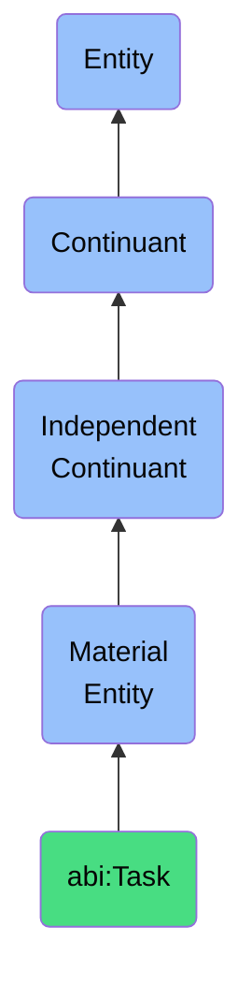

# Task

## Definition
A task is a material entity that is a discrete unit of work assigned to an agent with a clear objective, often linked to a broader workflow or capability.

## Hierarchy in BFO


## Ontological Schema (TBox)
```turtle
abi:Task a owl:Class ;
  rdfs:subClassOf bfo:0000040 ;
  rdfs:label "Task" ;
  skos:definition "A discrete unit of work assigned to an agent with a clear objective, often linked to a broader workflow or capability." .

abi:assigned_to a owl:ObjectProperty ;
  rdfs:domain abi:Task ;
  rdfs:range abi:Agent ;
  rdfs:label "assigned to" .

abi:part_of_project a owl:ObjectProperty ;
  rdfs:domain abi:Task ;
  rdfs:range abi:Project ;
  rdfs:label "part of project" .

abi:has_priority a owl:DatatypeProperty ;
  rdfs:domain abi:Task ;
  rdfs:range xsd:string ;
  rdfs:label "has priority" .

abi:has_deadline a owl:DatatypeProperty ;
  rdfs:domain abi:Task ;
  rdfs:range xsd:dateTime ;
  rdfs:label "has deadline" .

abi:has_status a owl:DatatypeProperty ;
  rdfs:domain abi:Task ;
  rdfs:range xsd:string ;
  rdfs:label "has status" .
```

## Ontological Instance (ABox)
```turtle
ex:CodeReviewTask a abi:Task ;
  rdfs:label "Code Review for Feature X" ;
  abi:assigned_to ex:SeniorDeveloper ;
  abi:part_of_project ex:SoftwareDevelopmentProject ;
  abi:has_priority "High" ;
  abi:has_deadline "2023-11-25T17:00:00Z"^^xsd:dateTime ;
  abi:has_status "In Progress" .

ex:DataAnalysisTask a abi:Task ;
  rdfs:label "Customer Survey Data Analysis" ;
  abi:assigned_to ex:DataAnalyst ;
  abi:part_of_project ex:MarketResearchProject ;
  abi:has_priority "Medium" ;
  abi:has_deadline "2023-12-05T17:00:00Z"^^xsd:dateTime ;
  abi:has_status "Not Started" .
```

## Related Classes
- **abi:Project** - A material entity that aggregates actions, tasks, and resources toward a defined outcome over a finite period.
- **abi:WorkflowInstance** - A material entity that is a materialized instantiation of a process or set of tasks executing across systems or agents.
- **abi:SoftwareAgent** - A material entity that is a materialized computational unit that autonomously executes tasks defined by workflows, prompts, or APIs. 