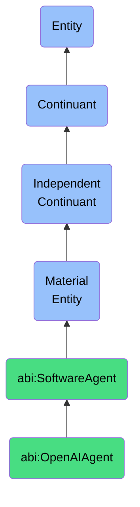

# OpenAIAgent

## Definition
An OpenAI agent is a material entity that is a subclass of SoftwareAgent that interacts with OpenAI services to generate observations.

## Hierarchy in BFO


## Ontological Schema (TBox)
```turtle
abi:OpenAIAgent a owl:Class ;
  rdfs:subClassOf abi:SoftwareAgent ;
  rdfs:label "OpenAI Agent" ;
  skos:definition "A subclass of SoftwareAgent that interacts with OpenAI services to generate observations." .

abi:uses_model a owl:ObjectProperty ;
  rdfs:domain abi:OpenAIAgent ;
  rdfs:range abi:OpenAIModel ;
  rdfs:label "uses model" .

abi:generates_observation a owl:ObjectProperty ;
  rdfs:domain abi:OpenAIAgent ;
  rdfs:range abi:ObservationContent ;
  rdfs:label "generates observation" .

abi:has_api_key a owl:DatatypeProperty ;
  rdfs:domain abi:OpenAIAgent ;
  rdfs:range xsd:string ;
  rdfs:label "has API key" .
```

## Ontological Instance (ABox)
```turtle
ex:GPT4Agent a abi:OpenAIAgent ;
  rdfs:label "GPT-4 Agent" ;
  abi:uses_model ex:GPT4 ;
  abi:generates_observation ex:CustomerSentimentObservation ;
  abi:hosted_on ex:AzureGPTContainer .

ex:GPT35Agent a abi:OpenAIAgent ;
  rdfs:label "GPT-3.5 Turbo Agent" ;
  abi:uses_model ex:GPT35Turbo ;
  abi:generates_observation ex:DocumentSummaryObservation ;
  abi:hosted_on ex:AWSContainer .
```

## Related Classes
- **abi:SoftwareAgent** - A material entity that is a materialized computational unit that autonomously executes tasks defined by workflows, prompts, or APIs.
- **abi:PerplexityAgent** - A material entity that is a software agent that queries and retrieves summaries or documents from Perplexity.
- **abi:ScraperBot** - A material entity that is a software agent that extracts structured or unstructured data from web-based or document-based sources. 