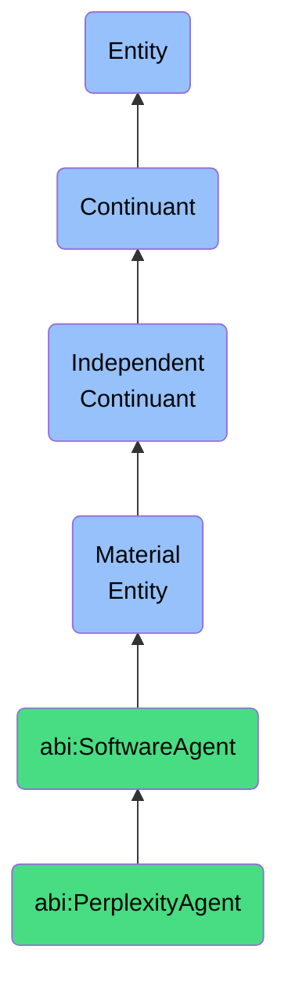

# PerplexityAgent

## Definition
A perplexity agent is a material entity that is a software agent that queries and retrieves summaries or documents from Perplexity.

## Hierarchy in BFO


## Ontological Schema (TBox)
```turtle
abi:PerplexityAgent a owl:Class ;
  rdfs:subClassOf abi:SoftwareAgent ;
  rdfs:label "Perplexity Agent" ;
  skos:definition "A software agent that queries and retrieves summaries or documents from Perplexity." .

abi:queries_knowledge_base a owl:ObjectProperty ;
  rdfs:domain abi:PerplexityAgent ;
  rdfs:range abi:PerplexityAPI ;
  rdfs:label "queries knowledge base" .

abi:retrieves_summary a owl:ObjectProperty ;
  rdfs:domain abi:PerplexityAgent ;
  rdfs:range abi:ObservationContent ;
  rdfs:label "retrieves summary" .

abi:cites_source a owl:ObjectProperty ;
  rdfs:domain abi:PerplexityAgent ;
  rdfs:range abi:ExternalDocument ;
  rdfs:label "cites source" .
```

## Ontological Instance (ABox)
```turtle
ex:MarketResearchAgent a abi:PerplexityAgent ;
  rdfs:label "Market Research Agent" ;
  abi:queries_knowledge_base ex:PerplexityPro ;
  abi:retrieves_summary ex:IndustryTrendSummary ;
  abi:cites_source ex:MarketReportCollection, ex:JournalArticles .

ex:CompetitorAnalysisAgent a abi:PerplexityAgent ;
  rdfs:label "Competitor Analysis Agent" ;
  abi:queries_knowledge_base ex:PerplexityCorpus ;
  abi:retrieves_summary ex:CompetitorStrategyInsights ;
  abi:cites_source ex:EarningsReports, ex:NewsArticles .
```

## Related Classes
- **abi:SoftwareAgent** - A material entity that is a materialized computational unit that autonomously executes tasks defined by workflows, prompts, or APIs.
- **abi:OpenAIAgent** - A material entity that is a subclass of SoftwareAgent that interacts with OpenAI services to generate observations.
- **abi:ScraperBot** - A material entity that is a software agent that extracts structured or unstructured data from web-based or document-based sources. 