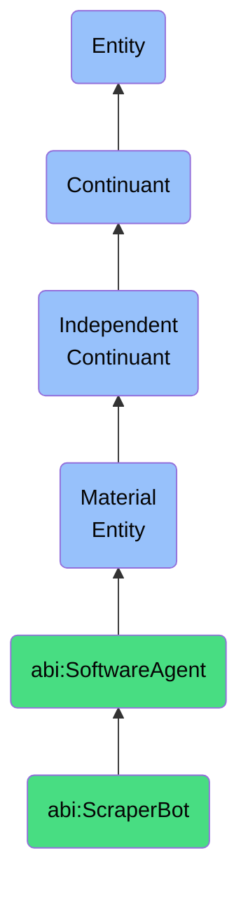

# ScraperBot

## Definition
A scraper bot is a material entity that is a software agent that extracts structured or unstructured data from web-based or document-based sources.

## Hierarchy in BFO


## Ontological Schema (TBox)
```turtle
abi:ScraperBot a owl:Class ;
  rdfs:subClassOf abi:SoftwareAgent ;
  rdfs:label "Scraper Bot" ;
  skos:definition "A software agent that extracts structured or unstructured data from web-based or document-based sources." .

abi:scrapes_from a owl:ObjectProperty ;
  rdfs:domain abi:ScraperBot ;
  rdfs:range abi:DigitalSource ;
  rdfs:label "scrapes from" .

abi:extracts_data a owl:ObjectProperty ;
  rdfs:domain abi:ScraperBot ;
  rdfs:range abi:ExtractedData ;
  rdfs:label "extracts data" .

abi:uses_extraction_technique a owl:ObjectProperty ;
  rdfs:domain abi:ScraperBot ;
  rdfs:range abi:DataExtractionTechnique ;
  rdfs:label "uses extraction technique" .
```

## Ontological Instance (ABox)
```turtle
ex:WebScraperBot a abi:ScraperBot ;
  rdfs:label "Web Scraper Bot" ;
  abi:scrapes_from ex:CompanyWebsites, ex:NewsPortals ;
  abi:extracts_data ex:PricingData, ex:ProductFeatures ;
  abi:uses_extraction_technique ex:HTMLParsing, ex:DOMTraversal .

ex:PDFScraperBot a abi:ScraperBot ;
  rdfs:label "PDF Scraper Bot" ;
  abi:scrapes_from ex:FinancialReports, ex:ResearchPapers ;
  abi:extracts_data ex:FinancialMetrics, ex:ResearchFindings ;
  abi:uses_extraction_technique ex:PDFTextExtraction, ex:TableExtraction .
```

## Related Classes
- **abi:SoftwareAgent** - A material entity that is a materialized computational unit that autonomously executes tasks defined by workflows, prompts, or APIs.
- **abi:OpenAIAgent** - A material entity that is a subclass of SoftwareAgent that interacts with OpenAI services to generate observations.
- **abi:PerplexityAgent** - A material entity that is a software agent that queries and retrieves summaries or documents from Perplexity. 