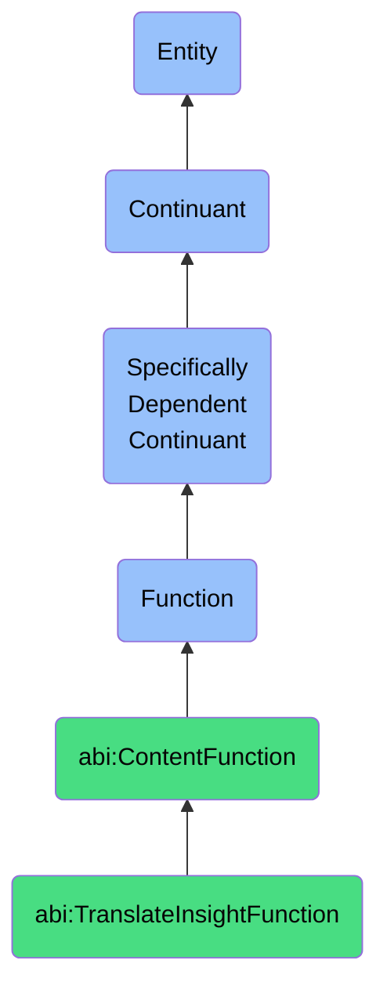

# TranslateInsightFunction

## Definition
A translate insight function is a specifically dependent continuant that inheres in its bearer, enabling the transformation of technical, analytical, or domain-specific content into business-readable language that preserves core meaning while adapting terminology, structure, and presentation to suit the comprehension needs of target stakeholders.

## Hierarchy in BFO


## Ontological Schema (TBox)
```turtle
abi:TranslateInsightFunction a owl:Class ;
  rdfs:subClassOf abi:ContentFunction ;
  rdfs:label "Translate Insight Function" ;
  skos:definition "A function that transforms technical or analytical output into business-readable language." .

abi:ContentFunction a owl:Class ;
  rdfs:subClassOf bfo:0000034 ;
  rdfs:label "Content Function" ;
  skos:definition "A function related to the creation, transformation, or delivery of content." .

abi:inheres_in a owl:ObjectProperty ;
  rdfs:domain abi:TranslateInsightFunction ;
  rdfs:range abi:InsightTranslator ;
  rdfs:label "inheres in" .

abi:transforms_content_type a owl:ObjectProperty ;
  rdfs:domain abi:TranslateInsightFunction ;
  rdfs:range abi:TechnicalContent ;
  rdfs:label "transforms content type" .

abi:produces_content_form a owl:ObjectProperty ;
  rdfs:domain abi:TranslateInsightFunction ;
  rdfs:range abi:BusinessContent ;
  rdfs:label "produces content form" .

abi:tailors_for_audience a owl:ObjectProperty ;
  rdfs:domain abi:TranslateInsightFunction ;
  rdfs:range abi:BusinessStakeholder ;
  rdfs:label "tailors for audience" .

abi:preserves_key_insights a owl:ObjectProperty ;
  rdfs:domain abi:TranslateInsightFunction ;
  rdfs:range abi:CoreInsight ;
  rdfs:label "preserves key insights" .

abi:uses_translation_method a owl:ObjectProperty ;
  rdfs:domain abi:TranslateInsightFunction ;
  rdfs:range abi:ContentTranslationMethod ;
  rdfs:label "uses translation method" .

abi:simplifies_terminology a owl:ObjectProperty ;
  rdfs:domain abi:TranslateInsightFunction ;
  rdfs:range abi:TechnicalTerminology ;
  rdfs:label "simplifies terminology" .

abi:supports_business_objective a owl:ObjectProperty ;
  rdfs:domain abi:TranslateInsightFunction ;
  rdfs:range abi:BusinessObjective ;
  rdfs:label "supports business objective" .

abi:has_clarity_score a owl:DatatypeProperty ;
  rdfs:domain abi:TranslateInsightFunction ;
  rdfs:range xsd:decimal ;
  rdfs:label "has clarity score" .

abi:has_technical_accuracy a owl:DatatypeProperty ;
  rdfs:domain abi:TranslateInsightFunction ;
  rdfs:range xsd:decimal ;
  rdfs:label "has technical accuracy" .

abi:has_actionability_rating a owl:DatatypeProperty ;
  rdfs:domain abi:TranslateInsightFunction ;
  rdfs:range xsd:decimal ;
  rdfs:label "has actionability rating" .
```

## Ontological Instance (ABox)
```turtle
ex:ABISystemPresentationTranslationFunction a abi:TranslateInsightFunction ;
  rdfs:label "ABI System Presentation Translation Function" ;
  abi:inheres_in ex:ABISystem ;
  abi:transforms_content_type ex:DataAnalysisReport, ex:AlgorithmicOutput ;
  abi:produces_content_form ex:ExecutivePresentation, ex:StrategicRecommendation ;
  abi:tailors_for_audience ex:CorporateExecutive, ex:BusinessManager ;
  abi:preserves_key_insights ex:PerformanceTrend, ex:MarketOpportunity, ex:RiskFactor ;
  abi:uses_translation_method ex:NarrativeTransformation, ex:VisualRepresentation ;
  abi:simplifies_terminology ex:StatisticalTerminology, ex:TechnicalJargon ;
  abi:supports_business_objective ex:StrategicDecisionMaking, ex:ResourceAllocation ;
  abi:has_clarity_score "0.90"^^xsd:decimal ;
  abi:has_technical_accuracy "0.95"^^xsd:decimal ;
  abi:has_actionability_rating "0.88"^^xsd:decimal .

ex:DataScienceTeamInsightTranslationFunction a abi:TranslateInsightFunction ;
  rdfs:label "Data Science Team Insight Translation Function" ;
  abi:inheres_in ex:EnterpriseDataScienceTeam ;
  abi:transforms_content_type ex:MachineLearningModel, ex:PredictiveAnalysis ;
  abi:produces_content_form ex:BusinessOpportunityBrief, ex:ActionableDashboard ;
  abi:tailors_for_audience ex:ProductManager, ex:SalesTeam, ex:MarketingDirector ;
  abi:preserves_key_insights ex:CustomerBehaviorPattern, ex:ConversionDrivers, ex:RetentionFactors ;
  abi:uses_translation_method ex:StoryboardTechnique, ex:BusinessCaseFramework ;
  abi:simplifies_terminology ex:StatisticalModelTerminology, ex:DataScienceVocabulary ;
  abi:supports_business_objective ex:CustomerRetention, ex:MarketExpansion, ex:ProductDevelopment ;
  abi:has_clarity_score "0.92"^^xsd:decimal ;
  abi:has_technical_accuracy "0.87"^^xsd:decimal ;
  abi:has_actionability_rating "0.94"^^xsd:decimal .
```

## Related Classes
- **abi:GenerateContentFunction** - A function that creates content, which may be informed by translated insights.
- **abi:SummarizeTextFunction** - A function that often precedes translation of insights by distilling information.
- **abi:VisualizeDataFunction** - A function that presents data graphically, frequently used alongside insight translation.
- **abi:ExplainAnalysisFunction** - A function that clarifies complex analyses, complementing insight translation.
- **abi:SimplifyConceptFunction** - A function that makes complex ideas more accessible, related to insight translation. 