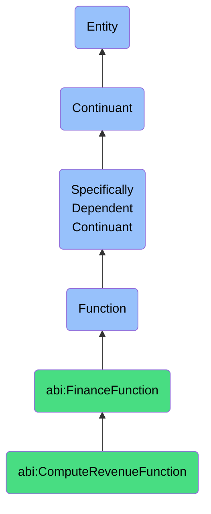

# ComputeRevenueFunction

## Definition
A compute revenue function is a specifically dependent continuant that inheres in its bearer, providing the capability to calculate monetary income values through the systematic processing of contractual agreements, transactional records, and pricing models, applying appropriate recognition rules to determine realized or projected revenue metrics for financial reporting and business performance evaluation.

## Hierarchy in BFO


## Ontological Schema (TBox)
```turtle
abi:ComputeRevenueFunction a owl:Class ;
  rdfs:subClassOf abi:FinanceFunction ;
  rdfs:label "Compute Revenue Function" ;
  skos:definition "A function that calculates realized or projected revenue based on contractual and transactional data." .

abi:FinanceFunction a owl:Class ;
  rdfs:subClassOf bfo:0000034 ;
  rdfs:label "Finance Function" ;
  skos:definition "A function related to processing, analyzing, calculating, or reconciling financial and monetary information." .

abi:inheres_in a owl:ObjectProperty ;
  rdfs:domain abi:ComputeRevenueFunction ;
  rdfs:range abi:RevenueCalculator ;
  rdfs:label "inheres in" .

abi:processes_transaction_data a owl:ObjectProperty ;
  rdfs:domain abi:ComputeRevenueFunction ;
  rdfs:range abi:TransactionData ;
  rdfs:label "processes transaction data" .

abi:applies_revenue_recognition_rule a owl:ObjectProperty ;
  rdfs:domain abi:ComputeRevenueFunction ;
  rdfs:range abi:RevenueRecognitionRule ;
  rdfs:label "applies revenue recognition rule" .

abi:analyzes_contract_term a owl:ObjectProperty ;
  rdfs:domain abi:ComputeRevenueFunction ;
  rdfs:range abi:ContractTerm ;
  rdfs:label "analyzes contract term" .

abi:calculates_revenue_metric a owl:ObjectProperty ;
  rdfs:domain abi:ComputeRevenueFunction ;
  rdfs:range abi:RevenueMetric ;
  rdfs:label "calculates revenue metric" .

abi:considers_pricing_model a owl:ObjectProperty ;
  rdfs:domain abi:ComputeRevenueFunction ;
  rdfs:range abi:PricingModel ;
  rdfs:label "considers pricing model" .

abi:accounts_for_adjustment a owl:ObjectProperty ;
  rdfs:domain abi:ComputeRevenueFunction ;
  rdfs:range abi:RevenueAdjustment ;
  rdfs:label "accounts for adjustment" .

abi:supports_financial_reporting a owl:ObjectProperty ;
  rdfs:domain abi:ComputeRevenueFunction ;
  rdfs:range abi:FinancialReport ;
  rdfs:label "supports financial reporting" .

abi:has_calculation_periodicity a owl:DatatypeProperty ;
  rdfs:domain abi:ComputeRevenueFunction ;
  rdfs:range xsd:string ;
  rdfs:label "has calculation periodicity" .

abi:has_revenue_classification a owl:DatatypeProperty ;
  rdfs:domain abi:ComputeRevenueFunction ;
  rdfs:range xsd:string ;
  rdfs:label "has revenue classification" .

abi:has_compliance_standard a owl:DatatypeProperty ;
  rdfs:domain abi:ComputeRevenueFunction ;
  rdfs:range xsd:string ;
  rdfs:label "has compliance standard" .
```

## Ontological Instance (ABox)
```turtle
ex:ARRTrackingNotebookFunction a abi:ComputeRevenueFunction ;
  rdfs:label "Annual Recurring Revenue Tracking Notebook Function" ;
  abi:inheres_in ex:SaaSRevenueDashboard ;
  abi:processes_transaction_data ex:SubscriptionOrders, ex:RenewalTransactions, ex:UpgradeDowngradeEvents ;
  abi:applies_revenue_recognition_rule ex:AnnualizedValueRule, ex:ContractualCommitmentRule ;
  abi:analyzes_contract_term ex:SubscriptionDuration, ex:AutoRenewalProvision, ex:PricingTier ;
  abi:calculates_revenue_metric ex:AnnualRecurringRevenue, ex:NetRetentionRate, ex:NewARRAdded ;
  abi:considers_pricing_model ex:TieredPricing, ex:UserBasedPricing, ex:ConsumptionBasedPricing ;
  abi:accounts_for_adjustment ex:PromotionalDiscount, ex:LoyaltyCredit, ex:ServiceCredit ;
  abi:supports_financial_reporting ex:BoardPresentationReport, ex:InvestorUpdates ;
  abi:has_calculation_periodicity "Monthly with annual comparison" ;
  abi:has_revenue_classification "Recurring, Non-recurring, and Usage-based" ;
  abi:has_compliance_standard "ASC 606" .

ex:QuarterlyRevenueRecognitionFunction a abi:ComputeRevenueFunction ;
  rdfs:label "Quarterly Revenue Recognition Function" ;
  abi:inheres_in ex:EnterpriseFinancialSystem ;
  abi:processes_transaction_data ex:InvoicedSales, ex:ServiceDeliveryData, ex:MilestoneCompletions ;
  abi:applies_revenue_recognition_rule ex:PercentageOfCompletionRule, ex:DeliveryAcceptanceRule ;
  abi:analyzes_contract_term ex:PaymentSchedule, ex:DeliverableDefinition, ex:AcceptanceCriteria ;
  abi:calculates_revenue_metric ex:QuarterlyRevenue, ex:RevenueByProductLine, ex:DeferredRevenue ;
  abi:considers_pricing_model ex:FixedBidPricing, ex:TimeAndMaterialsPricing, ex:ValueBasedPricing ;
  abi:accounts_for_adjustment ex:CancellationRefund, ex:ForeignExchangeAdjustment, ex:RevenueReserve ;
  abi:supports_financial_reporting ex:SECFilings, ex:ManagementAccountingReports ;
  abi:has_calculation_periodicity "Quarterly with year-to-date totals" ;
  abi:has_revenue_classification "Product, Service, and Maintenance" ;
  abi:has_compliance_standard "IFRS 15, GAAP" .
```

## Related Classes
- **abi:ForecastCashFunction** - A function that projects future cash flows, often utilizing revenue calculations as inputs.
- **abi:ReconcileBankFlowFunction** - A function that verifies actual financial transactions, which may include revenue receipts.
- **abi:ProfitabilityAnalysisFunction** - A function that evaluates financial performance by comparing revenue to costs.
- **abi:ContractManagementFunction** - A function that manages contractual agreements that serve as the basis for revenue calculations.
- **abi:CustomerLifetimeValueFunction** - A function that projects the total value expected from customer relationships, incorporating revenue projections. 