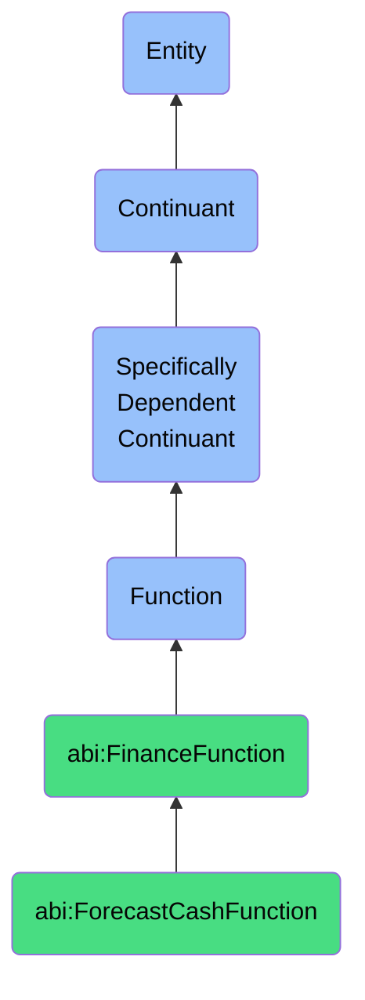

# ForecastCashFunction

## Definition
A forecast cash function is a specifically dependent continuant that inheres in its bearer, providing the capability to estimate future cash inflows and outflows by analyzing historical data, applying trend analysis, incorporating known future events, and modeling business scenarios to support liquidity management, budget planning, and financial decision-making.

## Hierarchy in BFO


## Ontological Schema (TBox)
```turtle
abi:ForecastCashFunction a owl:Class ;
  rdfs:subClassOf abi:FinanceFunction ;
  rdfs:label "Forecast Cash Function" ;
  skos:definition "A function that estimates future cash flow from structured inputs and business rules." .

abi:FinanceFunction a owl:Class ;
  rdfs:subClassOf bfo:0000034 ;
  rdfs:label "Finance Function" ;
  skos:definition "A function related to processing, analyzing, calculating, or reconciling financial and monetary information." .

abi:inheres_in a owl:ObjectProperty ;
  rdfs:domain abi:ForecastCashFunction ;
  rdfs:range abi:CashFlowForecaster ;
  rdfs:label "inheres in" .

abi:analyzes_historical_cashflow a owl:ObjectProperty ;
  rdfs:domain abi:ForecastCashFunction ;
  rdfs:range abi:HistoricalCashflow ;
  rdfs:label "analyzes historical cashflow" .

abi:applies_forecasting_rule a owl:ObjectProperty ;
  rdfs:domain abi:ForecastCashFunction ;
  rdfs:range abi:ForecastingRule ;
  rdfs:label "applies forecasting rule" .

abi:incorporates_future_commitment a owl:ObjectProperty ;
  rdfs:domain abi:ForecastCashFunction ;
  rdfs:range abi:FinancialCommitment ;
  rdfs:label "incorporates future commitment" .

abi:produces_cash_projection a owl:ObjectProperty ;
  rdfs:domain abi:ForecastCashFunction ;
  rdfs:range abi:CashProjection ;
  rdfs:label "produces cash projection" .

abi:considers_seasonality a owl:ObjectProperty ;
  rdfs:domain abi:ForecastCashFunction ;
  rdfs:range abi:SeasonalityPattern ;
  rdfs:label "considers seasonality" .

abi:models_scenario a owl:ObjectProperty ;
  rdfs:domain abi:ForecastCashFunction ;
  rdfs:range abi:BusinessScenario ;
  rdfs:label "models scenario" .

abi:supports_treasury_decision a owl:ObjectProperty ;
  rdfs:domain abi:ForecastCashFunction ;
  rdfs:range abi:TreasuryDecision ;
  rdfs:label "supports treasury decision" .

abi:has_forecast_horizon a owl:DatatypeProperty ;
  rdfs:domain abi:ForecastCashFunction ;
  rdfs:range xsd:duration ;
  rdfs:label "has forecast horizon" .

abi:has_confidence_interval a owl:DatatypeProperty ;
  rdfs:domain abi:ForecastCashFunction ;
  rdfs:range xsd:decimal ;
  rdfs:label "has confidence interval" .

abi:has_forecast_frequency a owl:DatatypeProperty ;
  rdfs:domain abi:ForecastCashFunction ;
  rdfs:range xsd:string ;
  rdfs:label "has forecast frequency" .
```

## Ontological Instance (ABox)
```turtle
ex:FinanceAssistantWeeklyCashFunction a abi:ForecastCashFunction ;
  rdfs:label "Finance Assistant Weekly Cash Forecasting Function" ;
  abi:inheres_in ex:FinanceAssistantSystem ;
  abi:analyzes_historical_cashflow ex:AccountsReceivableHistory, ex:AccountsPayableHistory, ex:OperatingExpenseHistory ;
  abi:applies_forecasting_rule ex:PaymentTimingRule, ex:RevenueRecognitionRule, ex:ExpenseAccrualRule ;
  abi:incorporates_future_commitment ex:VendorPaymentSchedule, ex:PayrollObligations, ex:DebtServicePayments ;
  abi:produces_cash_projection ex:ThirteenWeekCashForecast, ex:WeeklyLiquidityReport ;
  abi:considers_seasonality ex:QuarterEndPattern, ex:HolidaySeasonPattern ;
  abi:models_scenario ex:BaselineScenario, ex:ConservativeScenario, ex:AggressiveGrowthScenario ;
  abi:supports_treasury_decision ex:ShortTermInvestmentDecision, ex:CreditLineUtilizationDecision ;
  abi:has_forecast_horizon "P13W"^^xsd:duration ;
  abi:has_confidence_interval "0.85"^^xsd:decimal ;
  abi:has_forecast_frequency "Weekly" .

ex:TreasuryDepartmentCashForecastFunction a abi:ForecastCashFunction ;
  rdfs:label "Treasury Department Cash Forecasting Function" ;
  abi:inheres_in ex:TreasuryManagementTeam ;
  abi:analyzes_historical_cashflow ex:GlobalCashPositionHistory, ex:SubsidiaryRemittanceHistory ;
  abi:applies_forecasting_rule ex:ForeignExchangeImpactRule, ex:IntercompanySettlementRule ;
  abi:incorporates_future_commitment ex:CapitalExpenditurePlan, ex:TaxPaymentSchedule, ex:DividendPayments ;
  abi:produces_cash_projection ex:QuarterlyCashProjection, ex:AnnualCashFlowForecast ;
  abi:considers_seasonality ex:FiscalYearPattern, ex:RegionalBusinessCyclePattern ;
  abi:models_scenario ex:MarketExpansionScenario, ex:EconomicDownturnScenario, ex:MergerIntegrationScenario ;
  abi:supports_treasury_decision ex:DebtRefinancingDecision, ex:StrategicInvestmentDecision, ex:DividendPolicyDecision ;
  abi:has_forecast_horizon "P1Y"^^xsd:duration ;
  abi:has_confidence_interval "0.80"^^xsd:decimal ;
  abi:has_forecast_frequency "Monthly with quarterly consolidation" .
```

## Related Classes
- **abi:ComputeRevenueFunction** - A related function focused on calculating revenue that may provide inputs to cash forecasting.
- **abi:ReconcileBankFlowFunction** - A function that verifies actual cash transactions, providing data that can refine forecasts.
- **abi:BudgetPlanningFunction** - A function that creates formal financial plans, informed by cash forecasts.
- **abi:LiquidityAnalysisFunction** - A function that evaluates an organization's ability to meet short-term obligations.
- **abi:ScenarioModelingFunction** - A function that creates and evaluates different business scenarios, often incorporating cash projections. 