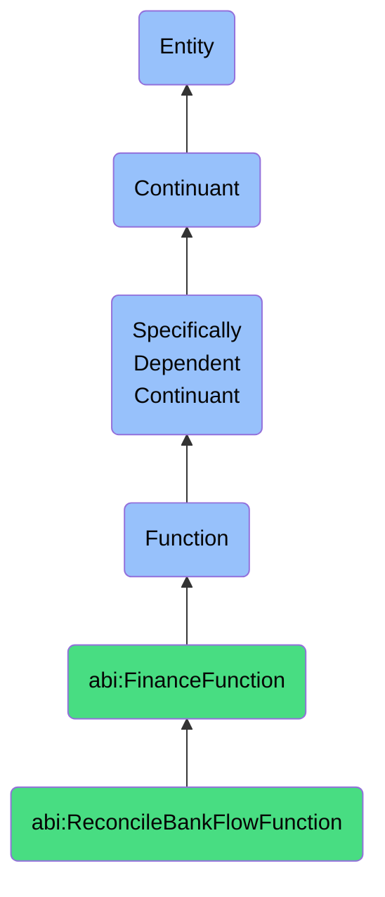

# ReconcileBankFlowFunction

## Definition
A reconcile bank flow function is a specifically dependent continuant that inheres in its bearer, providing the capability to systematically compare, match, and verify internal financial transaction records against external bank statements or data feeds, identifying and resolving discrepancies to ensure accurate financial reporting, detect anomalies, and maintain financial control.

## Hierarchy in BFO


## Ontological Schema (TBox)
```turtle
abi:ReconcileBankFlowFunction a owl:Class ;
  rdfs:subClassOf abi:FinanceFunction ;
  rdfs:label "Reconcile Bank Flow Function" ;
  skos:definition "A function that matches internal transactions against external bank data." .

abi:FinanceFunction a owl:Class ;
  rdfs:subClassOf bfo:0000034 ;
  rdfs:label "Finance Function" ;
  skos:definition "A function related to processing, analyzing, calculating, or reconciling financial and monetary information." .

abi:inheres_in a owl:ObjectProperty ;
  rdfs:domain abi:ReconcileBankFlowFunction ;
  rdfs:range abi:BankReconciler ;
  rdfs:label "inheres in" .

abi:compares_internal_record a owl:ObjectProperty ;
  rdfs:domain abi:ReconcileBankFlowFunction ;
  rdfs:range abi:InternalFinancialRecord ;
  rdfs:label "compares internal record" .

abi:matches_against_bank_data a owl:ObjectProperty ;
  rdfs:domain abi:ReconcileBankFlowFunction ;
  rdfs:range abi:BankStatement ;
  rdfs:label "matches against bank data" .

abi:identifies_discrepancy a owl:ObjectProperty ;
  rdfs:domain abi:ReconcileBankFlowFunction ;
  rdfs:range abi:TransactionDiscrepancy ;
  rdfs:label "identifies discrepancy" .

abi:applies_matching_rule a owl:ObjectProperty ;
  rdfs:domain abi:ReconcileBankFlowFunction ;
  rdfs:range abi:ReconciliationRule ;
  rdfs:label "applies matching rule" .

abi:generates_reconciliation_report a owl:ObjectProperty ;
  rdfs:domain abi:ReconcileBankFlowFunction ;
  rdfs:range abi:ReconciliationReport ;
  rdfs:label "generates reconciliation report" .

abi:flags_exception a owl:ObjectProperty ;
  rdfs:domain abi:ReconcileBankFlowFunction ;
  rdfs:range abi:ReconciliationException ;
  rdfs:label "flags exception" .

abi:supports_financial_control a owl:ObjectProperty ;
  rdfs:domain abi:ReconcileBankFlowFunction ;
  rdfs:range abi:FinancialControlProcess ;
  rdfs:label "supports financial control" .

abi:has_reconciliation_frequency a owl:DatatypeProperty ;
  rdfs:domain abi:ReconcileBankFlowFunction ;
  rdfs:range xsd:string ;
  rdfs:label "has reconciliation frequency" .

abi:has_auto_match_threshold a owl:DatatypeProperty ;
  rdfs:domain abi:ReconcileBankFlowFunction ;
  rdfs:range xsd:decimal ;
  rdfs:label "has auto match threshold" .

abi:has_matching_algorithm a owl:DatatypeProperty ;
  rdfs:domain abi:ReconcileBankFlowFunction ;
  rdfs:range xsd:string ;
  rdfs:label "has matching algorithm" .
```

## Ontological Instance (ABox)
```turtle
ex:LedgerAgentDailyReconciliationFunction a abi:ReconcileBankFlowFunction ;
  rdfs:label "Ledger Agent Daily Bank Reconciliation Function" ;
  abi:inheres_in ex:LedgerAgent ;
  abi:compares_internal_record ex:AccountsPayableEntries, ex:AccountsReceivableEntries, ex:GeneralLedgerEntries ;
  abi:matches_against_bank_data ex:DailyBankFeeds, ex:CreditCardStatements, ex:PaymentProcessorReports ;
  abi:identifies_discrepancy ex:UnrecordedPayment, ex:DuplicateTransaction, ex:MiscategorizedTransaction ;
  abi:applies_matching_rule ex:ExactAmountMatchRule, ex:DateRangeMatchRule, ex:ReferenceNumberMatchRule ;
  abi:generates_reconciliation_report ex:DailyReconciliationSummary, ex:UnmatchedItemsReport ;
  abi:flags_exception ex:SuspiciousTransactionPattern, ex:LargeUnexplainedVariance ;
  abi:supports_financial_control ex:DailyCloseProcess, ex:FraudPreventionProcess ;
  abi:has_reconciliation_frequency "Daily with intraday updates" ;
  abi:has_auto_match_threshold "0.95"^^xsd:decimal ;
  abi:has_matching_algorithm "Fuzzy matching with multi-factor verification" .

ex:AccountingTeamMonthEndReconciliationFunction a abi:ReconcileBankFlowFunction ;
  rdfs:label "Accounting Team Month-End Bank Reconciliation Function" ;
  abi:inheres_in ex:FinanceTeam ;
  abi:compares_internal_record ex:MonthlyJournalEntries, ex:OutstandingChecks, ex:PendingDeposits ;
  abi:matches_against_bank_data ex:MonthlyBankStatements, ex:MerchantServiceReports, ex:InternationalWireReports ;
  abi:identifies_discrepancy ex:BankFeeDiscrepancy, ex:ForexAdjustment, ex:TimingDifference ;
  abi:applies_matching_rule ex:BatchTransactionRule, ex:RecurringPaymentRecognitionRule, ex:CrossAccountNetSettlementRule ;
  abi:generates_reconciliation_report ex:MonthlyReconciliationWorksheet, ex:AdjustingEntryLog ;
  abi:flags_exception ex:UnreconciledItemsAging, ex:RecurringDiscrepancyPattern ;
  abi:supports_financial_control ex:MonthEndCloseProcess, ex:AuditReadinessProcess, ex:RegulatoryComplianceProcess ;
  abi:has_reconciliation_frequency "Monthly with quarterly review" ;
  abi:has_auto_match_threshold "0.90"^^xsd:decimal ;
  abi:has_matching_algorithm "Rules-based matching with supervisory approval workflow" .
```

## Related Classes
- **abi:ForecastCashFunction** - A function that projects future cash flows based on reconciled historical bank data.
- **abi:ComputeRevenueFunction** - A function that calculates revenue, often using reconciled transaction data as input.
- **abi:AccountingAdjustmentFunction** - A function that creates corrective entries based on reconciliation findings.
- **abi:FraudDetectionFunction** - A function that identifies suspicious activities, which may utilize bank reconciliation data.
- **abi:FinancialAuditFunction** - A function that evaluates financial controls, including reconciliation processes. 