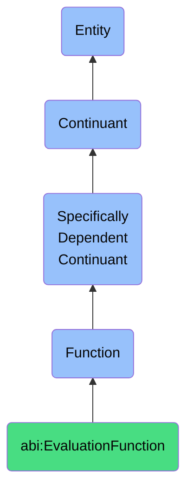

# EvaluationFunction

## Definition
An evaluation function is a specifically dependent continuant that inheres in its bearer, providing capabilities to assess, measure, categorize, or score inputs, entities, or processes against defined criteria, standards, or models to enable decision-making, prioritization, or quality control.

## Hierarchy in BFO


## Ontological Schema (TBox)
```turtle
abi:EvaluationFunction a owl:Class ;
  rdfs:subClassOf bfo:0000034 ;
  rdfs:label "Evaluation Function" ;
  skos:definition "A function that enables assessment, measurement, categorization, or scoring against defined criteria." .

abi:inheres_in a owl:ObjectProperty ;
  rdfs:domain abi:EvaluationFunction ;
  rdfs:range abi:Evaluator ;
  rdfs:label "inheres in" .

abi:evaluates_input a owl:ObjectProperty ;
  rdfs:domain abi:EvaluationFunction ;
  rdfs:range abi:EvaluationInput ;
  rdfs:label "evaluates input" .

abi:applies_criteria a owl:ObjectProperty ;
  rdfs:domain abi:EvaluationFunction ;
  rdfs:range abi:EvaluationCriteria ;
  rdfs:label "applies criteria" .

abi:produces_assessment a owl:ObjectProperty ;
  rdfs:domain abi:EvaluationFunction ;
  rdfs:range abi:EvaluationOutput ;
  rdfs:label "produces assessment" .

abi:uses_evaluation_method a owl:ObjectProperty ;
  rdfs:domain abi:EvaluationFunction ;
  rdfs:range abi:EvaluationMethod ;
  rdfs:label "uses evaluation method" .

abi:supports_decision_process a owl:ObjectProperty ;
  rdfs:domain abi:EvaluationFunction ;
  rdfs:range abi:DecisionProcess ;
  rdfs:label "supports decision process" .

abi:has_evaluation_dimensions a owl:ObjectProperty ;
  rdfs:domain abi:EvaluationFunction ;
  rdfs:range abi:EvaluationDimension ;
  rdfs:label "has evaluation dimensions" .

abi:has_accuracy_level a owl:DatatypeProperty ;
  rdfs:domain abi:EvaluationFunction ;
  rdfs:range xsd:decimal ;
  rdfs:label "has accuracy level" .

abi:has_processing_time a owl:DatatypeProperty ;
  rdfs:domain abi:EvaluationFunction ;
  rdfs:range xsd:decimal ;
  rdfs:label "has processing time" .

abi:has_confidence_threshold a owl:DatatypeProperty ;
  rdfs:domain abi:EvaluationFunction ;
  rdfs:range xsd:decimal ;
  rdfs:label "has confidence threshold" .
```

## Ontological Instance (ABox)
```turtle
# EvaluationFunction is a parent class with subclasses:
# - abi:ScoreObservationFunction
# - abi:ClassifyInputFunction
# - abi:RatePersonaMatchFunction
# and other evaluation-related functions
```

## Related Classes
- **abi:ScoreObservationFunction** - A specialized function for applying trust or relevance scores to observations.
- **abi:ClassifyInputFunction** - A specialized function for assigning labels or tags to inputs using models or rules.
- **abi:RatePersonaMatchFunction** - A specialized function for evaluating how well a lead fits a predefined persona.
- **abi:AnalysisFunction** - A related function focused on examining and interpreting information.
- **abi:DecisionSupportFunction** - A function that uses evaluations to facilitate better decision-making. 