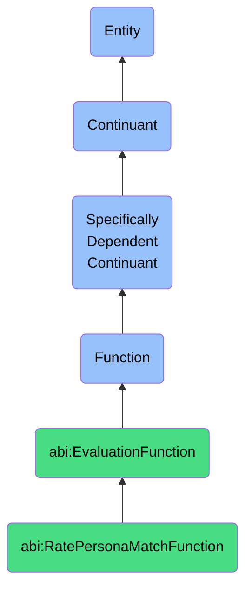

# RatePersonaMatchFunction

## Definition
A rate persona match function is a specifically dependent continuant that inheres in its bearer, providing the capability to evaluate how closely an entity, typically a potential customer or lead, aligns with predefined customer personas based on demographic, behavioral, and contextual attributes to determine fit, targeting relevance, or engagement priority.

## Hierarchy in BFO


## Ontological Schema (TBox)
```turtle
abi:RatePersonaMatchFunction a owl:Class ;
  rdfs:subClassOf abi:EvaluationFunction ;
  rdfs:label "Rate Persona Match Function" ;
  skos:definition "A function that evaluates how well a lead fits a predefined persona." .

abi:EvaluationFunction a owl:Class ;
  rdfs:subClassOf bfo:0000034 ;
  rdfs:label "Evaluation Function" ;
  skos:definition "A function that enables assessment, measurement, categorization, or scoring against defined criteria." .

abi:inheres_in a owl:ObjectProperty ;
  rdfs:domain abi:RatePersonaMatchFunction ;
  rdfs:range abi:PersonaMatcher ;
  rdfs:label "inheres in" .

abi:evaluates_lead a owl:ObjectProperty ;
  rdfs:domain abi:RatePersonaMatchFunction ;
  rdfs:range abi:Lead ;
  rdfs:label "evaluates lead" .

abi:compares_to_persona a owl:ObjectProperty ;
  rdfs:domain abi:RatePersonaMatchFunction ;
  rdfs:range abi:CustomerPersona ;
  rdfs:label "compares to persona" .

abi:produces_match_score a owl:ObjectProperty ;
  rdfs:domain abi:RatePersonaMatchFunction ;
  rdfs:range abi:PersonaMatchScore ;
  rdfs:label "produces match score" .

abi:considers_attribute a owl:ObjectProperty ;
  rdfs:domain abi:RatePersonaMatchFunction ;
  rdfs:range abi:PersonaAttribute ;
  rdfs:label "considers attribute" .

abi:uses_matching_algorithm a owl:ObjectProperty ;
  rdfs:domain abi:RatePersonaMatchFunction ;
  rdfs:range abi:MatchingAlgorithm ;
  rdfs:label "uses matching algorithm" .

abi:analyzes_interaction_data a owl:ObjectProperty ;
  rdfs:domain abi:RatePersonaMatchFunction ;
  rdfs:range abi:InteractionData ;
  rdfs:label "analyzes interaction data" .

abi:supports_lead_qualification a owl:ObjectProperty ;
  rdfs:domain abi:RatePersonaMatchFunction ;
  rdfs:range abi:LeadQualificationProcess ;
  rdfs:label "supports lead qualification" .

abi:has_attribute_weighting a owl:DatatypeProperty ;
  rdfs:domain abi:RatePersonaMatchFunction ;
  rdfs:range xsd:string ;
  rdfs:label "has attribute weighting" .

abi:has_match_threshold a owl:DatatypeProperty ;
  rdfs:domain abi:RatePersonaMatchFunction ;
  rdfs:range xsd:decimal ;
  rdfs:label "has match threshold" .

abi:has_confidence_level a owl:DatatypeProperty ;
  rdfs:domain abi:RatePersonaMatchFunction ;
  rdfs:range xsd:decimal ;
  rdfs:label "has confidence level" .
```

## Ontological Instance (ABox)
```turtle
ex:LinkedInScoringBotPersonaMatchFunction a abi:RatePersonaMatchFunction ;
  rdfs:label "LinkedIn Scoring Bot Persona Match Function" ;
  abi:inheres_in ex:MarketingAutomationBot ;
  abi:evaluates_lead ex:LinkedInProspect, ex:WebsiteVisitor ;
  abi:compares_to_persona ex:EnterpriseDecisionMakerPersona, ex:TechnicalInfluencerPersona, ex:FinancialBuyerPersona ;
  abi:produces_match_score ex:PersonaFitScore, ex:BuyingIntentScore ;
  abi:considers_attribute ex:JobTitleAttribute, ex:IndustryAttribute, ex:CompanySizeAttribute, ex:EngagementHistoryAttribute ;
  abi:uses_matching_algorithm ex:BayesianMatchingAlgorithm, ex:ProfileSimilarityAlgorithm ;
  abi:analyzes_interaction_data ex:LinkedInPostEngagement, ex:ContentDownloadHistory, ex:WebsiteBrowsingPattern ;
  abi:supports_lead_qualification ex:SalesOutreachPrioritization, ex:ContentTargetingProcess ;
  abi:has_attribute_weighting "Job Title (0.3), Industry (0.2), Company Size (0.2), Engagement History (0.3)" ;
  abi:has_match_threshold "0.70"^^xsd:decimal ;
  abi:has_confidence_level "0.85"^^xsd:decimal .

ex:CRMProspectPersonaMatchFunction a abi:RatePersonaMatchFunction ;
  rdfs:label "CRM Prospect Persona Matching Function" ;
  abi:inheres_in ex:SalesOperationsSystem ;
  abi:evaluates_lead ex:InboundLead, ex:ConferenceLead, ex:PartnerReferral ;
  abi:compares_to_persona ex:SMBOwnerPersona, ex:MidMarketITManagerPersona, ex:EnterpriseExecutivePersona ;
  abi:produces_match_score ex:PersonaAlignmentScore, ex:RevenuePotentialScore, ex:SalesReadinessScore ;
  abi:considers_attribute ex:BudgetAttribute, ex:AuthorityAttribute, ex:NeedAttribute, ex:TimelineAttribute ;
  abi:uses_matching_algorithm ex:BANTScoringAlgorithm, ex:PredictiveScoringModel ;
  abi:analyzes_interaction_data ex:EmailResponsePattern, ex:DemoAttendance, ex:PricingPageVisits ;
  abi:supports_lead_qualification ex:AccountExecutiveAssignment, ex:NurtureCampaignSelection ;
  abi:has_attribute_weighting "Budget (0.25), Authority (0.25), Need (0.30), Timeline (0.20)" ;
  abi:has_match_threshold "0.60"^^xsd:decimal ;
  abi:has_confidence_level "0.78"^^xsd:decimal .
```

## Related Classes
- **abi:ScoreObservationFunction** - A related function that applies trust or relevance scores to information rather than persona matches.
- **abi:ClassifyInputFunction** - A function that may be used to categorize leads before persona matching.
- **abi:LeadScoringFunction** - A function that evaluates lead quality and sales readiness, often using persona match as one component.
- **abi:MarketSegmentationFunction** - A function that groups potential customers based on shared characteristics, complementary to persona matching.
- **abi:PredictPurchaseIntentFunction** - A function that uses persona match data to forecast buying intentions. 