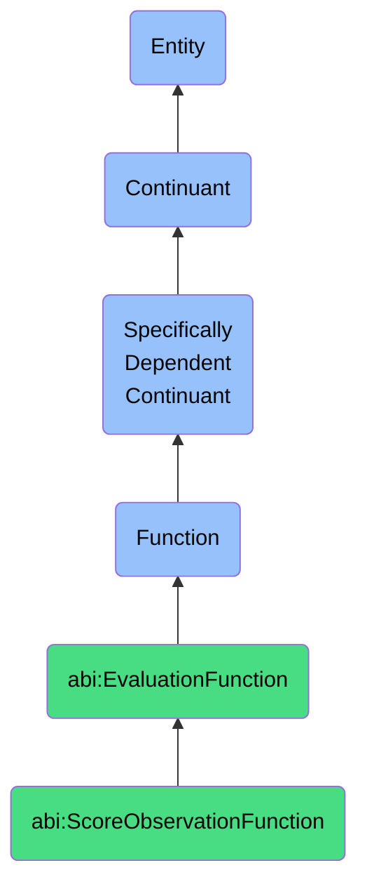

# ScoreObservationFunction

## Definition
A score observation function is a specifically dependent continuant that inheres in its bearer, providing the capability to systematically evaluate observations, insights, or data points according to defined metrics of trust, relevance, accuracy, or utility, and assign quantitative or qualitative ratings that reflect their relative value or reliability.

## Hierarchy in BFO


## Ontological Schema (TBox)
```turtle
abi:ScoreObservationFunction a owl:Class ;
  rdfs:subClassOf abi:EvaluationFunction ;
  rdfs:label "Score Observation Function" ;
  skos:definition "A function that allows a bearer to apply trust or relevance scores to observations." .

abi:EvaluationFunction a owl:Class ;
  rdfs:subClassOf bfo:0000034 ;
  rdfs:label "Evaluation Function" ;
  skos:definition "A function that enables assessment, measurement, categorization, or scoring against defined criteria." .

abi:inheres_in a owl:ObjectProperty ;
  rdfs:domain abi:ScoreObservationFunction ;
  rdfs:range abi:ObservationScorer ;
  rdfs:label "inheres in" .

abi:scores_observation a owl:ObjectProperty ;
  rdfs:domain abi:ScoreObservationFunction ;
  rdfs:range abi:Observation ;
  rdfs:label "scores observation" .

abi:applies_scoring_criteria a owl:ObjectProperty ;
  rdfs:domain abi:ScoreObservationFunction ;
  rdfs:range abi:ScoringCriteria ;
  rdfs:label "applies scoring criteria" .

abi:produces_trust_score a owl:ObjectProperty ;
  rdfs:domain abi:ScoreObservationFunction ;
  rdfs:range abi:TrustScore ;
  rdfs:label "produces trust score" .

abi:produces_relevance_score a owl:ObjectProperty ;
  rdfs:domain abi:ScoreObservationFunction ;
  rdfs:range abi:RelevanceScore ;
  rdfs:label "produces relevance score" .

abi:uses_scoring_method a owl:ObjectProperty ;
  rdfs:domain abi:ScoreObservationFunction ;
  rdfs:range abi:ScoringMethod ;
  rdfs:label "uses scoring method" .

abi:compares_to_reference a owl:ObjectProperty ;
  rdfs:domain abi:ScoreObservationFunction ;
  rdfs:range abi:ReferenceStandard ;
  rdfs:label "compares to reference" .

abi:supports_validation_process a owl:ObjectProperty ;
  rdfs:domain abi:ScoreObservationFunction ;
  rdfs:range abi:ValidationProcess ;
  rdfs:label "supports validation process" .

abi:has_scoring_scale a owl:DatatypeProperty ;
  rdfs:domain abi:ScoreObservationFunction ;
  rdfs:range xsd:string ;
  rdfs:label "has scoring scale" .

abi:has_minimum_acceptable_score a owl:DatatypeProperty ;
  rdfs:domain abi:ScoreObservationFunction ;
  rdfs:range xsd:decimal ;
  rdfs:label "has minimum acceptable score" .

abi:has_scoring_precision a owl:DatatypeProperty ;
  rdfs:domain abi:ScoreObservationFunction ;
  rdfs:range xsd:decimal ;
  rdfs:label "has scoring precision" .
```

## Ontological Instance (ABox)
```turtle
ex:ValidatorAgentInsightScoringFunction a abi:ScoreObservationFunction ;
  rdfs:label "Validator Agent Insight Scoring Function" ;
  abi:inheres_in ex:ValidationAgent ;
  abi:scores_observation ex:AIGeneratedInsight, ex:DataAnalysisObservation ;
  abi:applies_scoring_criteria ex:TrustworthinessCriteria, ex:SourceQualityCriteria, ex:EvidenceStrengthCriteria ;
  abi:produces_trust_score ex:InsightTrustScore ;
  abi:produces_relevance_score ex:BusinessRelevanceScore ;
  abi:uses_scoring_method ex:BayesianTrustScoring, ex:MultiFactorEvaluation ;
  abi:compares_to_reference ex:ValidatedFactsDatabase, ex:IndustryBenchmarks ;
  abi:supports_validation_process ex:DecisionSupportValidation, ex:InsightFilteringProcess ;
  abi:has_scoring_scale "0.0 to 1.0 with 0.05 increments" ;
  abi:has_minimum_acceptable_score "0.75"^^xsd:decimal ;
  abi:has_scoring_precision "0.05"^^xsd:decimal .

ex:ResearchTeamDataQualityScoringFunction a abi:ScoreObservationFunction ;
  rdfs:label "Research Team Data Quality Scoring Function" ;
  abi:inheres_in ex:MarketResearchDepartment ;
  abi:scores_observation ex:MarketTrendData, ex:ConsumerBehaviorObservation, ex:CompetitorActionReport ;
  abi:applies_scoring_criteria ex:DataFreshnessCriteria, ex:MethodologicalRigorCriteria, ex:SampleSizeAdequacyCriteria ;
  abi:produces_trust_score ex:DataReliabilityScore ;
  abi:produces_relevance_score ex:StrategicRelevanceScore ;
  abi:uses_scoring_method ex:WeightedAttributeScoring, ex:ExpertConsensusMethod ;
  abi:compares_to_reference ex:IndustryResearchStandards, ex:PriorValidatedFindings ;
  abi:supports_validation_process ex:StrategicPlanningProcess, ex:InvestmentDecisionProcess ;
  abi:has_scoring_scale "1-10 integer scale" ;
  abi:has_minimum_acceptable_score "7"^^xsd:decimal ;
  abi:has_scoring_precision "1"^^xsd:decimal .
```

## Related Classes
- **abi:ClassifyInputFunction** - A related function that categorizes inputs, complementing the scoring process.
- **abi:RatePersonaMatchFunction** - A related function that uses similar scoring techniques but applied specifically to persona matching.
- **abi:ValidationFunction** - A function that may use observation scores to determine validity of information.
- **abi:DataQualityAssessmentFunction** - A specialized function for evaluating the quality of data.
- **abi:PredictiveReliabilityFunction** - A function that scores the reliability of predictive models or forecasts. 