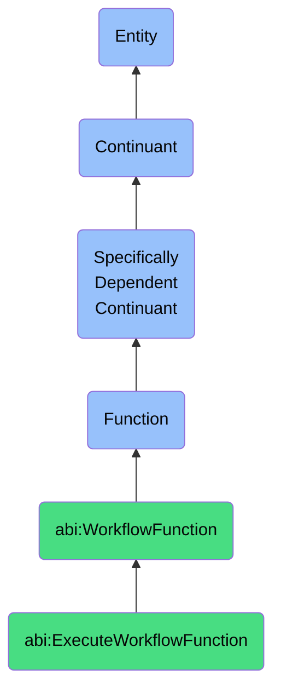

# ExecuteWorkflowFunction

## Definition
An execute workflow function is a specifically dependent continuant that inheres in its bearer, providing the capability to systematically process, coordinate, and complete predefined sequences of operational steps, managing dependencies, handling state transitions, and enforcing business rules to achieve a coherent and controlled execution of complex business processes.

## Hierarchy in BFO


## Ontological Schema (TBox)
```turtle
abi:ExecuteWorkflowFunction a owl:Class ;
  rdfs:subClassOf abi:WorkflowFunction ;
  rdfs:label "Execute Workflow Function" ;
  skos:definition "A function that allows a bearer to run a predefined sequence of steps." .

abi:WorkflowFunction a owl:Class ;
  rdfs:subClassOf bfo:0000034 ;
  rdfs:label "Workflow Function" ;
  skos:definition "A function that enables coordination, execution, or management of operational sequences, data flows, or agent interactions." .

abi:inheres_in a owl:ObjectProperty ;
  rdfs:domain abi:ExecuteWorkflowFunction ;
  rdfs:range abi:WorkflowEngine ;
  rdfs:label "inheres in" .

abi:processes_workflow_definition a owl:ObjectProperty ;
  rdfs:domain abi:ExecuteWorkflowFunction ;
  rdfs:range abi:WorkflowDefinition ;
  rdfs:label "processes workflow definition" .

abi:executes_workflow_step a owl:ObjectProperty ;
  rdfs:domain abi:ExecuteWorkflowFunction ;
  rdfs:range abi:WorkflowStep ;
  rdfs:label "executes workflow step" .

abi:manages_workflow_state a owl:ObjectProperty ;
  rdfs:domain abi:ExecuteWorkflowFunction ;
  rdfs:range abi:WorkflowState ;
  rdfs:label "manages workflow state" .

abi:handles_dependency a owl:ObjectProperty ;
  rdfs:domain abi:ExecuteWorkflowFunction ;
  rdfs:range abi:StepDependency ;
  rdfs:label "handles dependency" .

abi:enforces_business_rule a owl:ObjectProperty ;
  rdfs:domain abi:ExecuteWorkflowFunction ;
  rdfs:range abi:BusinessRule ;
  rdfs:label "enforces business rule" .

abi:processes_workflow_input a owl:ObjectProperty ;
  rdfs:domain abi:ExecuteWorkflowFunction ;
  rdfs:range abi:WorkflowInput ;
  rdfs:label "processes workflow input" .

abi:produces_workflow_output a owl:ObjectProperty ;
  rdfs:domain abi:ExecuteWorkflowFunction ;
  rdfs:range abi:WorkflowOutput ;
  rdfs:label "produces workflow output" .

abi:has_execution_mode a owl:DatatypeProperty ;
  rdfs:domain abi:ExecuteWorkflowFunction ;
  rdfs:range xsd:string ;
  rdfs:label "has execution mode" .

abi:has_error_handling_policy a owl:DatatypeProperty ;
  rdfs:domain abi:ExecuteWorkflowFunction ;
  rdfs:range xsd:string ;
  rdfs:label "has error handling policy" .

abi:has_execution_timeout a owl:DatatypeProperty ;
  rdfs:domain abi:ExecuteWorkflowFunction ;
  rdfs:range xsd:duration ;
  rdfs:label "has execution timeout" .
```

## Ontological Instance (ABox)
```turtle
ex:CampaignLogicAssistantWorkflowFunction a abi:ExecuteWorkflowFunction ;
  rdfs:label "Campaign Logic Assistant Workflow Function" ;
  abi:inheres_in ex:MarketingAutomationAssistant ;
  abi:processes_workflow_definition ex:CampaignWorkflowDefinition, ex:LeadNurturingWorkflowDefinition ;
  abi:executes_workflow_step ex:AudienceSegmentationStep, ex:ContentSelectionStep, ex:ChannelDistributionStep, ex:EngagementTrackingStep ;
  abi:manages_workflow_state ex:CampaignActiveState, ex:LeadQualificationState, ex:FollowupTriggerState ;
  abi:handles_dependency ex:ContentAvailabilityDependency, ex:AudienceReadinessDependency, ex:ChannelRateLimit ;
  abi:enforces_business_rule ex:ContactFrequencyRule, ex:ChannelPreferenceRule, ex:ComplianceRequirementRule ;
  abi:processes_workflow_input ex:CustomerDataInput, ex:CampaignParametersInput, ex:ContentInventoryInput ;
  abi:produces_workflow_output ex:CampaignPerformanceReport, ex:LeadQualificationOutput, ex:EngagementMetrics ;
  abi:has_execution_mode "Scheduled with manual override" ;
  abi:has_error_handling_policy "Retry non-critical steps, alert on critical failures" ;
  abi:has_execution_timeout "P2D"^^xsd:duration .

ex:CustomerOnboardingProcessWorkflowFunction a abi:ExecuteWorkflowFunction ;
  rdfs:label "Customer Onboarding Process Workflow Function" ;
  abi:inheres_in ex:CustomerSuccessSystem ;
  abi:processes_workflow_definition ex:EnterpriseOnboardingDefinition, ex:SMBOnboardingDefinition ;
  abi:executes_workflow_step ex:AccountSetupStep, ex:UserProvisioningStep, ex:InitialTrainingStep, ex:ConfigurationStep, ex:SuccessCheckpointStep ;
  abi:manages_workflow_state ex:ProvisioningState, ex:TrainingState, ex:AdoptionState, ex:CompletionState ;
  abi:handles_dependency ex:ContractActivationDependency, ex:ResourceAvailabilityDependency, ex:StakeholderAvailabilityDependency ;
  abi:enforces_business_rule ex:SLAComplianceRule, ex:EscalationThresholdRule, ex:DocumentationRequirementRule ;
  abi:processes_workflow_input ex:ContractDetailsInput, ex:CustomerProfileInput, ex:ProductConfigurationInput ;
  abi:produces_workflow_output ex:OnboardingStatusReport, ex:TimeToValueMetric, ex:CustomerReadinessScore ;
  abi:has_execution_mode "Sequential with parallel capability" ;
  abi:has_error_handling_policy "Human intervention with guided resolution steps" ;
  abi:has_execution_timeout "P30D"^^xsd:duration .
```

## Related Classes
- **abi:TriggerAgentFunction** - A function that can initiate workflow execution based on specific conditions.
- **abi:BuildKnowledgeGraphFunction** - A function that may be incorporated as a step within executed workflows.
- **abi:WorkflowMonitoringFunction** - A function that tracks and reports on workflow execution progress and performance.
- **abi:WorkflowDesignFunction** - A function that creates and modifies workflow definitions before they are executed.
- **abi:DecisionOrchestratorFunction** - A function that manages decision points within complex workflow executions. 