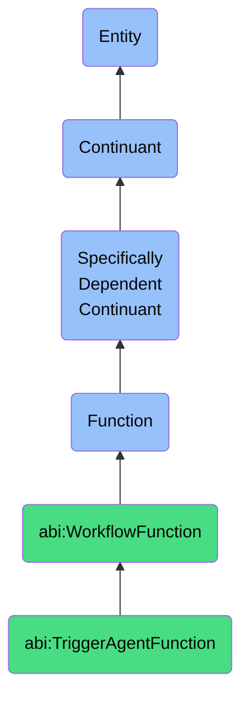

# TriggerAgentFunction

## Definition
A trigger agent function is a specifically dependent continuant that inheres in its bearer, providing the capability to monitor conditions or events and initiate the activation of designated agent processes when predefined criteria are met, serving as a conditional bridge between information states and agent actions within automated workflows.

## Hierarchy in BFO


## Ontological Schema (TBox)
```turtle
abi:TriggerAgentFunction a owl:Class ;
  rdfs:subClassOf abi:WorkflowFunction ;
  rdfs:label "Trigger Agent Function" ;
  skos:definition "A function that initiates or activates another agent based on conditions." .

abi:WorkflowFunction a owl:Class ;
  rdfs:subClassOf bfo:0000034 ;
  rdfs:label "Workflow Function" ;
  skos:definition "A function that enables coordination, execution, or management of operational sequences, data flows, or agent interactions." .

abi:inheres_in a owl:ObjectProperty ;
  rdfs:domain abi:TriggerAgentFunction ;
  rdfs:range abi:TriggerSystem ;
  rdfs:label "inheres in" .

abi:monitors_condition a owl:ObjectProperty ;
  rdfs:domain abi:TriggerAgentFunction ;
  rdfs:range abi:TriggerCondition ;
  rdfs:label "monitors condition" .

abi:evaluates_trigger_rules a owl:ObjectProperty ;
  rdfs:domain abi:TriggerAgentFunction ;
  rdfs:range abi:TriggerRule ;
  rdfs:label "evaluates trigger rules" .

abi:activates_agent a owl:ObjectProperty ;
  rdfs:domain abi:TriggerAgentFunction ;
  rdfs:range abi:TargetAgent ;
  rdfs:label "activates agent" .

abi:passes_context_data a owl:ObjectProperty ;
  rdfs:domain abi:TriggerAgentFunction ;
  rdfs:range abi:ContextData ;
  rdfs:label "passes context data" .

abi:operates_in_environment a owl:ObjectProperty ;
  rdfs:domain abi:TriggerAgentFunction ;
  rdfs:range abi:ExecutionEnvironment ;
  rdfs:label "operates in environment" .

abi:logs_trigger_events a owl:ObjectProperty ;
  rdfs:domain abi:TriggerAgentFunction ;
  rdfs:range abi:TriggerEvent ;
  rdfs:label "logs trigger events" .

abi:supports_workflow a owl:ObjectProperty ;
  rdfs:domain abi:TriggerAgentFunction ;
  rdfs:range abi:AutomatedWorkflow ;
  rdfs:label "supports workflow" .

abi:has_polling_frequency a owl:DatatypeProperty ;
  rdfs:domain abi:TriggerAgentFunction ;
  rdfs:range xsd:duration ;
  rdfs:label "has polling frequency" .

abi:has_condition_complexity a owl:DatatypeProperty ;
  rdfs:domain abi:TriggerAgentFunction ;
  rdfs:range xsd:string ;
  rdfs:label "has condition complexity" .

abi:has_trigger_timeout a owl:DatatypeProperty ;
  rdfs:domain abi:TriggerAgentFunction ;
  rdfs:range xsd:duration ;
  rdfs:label "has trigger timeout" .
```

## Ontological Instance (ABox)
```turtle
ex:SlackPatternMatchingTriggerFunction a abi:TriggerAgentFunction ;
  rdfs:label "Slack Pattern Matching Trigger Function" ;
  abi:inheres_in ex:DataPipelineSystem ;
  abi:monitors_condition ex:SlackMessagePattern, ex:ChannelActivityCondition ;
  abi:evaluates_trigger_rules ex:KeywordMatchRule, ex:UserMentionRule, ex:ChannelSpecificRule ;
  abi:activates_agent ex:DataAnalysisAgent, ex:NotificationAgent ;
  abi:passes_context_data ex:MessageContent, ex:UserContext, ex:ChannelMetadata ;
  abi:operates_in_environment ex:CloudEventProcessingEnvironment ;
  abi:logs_trigger_events ex:TriggerAuditLog, ex:PatternMatchRecord ;
  abi:supports_workflow ex:CustomerSupportWorkflow, ex:AlertResponseWorkflow ;
  abi:has_polling_frequency "PT5S"^^xsd:duration ;
  abi:has_condition_complexity "Regular expression with context awareness" ;
  abi:has_trigger_timeout "PT1M"^^xsd:duration .

ex:DataThresholdMonitoringTriggerFunction a abi:TriggerAgentFunction ;
  rdfs:label "Data Threshold Monitoring Trigger Function" ;
  abi:inheres_in ex:OperationalMonitoringSystem ;
  abi:monitors_condition ex:MetricThresholdCondition, ex:AnomalyDetectionCondition ;
  abi:evaluates_trigger_rules ex:StatisticalDeviationRule, ex:ThresholdBreachRule ;
  abi:activates_agent ex:IncidentResponseAgent, ex:AutoRemediationAgent, ex:NotificationAgent ;
  abi:passes_context_data ex:AffectedMetrics, ex:HistoricalTrends, ex:SystemState ;
  abi:operates_in_environment ex:RealTimeMonitoringEnvironment ;
  abi:logs_trigger_events ex:AlertHistory, ex:TriggerActionRecord ;
  abi:supports_workflow ex:IncidentManagementWorkflow, ex:ServiceRecoveryWorkflow ;
  abi:has_polling_frequency "PT30S"^^xsd:duration ;
  abi:has_condition_complexity "Multivariate threshold with temporal pattern recognition" ;
  abi:has_trigger_timeout "PT5M"^^xsd:duration .
```

## Related Classes
- **abi:BuildKnowledgeGraphFunction** - A function that may be activated by a trigger agent to construct semantic networks.
- **abi:ExecuteWorkflowFunction** - A function that can be initiated by a trigger agent to run predefined sequences.
- **abi:EventListenerFunction** - A specialized function that detects events which may satisfy trigger conditions.
- **abi:ConditionEvaluationFunction** - A function that assesses whether complex criteria are met for triggering.
- **abi:AgentSchedulerFunction** - A function that manages the timing and sequencing of agent activations. 