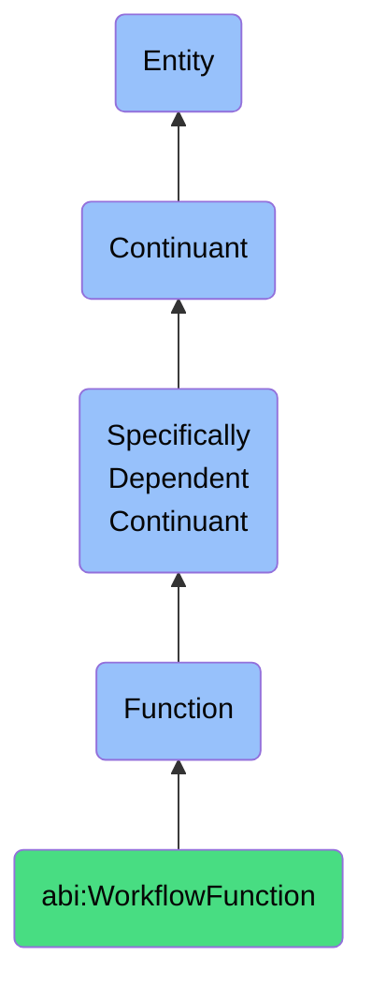

# WorkflowFunction

## Definition
A workflow function is a specifically dependent continuant that inheres in its bearer, providing capabilities to coordinate, execute, transform, or manage sequences of operations, data flows, or agent interactions within structured processes to achieve predefined objectives or maintain system states.

## Hierarchy in BFO


## Ontological Schema (TBox)
```turtle
abi:WorkflowFunction a owl:Class ;
  rdfs:subClassOf bfo:0000034 ;
  rdfs:label "Workflow Function" ;
  skos:definition "A function that enables coordination, execution, or management of operational sequences, data flows, or agent interactions." .

abi:inheres_in a owl:ObjectProperty ;
  rdfs:domain abi:WorkflowFunction ;
  rdfs:range abi:WorkflowCoordinator ;
  rdfs:label "inheres in" .

abi:coordinates_process a owl:ObjectProperty ;
  rdfs:domain abi:WorkflowFunction ;
  rdfs:range abi:WorkflowProcess ;
  rdfs:label "coordinates process" .

abi:follows_execution_rules a owl:ObjectProperty ;
  rdfs:domain abi:WorkflowFunction ;
  rdfs:range abi:ExecutionRule ;
  rdfs:label "follows execution rules" .

abi:transforms_input a owl:ObjectProperty ;
  rdfs:domain abi:WorkflowFunction ;
  rdfs:range abi:WorkflowInput ;
  rdfs:label "transforms input" .

abi:produces_output a owl:ObjectProperty ;
  rdfs:domain abi:WorkflowFunction ;
  rdfs:range abi:WorkflowOutput ;
  rdfs:label "produces output" .

abi:manages_state a owl:ObjectProperty ;
  rdfs:domain abi:WorkflowFunction ;
  rdfs:range abi:SystemState ;
  rdfs:label "manages state" .

abi:interacts_with_agent a owl:ObjectProperty ;
  rdfs:domain abi:WorkflowFunction ;
  rdfs:range abi:WorkflowAgent ;
  rdfs:label "interacts with agent" .

abi:has_execution_pattern a owl:DatatypeProperty ;
  rdfs:domain abi:WorkflowFunction ;
  rdfs:range xsd:string ;
  rdfs:label "has execution pattern" .

abi:has_priority_level a owl:DatatypeProperty ;
  rdfs:domain abi:WorkflowFunction ;
  rdfs:range xsd:integer ;
  rdfs:label "has priority level" .

abi:has_error_handling_strategy a owl:DatatypeProperty ;
  rdfs:domain abi:WorkflowFunction ;
  rdfs:range xsd:string ;
  rdfs:label "has error handling strategy" .
```

## Ontological Instance (ABox)
```turtle
# WorkflowFunction is a parent class with subclasses:
# - abi:TriggerAgentFunction
# - abi:BuildKnowledgeGraphFunction
# - abi:ExecuteWorkflowFunction
# and other workflow-related functions
```

## Related Classes
- **abi:TriggerAgentFunction** - A specialized function for initiating or activating agents based on conditions.
- **abi:BuildKnowledgeGraphFunction** - A specialized function for transforming data into semantic networks.
- **abi:ExecuteWorkflowFunction** - A specialized function for running predefined sequences of steps.
- **abi:MonitorProcessFunction** - A function that tracks the status and performance of workflow execution.
- **abi:OrchestrationFunction** - A function that coordinates multiple workflows across different systems. 