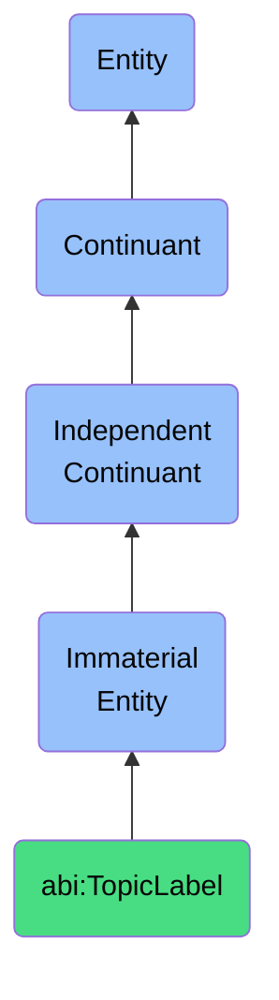

# TopicLabel

## Definition
A topic label is an immaterial entity that links content to a specific semantic domain or subject area, enabling efficient information organization, retrieval, and contextual understanding by establishing thematic connections between information resources and knowledge domains.

## Hierarchy in BFO


## Ontological Schema (TBox)
```turtle
abi:TopicLabel a owl:Class ;
  rdfs:subClassOf bfo:0000141 ;
  rdfs:label "Topic Label" ;
  skos:definition "An immaterial entity that links content to a specific semantic domain or subject area, enabling efficient information organization, retrieval, and contextual understanding by establishing thematic connections between information resources and knowledge domains." .

abi:labels_content a owl:ObjectProperty ;
  rdfs:domain abi:TopicLabel ;
  rdfs:range abi:Content ;
  rdfs:label "labels content" .

abi:references_domain a owl:ObjectProperty ;
  rdfs:domain abi:TopicLabel ;
  rdfs:range abi:KnowledgeDomain ;
  rdfs:label "references domain" .

abi:derived_from_taxonomy a owl:ObjectProperty ;
  rdfs:domain abi:TopicLabel ;
  rdfs:range abi:TopicTaxonomy ;
  rdfs:label "derived from taxonomy" .

abi:assigned_by a owl:ObjectProperty ;
  rdfs:domain abi:TopicLabel ;
  rdfs:range abi:Agent ;
  rdfs:label "assigned by" .

abi:related_to_topic a owl:ObjectProperty ;
  rdfs:domain abi:TopicLabel ;
  rdfs:range abi:TopicLabel ;
  rdfs:label "related to topic" .

abi:has_topic_name a owl:DatatypeProperty ;
  rdfs:domain abi:TopicLabel ;
  rdfs:range xsd:string ;
  rdfs:label "has topic name" .

abi:has_assignment_confidence a owl:DatatypeProperty ;
  rdfs:domain abi:TopicLabel ;
  rdfs:range xsd:decimal ;
  rdfs:label "has assignment confidence" .

abi:has_timestamp a owl:DatatypeProperty ;
  rdfs:domain abi:TopicLabel ;
  rdfs:range xsd:dateTime ;
  rdfs:label "has timestamp" .
```

## Ontological Instance (ABox)
```turtle
ex:RevenueRecognitionTopicLabel a abi:TopicLabel ;
  rdfs:label "Revenue Recognition Topic Label" ;
  abi:labels_content ex:FinancialBlogPost12345, ex:AccountingGuidanceDocument ;
  abi:references_domain ex:FinancialAccountingDomain ;
  abi:derived_from_taxonomy ex:AccountingStandardsTaxonomy ;
  abi:assigned_by ex:ContentTaxonomyAlgorithm ;
  abi:related_to_topic ex:ASC606TopicLabel, ex:ContractAccountingTopicLabel ;
  abi:has_topic_name "Revenue Recognition" ;
  abi:has_assignment_confidence "0.95"^^xsd:decimal ;
  abi:has_timestamp "2023-06-12T15:30:00Z"^^xsd:dateTime .

ex:MachineLearningTopicLabel a abi:TopicLabel ;
  rdfs:label "Machine Learning Topic Label" ;
  abi:labels_content ex:TechnicalWhitepaper, ex:AIConferencePresentationSlides ;
  abi:references_domain ex:ArtificialIntelligenceDomain ;
  abi:derived_from_taxonomy ex:TechnologyFieldsTaxonomy ;
  abi:assigned_by ex:SubjectMatterExpert ;
  abi:related_to_topic ex:DeepLearningTopicLabel, ex:NeuralNetworksTopicLabel ;
  abi:has_topic_name "Machine Learning" ;
  abi:has_assignment_confidence "1.0"^^xsd:decimal ;
  abi:has_timestamp "2023-05-20T09:15:00Z"^^xsd:dateTime .
```

## Related Classes
- **abi:Annotation** - An immaterial entity that provides contextual notes or markers giving additional meaning to content or data elements.
- **abi:Category** - An immaterial entity that serves to classify a bearer within a known, structured set of groupings.
- **abi:KnowledgeDomain** - An immaterial entity that represents a specific field of study or area of expertise characterized by a distinct body of knowledge and methods.
- **abi:Content** - An immaterial entity representing organized information expressed in various media and formats for consumption, storage, or communication. 