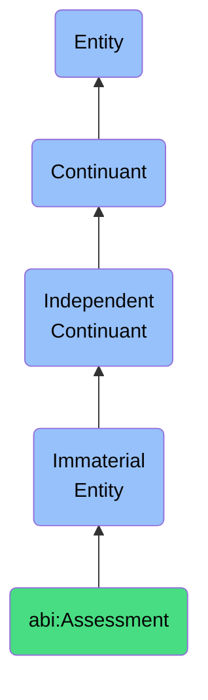

# Assessment

## Definition
An assessment is an immaterial entity that expresses a general evaluative outcome based on specific criteria, standards, or frameworks, providing structured qualitative or categorical judgments about an entity's performance, maturity, conformance, or suitability within a defined context.

## Hierarchy in BFO


## Ontological Schema (TBox)
```turtle
abi:Assessment a owl:Class ;
  rdfs:subClassOf bfo:0000141 ;
  rdfs:label "Assessment" ;
  skos:definition "An immaterial entity that expresses a general evaluative outcome based on specific criteria, standards, or frameworks, providing structured qualitative or categorical judgments about an entity's performance, maturity, conformance, or suitability within a defined context." .

abi:evaluates_entity a owl:ObjectProperty ;
  rdfs:domain abi:Assessment ;
  rdfs:range owl:Thing ;
  rdfs:label "evaluates entity" .

abi:applies_framework a owl:ObjectProperty ;
  rdfs:domain abi:Assessment ;
  rdfs:range abi:AssessmentFramework ;
  rdfs:label "applies framework" .

abi:conducted_by a owl:ObjectProperty ;
  rdfs:domain abi:Assessment ;
  rdfs:range abi:Assessor ;
  rdfs:label "conducted by" .

abi:uses_evidence a owl:ObjectProperty ;
  rdfs:domain abi:Assessment ;
  rdfs:range abi:Evidence ;
  rdfs:label "uses evidence" .

abi:has_finding a owl:ObjectProperty ;
  rdfs:domain abi:Assessment ;
  rdfs:range abi:Finding ;
  rdfs:label "has finding" .

abi:has_recommendation a owl:ObjectProperty ;
  rdfs:domain abi:Assessment ;
  rdfs:range abi:Recommendation ;
  rdfs:label "has recommendation" .

abi:has_outcome_value a owl:DatatypeProperty ;
  rdfs:domain abi:Assessment ;
  rdfs:range xsd:string ;
  rdfs:label "has outcome value" .

abi:has_assessment_date a owl:DatatypeProperty ;
  rdfs:domain abi:Assessment ;
  rdfs:range xsd:date ;
  rdfs:label "has assessment date" .

abi:has_validity_period a owl:DatatypeProperty ;
  rdfs:domain abi:Assessment ;
  rdfs:range xsd:duration ;
  rdfs:label "has validity period" .
```

## Ontological Instance (ABox)
```turtle
ex:DEIReadinessAssessment a abi:Assessment ;
  rdfs:label "DE&I Readiness Assessment" ;
  abi:evaluates_entity ex:CorporateOrganization ;
  abi:applies_framework ex:DEIMaturityModel ;
  abi:conducted_by ex:DiversityConsultant ;
  abi:uses_evidence ex:EmployeeSurveyData, ex:HiringPracticesReview, ex:LeadershipCompositionAnalysis ;
  abi:has_finding ex:LimitedDiversityInLeadershipFinding, ex:StrongRecruitmentPracticesFinding ;
  abi:has_recommendation ex:LeadershipDevelopmentProgram, ex:MentorshipInitiative ;
  abi:has_outcome_value "Mature" ;
  abi:has_assessment_date "2023-05-20"^^xsd:date ;
  abi:has_validity_period "P1Y"^^xsd:duration .

ex:VendorSecurityAssessment a abi:Assessment ;
  rdfs:label "Vendor Security Assessment" ;
  abi:evaluates_entity ex:SoftwareVendor ;
  abi:applies_framework ex:ISO27001Framework, ex:NISTCybersecurityFramework ;
  abi:conducted_by ex:SecurityAuditor ;
  abi:uses_evidence ex:SecurityQuestionnaire, ex:PenerationTestResults, ex:DocumentationReview ;
  abi:has_finding ex:InsufficientAccessControlsFinding, ex:StrongEncryptionPracticesFinding ;
  abi:has_recommendation ex:AccessControlRemediation, ex:MonthlyVulnerabilityScan ;
  abi:has_outcome_value "Conditionally Approved" ;
  abi:has_assessment_date "2023-04-15"^^xsd:date ;
  abi:has_validity_period "P6M"^^xsd:duration .
```

## Related Classes
- **abi:AssessmentFramework** - An immaterial entity that defines a structured approach for evaluating entities against a specific set of criteria, standards, or best practices.
- **abi:ScoreExplanation** - An immaterial entity that provides reasons or rationale behind a given score or assessment.
- **abi:Finding** - An immaterial entity that represents a specific observation or determination made during an evaluation or assessment process.
- **abi:TrustScore** - An immaterial entity that represents a quality reflecting the perceived reliability, credibility, and integrity of a source, agent, or observation. 