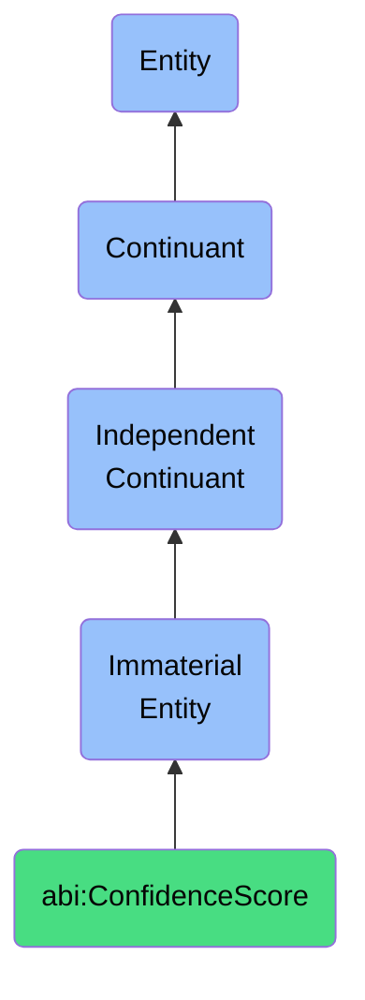

# ConfidenceScore

## Definition
A confidence score is an immaterial entity that expresses the degree of certainty that a system, algorithm, or human reviewer has about an outcome, prediction, or classification, enabling probabilistic reasoning, decision thresholds, and uncertainty quantification within analytical processes.

## Hierarchy in BFO


## Ontological Schema (TBox)
```turtle
abi:ConfidenceScore a owl:Class ;
  rdfs:subClassOf bfo:0000141 ;
  rdfs:label "Confidence Score" ;
  skos:definition "An immaterial entity that expresses the degree of certainty that a system, algorithm, or human reviewer has about an outcome, prediction, or classification, enabling probabilistic reasoning, decision thresholds, and uncertainty quantification within analytical processes." .

abi:applies_to_prediction a owl:ObjectProperty ;
  rdfs:domain abi:ConfidenceScore ;
  rdfs:range abi:Prediction ;
  rdfs:label "applies to prediction" .

abi:generated_by_system a owl:ObjectProperty ;
  rdfs:domain abi:ConfidenceScore ;
  rdfs:range abi:System ;
  rdfs:label "generated by system" .

abi:assigned_by_reviewer a owl:ObjectProperty ;
  rdfs:domain abi:ConfidenceScore ;
  rdfs:range abi:Reviewer ;
  rdfs:label "assigned by reviewer" .

abi:relates_to_classification a owl:ObjectProperty ;
  rdfs:domain abi:ConfidenceScore ;
  rdfs:range abi:Classification ;
  rdfs:label "relates to classification" .

abi:has_statistical_basis a owl:ObjectProperty ;
  rdfs:domain abi:ConfidenceScore ;
  rdfs:range abi:StatisticalMethod ;
  rdfs:label "has statistical basis" .

abi:has_confidence_value a owl:DatatypeProperty ;
  rdfs:domain abi:ConfidenceScore ;
  rdfs:range xsd:decimal ;
  rdfs:label "has confidence value" .

abi:has_confidence_interval a owl:DatatypeProperty ;
  rdfs:domain abi:ConfidenceScore ;
  rdfs:range xsd:string ;
  rdfs:label "has confidence interval" .

abi:exceeds_threshold a owl:DatatypeProperty ;
  rdfs:domain abi:ConfidenceScore ;
  rdfs:range xsd:boolean ;
  rdfs:label "exceeds threshold" .
```

## Ontological Instance (ABox)
```turtle
ex:LeadQualificationConfidence a abi:ConfidenceScore ;
  rdfs:label "Lead Qualification Confidence Score" ;
  abi:applies_to_prediction ex:LeadConversionPrediction ;
  abi:generated_by_system ex:LeadScoringAlgorithm ;
  abi:relates_to_classification ex:QualifiedLeadClassification ;
  abi:has_statistical_basis ex:LogisticRegressionModel ;
  abi:has_confidence_value "0.93"^^xsd:decimal ;
  abi:has_confidence_interval "0.89-0.97" ;
  abi:exceeds_threshold "true"^^xsd:boolean .

ex:DocumentClassificationConfidence a abi:ConfidenceScore ;
  rdfs:label "Document Classification Confidence Score" ;
  abi:applies_to_prediction ex:DocumentCategoryPrediction ;
  abi:generated_by_system ex:NLPClassificationEngine ;
  abi:relates_to_classification ex:LegalDocumentClassification ;
  abi:has_statistical_basis ex:TransformerModelInference ;
  abi:has_confidence_value "0.87"^^xsd:decimal ;
  abi:has_confidence_interval "0.82-0.92" ;
  abi:exceeds_threshold "true"^^xsd:boolean .
```

## Related Classes
- **abi:TrustScore** - An immaterial entity that represents a quality reflecting the perceived reliability, credibility, and integrity of a source, agent, or observation.
- **abi:Prediction** - An immaterial entity that represents a forecasted outcome or state based on data analysis, patterns, or models.
- **abi:Classification** - An immaterial entity that represents the assignment of an entity to a specific category or class based on its features or characteristics.
- **abi:ScoreExplanation** - An immaterial entity that provides reasons or rationale behind a given score or assessment. 