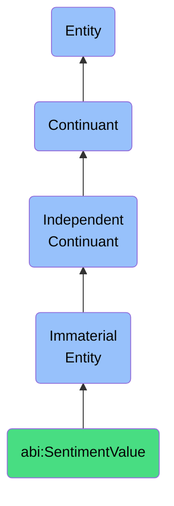

# SentimentValue

## Definition
A sentiment value is an immaterial entity that represents the emotional valence or affective tone expressed within content, conversation, or feedback, enabling the systematic analysis of subjective opinions, attitudes, and emotional responses across various contexts and modalities.

## Hierarchy in BFO


## Ontological Schema (TBox)
```turtle
abi:SentimentValue a owl:Class ;
  rdfs:subClassOf bfo:0000141 ;
  rdfs:label "Sentiment Value" ;
  skos:definition "An immaterial entity that represents the emotional valence or affective tone expressed within content, conversation, or feedback, enabling the systematic analysis of subjective opinions, attitudes, and emotional responses across various contexts and modalities." .

abi:analyzes_content a owl:ObjectProperty ;
  rdfs:domain abi:SentimentValue ;
  rdfs:range abi:Content ;
  rdfs:label "analyzes content" .

abi:derived_from_feedback a owl:ObjectProperty ;
  rdfs:domain abi:SentimentValue ;
  rdfs:range abi:Feedback ;
  rdfs:label "derived from feedback" .

abi:extracted_by_algorithm a owl:ObjectProperty ;
  rdfs:domain abi:SentimentValue ;
  rdfs:range abi:SentimentAnalysisAlgorithm ;
  rdfs:label "extracted by algorithm" .

abi:detected_emotions a owl:ObjectProperty ;
  rdfs:domain abi:SentimentValue ;
  rdfs:range abi:Emotion ;
  rdfs:label "detected emotions" .

abi:has_valence_type a owl:DatatypeProperty ;
  rdfs:domain abi:SentimentValue ;
  rdfs:range xsd:string ;
  rdfs:label "has valence type" .

abi:has_intensity_score a owl:DatatypeProperty ;
  rdfs:domain abi:SentimentValue ;
  rdfs:range xsd:decimal ;
  rdfs:label "has intensity score" .

abi:has_subjectivity_measure a owl:DatatypeProperty ;
  rdfs:domain abi:SentimentValue ;
  rdfs:range xsd:decimal ;
  rdfs:label "has subjectivity measure" .

abi:has_confidence_level a owl:DatatypeProperty ;
  rdfs:domain abi:SentimentValue ;
  rdfs:range xsd:decimal ;
  rdfs:label "has confidence level" .
```

## Ontological Instance (ABox)
```turtle
ex:UserCommentSentiment a abi:SentimentValue ;
  rdfs:label "User Comment Sentiment Value" ;
  abi:analyzes_content ex:CustomerFeedbackComment12345 ;
  abi:derived_from_feedback ex:ProductReviewSubmission ;
  abi:extracted_by_algorithm ex:NLPSentimentAnalyzer ;
  abi:detected_emotions ex:Frustration, ex:Disappointment ;
  abi:has_valence_type "Negative" ;
  abi:has_intensity_score "0.72"^^xsd:decimal ;
  abi:has_subjectivity_measure "0.85"^^xsd:decimal ;
  abi:has_confidence_level "0.91"^^xsd:decimal .

ex:SupportCallSentiment a abi:SentimentValue ;
  rdfs:label "Customer Support Call Sentiment Value" ;
  abi:analyzes_content ex:SupportCallTranscript78901 ;
  abi:derived_from_feedback ex:CustomerCallInteraction ;
  abi:extracted_by_algorithm ex:VoiceToneAnalyzer ;
  abi:detected_emotions ex:Satisfaction, ex:Relief ;
  abi:has_valence_type "Positive" ;
  abi:has_intensity_score "0.68"^^xsd:decimal ;
  abi:has_subjectivity_measure "0.62"^^xsd:decimal ;
  abi:has_confidence_level "0.88"^^xsd:decimal .
```

## Related Classes
- **abi:Content** - An immaterial entity that represents organized information, data, or creative work expressed in various mediums and formats.
- **abi:Feedback** - An immaterial entity that captures input, response, or evaluation provided by individuals regarding a product, service, or experience.
- **abi:Emotion** - An immaterial entity that represents a specific affective state or feeling characterized by distinctive psychological and physiological responses.
- **abi:ConfidenceScore** - An immaterial entity that expresses the system or reviewer certainty about an outcome or classification. 