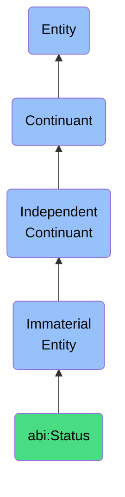

# Status

## Definition
A status is an immaterial entity that denotes the current lifecycle state or condition of an object, process, or entity, providing a standardized reference point for tracking progression, identifying operational context, and determining appropriate actions within workflows and systems.

## Hierarchy in BFO


## Ontological Schema (TBox)
```turtle
abi:Status a owl:Class ;
  rdfs:subClassOf bfo:0000141 ;
  rdfs:label "Status" ;
  skos:definition "An immaterial entity that denotes the current lifecycle state or condition of an object, process, or entity, providing a standardized reference point for tracking progression, identifying operational context, and determining appropriate actions within workflows and systems." .

abi:applies_to_entity a owl:ObjectProperty ;
  rdfs:domain abi:Status ;
  rdfs:range owl:Thing ;
  rdfs:label "applies to entity" .

abi:belongs_to_workflow a owl:ObjectProperty ;
  rdfs:domain abi:Status ;
  rdfs:range abi:Workflow ;
  rdfs:label "belongs to workflow" .

abi:follows_status a owl:ObjectProperty ;
  rdfs:domain abi:Status ;
  rdfs:range abi:Status ;
  rdfs:label "follows status" .

abi:precedes_status a owl:ObjectProperty ;
  rdfs:domain abi:Status ;
  rdfs:range abi:Status ;
  rdfs:label "precedes status" .

abi:triggers_action a owl:ObjectProperty ;
  rdfs:domain abi:Status ;
  rdfs:range abi:Action ;
  rdfs:label "triggers action" .

abi:has_status_value a owl:DatatypeProperty ;
  rdfs:domain abi:Status ;
  rdfs:range xsd:string ;
  rdfs:label "has status value" .

abi:has_timestamp a owl:DatatypeProperty ;
  rdfs:domain abi:Status ;
  rdfs:range xsd:dateTime ;
  rdfs:label "has timestamp" .

abi:has_duration a owl:DatatypeProperty ;
  rdfs:domain abi:Status ;
  rdfs:range xsd:duration ;
  rdfs:label "has duration" .

abi:requires_attention a owl:DatatypeProperty ;
  rdfs:domain abi:Status ;
  rdfs:range xsd:boolean ;
  rdfs:label "requires attention" .
```

## Ontological Instance (ABox)
```turtle
ex:ReportUnderReviewStatus a abi:Status ;
  rdfs:label "Report Under Review Status" ;
  abi:applies_to_entity ex:QuarterlyFinancialReport ;
  abi:belongs_to_workflow ex:ReportingApprovalWorkflow ;
  abi:follows_status ex:ReportDraftStatus ;
  abi:precedes_status ex:ReportApprovedStatus ;
  abi:triggers_action ex:SendReviewNotification, ex:CreateReviewTask ;
  abi:has_status_value "Under Review" ;
  abi:has_timestamp "2023-06-10T09:30:00Z"^^xsd:dateTime ;
  abi:has_duration "P5D"^^xsd:duration ;
  abi:requires_attention "true"^^xsd:boolean .

ex:OrderFulfilledStatus a abi:Status ;
  rdfs:label "Order Fulfilled Status" ;
  abi:applies_to_entity ex:CustomerOrder12345 ;
  abi:belongs_to_workflow ex:OrderFulfillmentWorkflow ;
  abi:follows_status ex:OrderProcessingStatus ;
  abi:precedes_status ex:OrderDeliveredStatus ;
  abi:triggers_action ex:SendFulfillmentNotification, ex:UpdateInventory ;
  abi:has_status_value "Fulfilled" ;
  abi:has_timestamp "2023-06-15T14:45:00Z"^^xsd:dateTime ;
  abi:has_duration "PT3H"^^xsd:duration ;
  abi:requires_attention "false"^^xsd:boolean .
```

## Related Classes
- **abi:Workflow** - An immaterial entity that represents a defined sequence of operations, steps, or activities to achieve a specific outcome or goal.
- **abi:LifecycleSegment** - An immaterial entity that identifies a specific stretch of time or state within a content, contract, or asset lifecycle.
- **abi:WorkflowStage** - An immaterial entity that delineates a distinct phase within a broader business or operational process.
- **abi:Assessment** - An immaterial entity that expresses a general evaluative outcome based on specific criteria. 