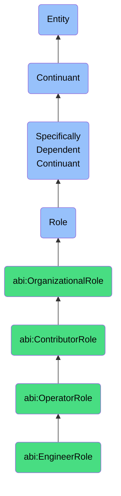

# EngineerRole

## Definition
An engineer role is a specifically dependent continuant that an agent bears when engaged in the design, development, implementation, and maintenance of technical systems and solutions, characterized by specialized technical knowledge, problem-solving skills, and the application of engineering principles to create, modify, and optimize systems, products, or processes.

## Hierarchy in BFO


## Ontological Schema (TBox)
```turtle
abi:EngineerRole a owl:Class ;
  rdfs:subClassOf abi:OperatorRole ;
  rdfs:label "Engineer Role" ;
  skos:definition "A role that an agent bears when engaged in the design, development, implementation, and maintenance of technical systems and solutions." .

abi:OperatorRole a owl:Class ;
  rdfs:subClassOf abi:ContributorRole ;
  rdfs:label "Operator Role" ;
  skos:definition "A contributor role focused on executing specific operational functions with specialized skills in a particular domain." .

abi:ContributorRole a owl:Class ;
  rdfs:subClassOf bfo:0000023 ;
  rdfs:label "Contributor Role" ;
  skos:definition "An organizational role focused on specialized individual work rather than management or leadership responsibilities." .

abi:has_bearer a owl:ObjectProperty ;
  rdfs:domain abi:EngineerRole ;
  rdfs:range abi:Agent ;
  rdfs:label "has bearer" .

abi:realized_in a owl:ObjectProperty ;
  rdfs:domain abi:EngineerRole ;
  rdfs:range abi:EngineeringProcess ;
  rdfs:label "realized in" .

abi:has_specialization a owl:ObjectProperty ;
  rdfs:domain abi:EngineerRole ;
  rdfs:range abi:TechnicalSpecialization ;
  rdfs:label "has specialization" .

abi:works_on_project a owl:ObjectProperty ;
  rdfs:domain abi:EngineerRole ;
  rdfs:range abi:Project ;
  rdfs:label "works on project" .

abi:creates_technical_artifact a owl:ObjectProperty ;
  rdfs:domain abi:EngineerRole ;
  rdfs:range abi:TechnicalArtifact ;
  rdfs:label "creates technical artifact" .

abi:reports_to a owl:ObjectProperty ;
  rdfs:domain abi:EngineerRole ;
  rdfs:range abi:TeamLeadRole ;
  rdfs:label "reports to" .

abi:applies_technical_knowledge a owl:ObjectProperty ;
  rdfs:domain abi:EngineerRole ;
  rdfs:range abi:TechnicalKnowledge ;
  rdfs:label "applies technical knowledge" .

abi:has_experience_level a owl:DatatypeProperty ;
  rdfs:domain abi:EngineerRole ;
  rdfs:range xsd:string ;
  rdfs:label "has experience level" .

abi:has_role_start_date a owl:DatatypeProperty ;
  rdfs:domain abi:EngineerRole ;
  rdfs:range xsd:date ;
  rdfs:label "has role start date" .
```

## Ontological Instance (ABox)
```turtle
ex:AshleySoftwareEngineerRole a abi:EngineerRole ;
  rdfs:label "Ashley's Software Engineer Role" ;
  abi:has_bearer ex:AshleyPerson ;
  abi:realized_in ex:BackendDevelopmentProcess, ex:APIDesignProcess ;
  abi:has_specialization ex:BackendDevelopment, ex:CloudArchitecture ;
  abi:works_on_project ex:CustomerDataPlatformProject ;
  abi:creates_technical_artifact ex:APIEndpoint, ex:DatabaseSchema, ex:MicroserviceComponent ;
  abi:reports_to ex:BackendTeamLeadRole ;
  abi:applies_technical_knowledge ex:JavaScriptKnowledge, ex:NodeJSKnowledge, ex:PostgreSQLKnowledge ;
  abi:has_experience_level "Senior" ;
  abi:has_role_start_date "2020-03-15"^^xsd:date .

ex:MiguelMLEngineerRole a abi:EngineerRole ;
  rdfs:label "Miguel's Machine Learning Engineer Role" ;
  abi:has_bearer ex:MiguelPerson ;
  abi:realized_in ex:ModelTrainingProcess, ex:ModelDeploymentProcess ;
  abi:has_specialization ex:MachineLearning, ex:DeepLearning, ex:ComputerVision ;
  abi:works_on_project ex:VisualInspectionAIProject ;
  abi:creates_technical_artifact ex:MLModel, ex:DataPipeline, ex:ModelTrainingScript ;
  abi:reports_to ex:AITeamLeadRole ;
  abi:applies_technical_knowledge ex:PythonKnowledge, ex:TensorFlowKnowledge, ex:PyTorchKnowledge ;
  abi:has_experience_level "Mid-level" ;
  abi:has_role_start_date "2021-11-01"^^xsd:date .
```

## Related Classes
- **abi:TeamLeadRole** - A management role responsible for leading technical teams and individual contributors.
- **abi:AnalystRole** - A contributor role focused on data analysis and insight generation.
- **abi:ProductManagerRole** - A role focused on defining product vision and translating it into technical requirements.
- **abi:QualityAssuranceRole** - A role focused on testing and quality verification of technical solutions. 