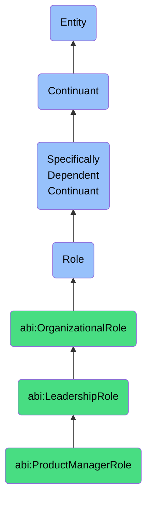

# ProductManagerRole

## Definition
A product manager role is a specifically dependent continuant that an agent bears when engaged in the strategic planning, development, and lifecycle management of products or services, acting as the nexus between business strategy, user needs, and technical implementation to deliver market value.

## Hierarchy in BFO


## Ontological Schema (TBox)
```turtle
abi:ProductManagerRole a owl:Class ;
  rdfs:subClassOf bfo:0000023 ;
  rdfs:label "Product Manager Role" ;
  skos:definition "A role that an agent bears when responsible for defining product strategy, roadmap, and feature prioritization to deliver solutions that meet market needs and business objectives." .

abi:LeadershipRole a owl:Class ;
  rdfs:subClassOf bfo:0000023 ;
  rdfs:label "Leadership Role" ;
  skos:definition "An organizational role that involves guiding vision, strategy and cross-functional coordination beyond direct team management." .

abi:has_bearer a owl:ObjectProperty ;
  rdfs:domain abi:ProductManagerRole ;
  rdfs:range abi:Agent ;
  rdfs:label "has bearer" .

abi:realized_in a owl:ObjectProperty ;
  rdfs:domain abi:ProductManagerRole ;
  rdfs:range abi:ProductDevelopmentProcess ;
  rdfs:label "realized in" .

abi:manages_product a owl:ObjectProperty ;
  rdfs:domain abi:ProductManagerRole ;
  rdfs:range abi:Product ;
  rdfs:label "manages product" .

abi:defines_product_strategy a owl:ObjectProperty ;
  rdfs:domain abi:ProductManagerRole ;
  rdfs:range abi:ProductStrategy ;
  rdfs:label "defines product strategy" .

abi:prioritizes_features a owl:ObjectProperty ;
  rdfs:domain abi:ProductManagerRole ;
  rdfs:range abi:ProductFeature ;
  rdfs:label "prioritizes features" .

abi:collaborates_with a owl:ObjectProperty ;
  rdfs:domain abi:ProductManagerRole ;
  rdfs:range abi:OrganizationalRole ;
  rdfs:label "collaborates with" .

abi:reports_to a owl:ObjectProperty ;
  rdfs:domain abi:ProductManagerRole ;
  rdfs:range abi:DepartmentManagerRole ;
  rdfs:label "reports to" .

abi:has_target_market a owl:ObjectProperty ;
  rdfs:domain abi:ProductManagerRole ;
  rdfs:range abi:Market ;
  rdfs:label "has target market" .

abi:uses_product_tool a owl:ObjectProperty ;
  rdfs:domain abi:ProductManagerRole ;
  rdfs:range abi:ProductManagementTool ;
  rdfs:label "uses product tool" .

abi:has_seniority_level a owl:DatatypeProperty ;
  rdfs:domain abi:ProductManagerRole ;
  rdfs:range xsd:string ;
  rdfs:label "has seniority level" .

abi:has_role_start_date a owl:DatatypeProperty ;
  rdfs:domain abi:ProductManagerRole ;
  rdfs:range xsd:date ;
  rdfs:label "has role start date" .
```

## Ontological Instance (ABox)
```turtle
ex:ElenaProductManagerRole a abi:ProductManagerRole ;
  rdfs:label "Elena's Product Manager Role" ;
  abi:has_bearer ex:ElenaPerson ;
  abi:realized_in ex:MobileAppDevelopmentProcess, ex:ProductBacklogRefinementProcess ;
  abi:manages_product ex:EnterpriseAnalyticsPlatform ;
  abi:defines_product_strategy ex:AnalyticsPlatformStrategy2023 ;
  abi:prioritizes_features ex:RealTimeDataVisualizationFeature, ex:CustomDashboardFeature, ex:APIIntegrationFeature ;
  abi:collaborates_with ex:EngineeringTeamLeadRole, ex:UXDesignerRole, ex:MarketingManagerRole, ex:SalesDirectorRole ;
  abi:reports_to ex:ProductDepartmentManagerRole ;
  abi:has_target_market ex:EnterpriseDataAnalyticsMarket, ex:MidMarketBusinessIntelligenceMarket ;
  abi:uses_product_tool ex:JiraProductTool, ex:ProductPlanTool, ex:UserResearchPlatform ;
  abi:has_seniority_level "Senior" ;
  abi:has_role_start_date "2020-02-10"^^xsd:date .

ex:MarcusProductManagerRole a abi:ProductManagerRole ;
  rdfs:label "Marcus's Product Manager Role" ;
  abi:has_bearer ex:MarcusPerson ;
  abi:realized_in ex:E-commercePlatformDevelopmentProcess, ex:MarketRequirementsGatheringProcess ;
  abi:manages_product ex:ConsumerShoppingApp ;
  abi:defines_product_strategy ex:MobileFirstStrategy2023 ;
  abi:prioritizes_features ex:OneClickCheckoutFeature, ex:PersonalizedRecommendationsFeature, ex:SocialSharingFeature ;
  abi:collaborates_with ex:MobileDevTeamLeadRole, ex:DataAnalystRole, ex:BrandMarketingRole ;
  abi:reports_to ex:ConsumerProductsManagerRole ;
  abi:has_target_market ex:RetailConsumerMarket, ex:DigitalNativeShoppersMarket ;
  abi:uses_product_tool ex:AsanaTool, ex:MixpanelAnalyticsTool, ex:FigmaPrototypingTool ;
  abi:has_seniority_level "Mid-level" ;
  abi:has_role_start_date "2021-08-05"^^xsd:date .
```

## Related Classes
- **abi:EngineerRole** - A technical role that implements the product features and solutions defined by product managers.
- **abi:AnalystRole** - A role that provides data insights to inform product decisions and measure product performance.
- **abi:DepartmentManagerRole** - A management role that oversees product management functions and typically supervises product managers.
- **abi:TeamLeadRole** - A leadership role focused on managing specific teams that collaborate with product managers.
- **abi:UXDesignerRole** - A specialized role focused on designing the user experience of products managed by product managers. 