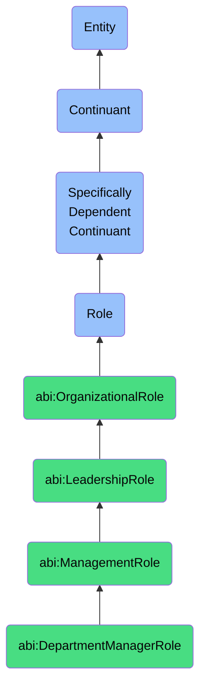

# DepartmentManagerRole

## Definition
A department manager role is a specifically dependent continuant that an agent bears when responsible for leading a functional department within an organization, including strategic planning, resource allocation, staff management, and operational execution to achieve departmental objectives aligned with organizational goals.

## Hierarchy in BFO


## Ontological Schema (TBox)
```turtle
abi:DepartmentManagerRole a owl:Class ;
  rdfs:subClassOf abi:ManagementRole ;
  rdfs:label "Department Manager Role" ;
  skos:definition "A role that an agent bears when responsible for leading a functional department or business unit, including strategic planning, budgeting, and personnel management to achieve organizational objectives." .

abi:ManagementRole a owl:Class ;
  rdfs:subClassOf abi:LeadershipRole ;
  rdfs:label "Management Role" ;
  skos:definition "A leadership role that involves planning, organizing, directing, and controlling resources to achieve organizational objectives." .

abi:has_bearer a owl:ObjectProperty ;
  rdfs:domain abi:DepartmentManagerRole ;
  rdfs:range abi:Agent ;
  rdfs:label "has bearer" .

abi:manages_department a owl:ObjectProperty ;
  rdfs:domain abi:DepartmentManagerRole ;
  rdfs:range abi:Department ;
  rdfs:label "manages department" .

abi:reports_to a owl:ObjectProperty ;
  rdfs:domain abi:DepartmentManagerRole ;
  rdfs:range abi:VicePresidentRole ;
  rdfs:label "reports to" .

abi:supervises a owl:ObjectProperty ;
  rdfs:domain abi:DepartmentManagerRole ;
  rdfs:range abi:TeamLeadRole ;
  rdfs:label "supervises" .

abi:manages_budget a owl:ObjectProperty ;
  rdfs:domain abi:DepartmentManagerRole ;
  rdfs:range abi:Budget ;
  rdfs:label "manages budget" .

abi:establishes_policy a owl:ObjectProperty ;
  rdfs:domain abi:DepartmentManagerRole ;
  rdfs:range abi:DepartmentalPolicy ;
  rdfs:label "establishes policy" .

abi:develops_strategy a owl:ObjectProperty ;
  rdfs:domain abi:DepartmentManagerRole ;
  rdfs:range abi:DepartmentStrategy ;
  rdfs:label "develops strategy" .

abi:responsible_for_outcome a owl:ObjectProperty ;
  rdfs:domain abi:DepartmentManagerRole ;
  rdfs:range abi:BusinessOutcome ;
  rdfs:label "responsible for outcome" .

abi:participates_in a owl:ObjectProperty ;
  rdfs:domain abi:DepartmentManagerRole ;
  rdfs:range abi:ManagementProcess ;
  rdfs:label "participates in" .

abi:has_authority_level a owl:DatatypeProperty ;
  rdfs:domain abi:DepartmentManagerRole ;
  rdfs:range xsd:string ;
  rdfs:label "has authority level" .

abi:has_department_size a owl:DatatypeProperty ;
  rdfs:domain abi:DepartmentManagerRole ;
  rdfs:range xsd:integer ;
  rdfs:label "has department size" .

abi:has_role_start_date a owl:DatatypeProperty ;
  rdfs:domain abi:DepartmentManagerRole ;
  rdfs:range xsd:date ;
  rdfs:label "has role start date" .
```

## Ontological Instance (ABox)
```turtle
ex:JenniferMarketingDirectorRole a abi:DepartmentManagerRole ;
  rdfs:label "Jennifer's Marketing Director Role" ;
  abi:has_bearer ex:JenniferPerson ;
  abi:manages_department ex:MarketingDepartment ;
  abi:reports_to ex:ChiefMarketingOfficerRole ;
  abi:supervises ex:DigitalMarketingTeamLeadRole, ex:BrandManagementTeamLeadRole, ex:ContentStrategyTeamLeadRole ;
  abi:manages_budget ex:MarketingAnnualBudget2023 ;
  abi:establishes_policy ex:BrandGuidelinesPolicy, ex:MarketingApprovalPolicy ;
  abi:develops_strategy ex:GlobalMarketExpansionStrategy, ex:DigitalTransformationStrategy ;
  abi:responsible_for_outcome ex:MarketShareGrowthOutcome, ex:BrandAwarenessOutcome ;
  abi:participates_in ex:QuarterlyStrategyReviewProcess, ex:AnnualBudgetingProcess ;
  abi:has_authority_level "Director" ;
  abi:has_department_size "27"^^xsd:integer ;
  abi:has_role_start_date "2019-04-15"^^xsd:date .

ex:MichaelITManagerRole a abi:DepartmentManagerRole ;
  rdfs:label "Michael's IT Department Manager Role" ;
  abi:has_bearer ex:MichaelPerson ;
  abi:manages_department ex:InformationTechnologyDepartment ;
  abi:reports_to ex:ChiefTechnologyOfficerRole ;
  abi:supervises ex:InfrastructureTeamLeadRole, ex:ApplicationDevelopmentTeamLeadRole, ex:ITSupportTeamLeadRole ;
  abi:manages_budget ex:ITOperationalBudget2023, ex:ITCapitalExpensesBudget2023 ;
  abi:establishes_policy ex:DataSecurityPolicy, ex:DisasterRecoveryPolicy, ex:AcceptableUsePolicy ;
  abi:develops_strategy ex:CloudMigrationStrategy, ex:DigitalWorkplaceStrategy ;
  abi:responsible_for_outcome ex:SystemUptimeOutcome, ex:CyberSecurityComplianceOutcome, ex:TechnologyModernizationOutcome ;
  abi:participates_in ex:TechnologySteeringCommitteeProcess, ex:DigitalTransformationInitiative ;
  abi:has_authority_level "Senior Manager" ;
  abi:has_department_size "42"^^xsd:integer ;
  abi:has_role_start_date "2020-08-01"^^xsd:date .
```

## Related Classes
- **abi:VicePresidentRole** - A senior executive role that typically oversees multiple department managers and is responsible for divisional strategy and execution.
- **abi:TeamLeadRole** - A management role that reports to department managers and is responsible for leading specific teams or functions within a department.
- **abi:ProductManagerRole** - A role focused on product development and management that often collaborates with and may report to department managers.
- **abi:ProjectManagerRole** - A role responsible for managing specific projects that cuts across departments and often coordinates with department managers.
- **abi:HumanResourceManagerRole** - A specialized department manager role focused on personnel management, organizational development, and employee relations. 