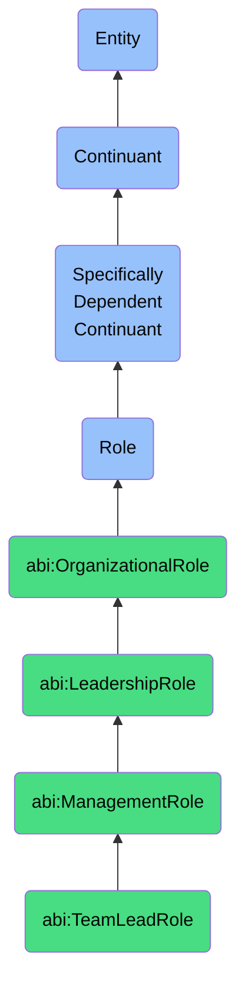

# TeamLeadRole

## Definition
A team lead role is a specifically dependent continuant that an agent bears when responsible for coordinating and supervising a functional team within a department, including day-to-day operational leadership, task assignment, performance monitoring, and technical guidance to achieve team objectives while serving as the primary liaison between team members and higher management.

## Hierarchy in BFO


## Ontological Schema (TBox)
```turtle
abi:TeamLeadRole a owl:Class ;
  rdfs:subClassOf abi:ManagementRole ;
  rdfs:label "Team Lead Role" ;
  skos:definition "A role that an agent bears when responsible for directing and coordinating a functional team, including task assignment, skill development, performance monitoring, and serving as the primary liaison between team members and department management." .

abi:has_bearer a owl:ObjectProperty ;
  rdfs:domain abi:TeamLeadRole ;
  rdfs:range abi:Agent ;
  rdfs:label "has bearer" .

abi:manages_team a owl:ObjectProperty ;
  rdfs:domain abi:TeamLeadRole ;
  rdfs:range abi:Team ;
  rdfs:label "manages team" .

abi:reports_to a owl:ObjectProperty ;
  rdfs:domain abi:TeamLeadRole ;
  rdfs:range abi:DepartmentManagerRole ;
  rdfs:label "reports to" .

abi:supervises a owl:ObjectProperty ;
  rdfs:domain abi:TeamLeadRole ;
  rdfs:range abi:IndividualContributorRole ;
  rdfs:label "supervises" .

abi:coordinates_work a owl:ObjectProperty ;
  rdfs:domain abi:TeamLeadRole ;
  rdfs:range abi:WorkActivity ;
  rdfs:label "coordinates work" .

abi:facilitates_process a owl:ObjectProperty ;
  rdfs:domain abi:TeamLeadRole ;
  rdfs:range abi:TeamProcess ;
  rdfs:label "facilitates process" .

abi:monitors_performance a owl:ObjectProperty ;
  rdfs:domain abi:TeamLeadRole ;
  rdfs:range abi:TeamPerformanceMetric ;
  rdfs:label "monitors performance" .

abi:provides_feedback a owl:ObjectProperty ;
  rdfs:domain abi:TeamLeadRole ;
  rdfs:range abi:PerformanceFeedback ;
  rdfs:label "provides feedback" .

abi:implements_directive a owl:ObjectProperty ;
  rdfs:domain abi:TeamLeadRole ;
  rdfs:range abi:ManagementDirective ;
  rdfs:label "implements directive" .

abi:has_team_size a owl:DatatypeProperty ;
  rdfs:domain abi:TeamLeadRole ;
  rdfs:range xsd:integer ;
  rdfs:label "has team size" .

abi:has_technical_expertise a owl:DatatypeProperty ;
  rdfs:domain abi:TeamLeadRole ;
  rdfs:range xsd:string ;
  rdfs:label "has technical expertise" .

abi:has_role_start_date a owl:DatatypeProperty ;
  rdfs:domain abi:TeamLeadRole ;
  rdfs:range xsd:date ;
  rdfs:label "has role start date" .
```

## Ontological Instance (ABox)
```turtle
ex:SarahDevTeamLeadRole a abi:TeamLeadRole ;
  rdfs:label "Sarah's Frontend Development Team Lead Role" ;
  abi:has_bearer ex:SarahPerson ;
  abi:manages_team ex:FrontendDevelopmentTeam ;
  abi:reports_to ex:SoftwareDevelopmentManagerRole ;
  abi:supervises ex:FrontendDeveloperRole1, ex:FrontendDeveloperRole2, ex:FrontendDeveloperRole3, ex:UIDesignerRole ;
  abi:coordinates_work ex:UserInterfaceDevelopmentActivity, ex:ResponsiveDesignImplementationActivity ;
  abi:facilitates_process ex:DailyStandupProcess, ex:SprintPlanningProcess, ex:CodeReviewProcess ;
  abi:monitors_performance ex:SprintVelocityMetric, ex:CodeQualityMetric, ex:DeliveryTimeMetric ;
  abi:provides_feedback ex:BiweeklyTeamMemberFeedback, ex:CodeReviewFeedback ;
  abi:implements_directive ex:FrontendArchitectureStandardsDirective, ex:AccessibilityComplianceDirective ;
  abi:has_team_size "5"^^xsd:integer ;
  abi:has_technical_expertise "JavaScript, React, CSS, UI/UX Design" ;
  abi:has_role_start_date "2021-03-15"^^xsd:date .

ex:CarlosOperationsTeamLeadRole a abi:TeamLeadRole ;
  rdfs:label "Carlos's Operations Team Lead Role" ;
  abi:has_bearer ex:CarlosPerson ;
  abi:manages_team ex:WarehouseOperationsTeam ;
  abi:reports_to ex:SupplyChainManagerRole ;
  abi:supervises ex:InventorySpecialistRole1, ex:InventorySpecialistRole2, ex:ShippingCoordinatorRole, ex:ReceivingClerkRole ;
  abi:coordinates_work ex:InventoryManagementActivity, ex:OrderFulfillmentActivity, ex:WarehouseOptimizationActivity ;
  abi:facilitates_process ex:ShiftHandoverProcess, ex:InventoryReconciliationProcess, ex:SafetyComplianceProcess ;
  abi:monitors_performance ex:OrderAccuracyMetric, ex:InventoryTurnoverMetric, ex:FulfillmentTimeMetric ;
  abi:provides_feedback ex:MonthlyPerformanceReview, ex:SafetyProceduresFeedback ;
  abi:implements_directive ex:InventoryControlProceduresDirective, ex:WorkplaceHealthAndSafetyDirective ;
  abi:has_team_size "7"^^xsd:integer ;
  abi:has_technical_expertise "Inventory Management, Supply Chain Operations, Warehouse Management Systems" ;
  abi:has_role_start_date "2020-07-01"^^xsd:date .
```

## Related Classes
- **abi:DepartmentManagerRole** - A management role that oversees multiple teams and is responsible for departmental strategy and resource allocation.
- **abi:VicePresidentRole** - A senior executive role that typically oversees multiple departments and establishes divisional strategy.
- **abi:IndividualContributorRole** - A role focused on performing specific tasks and activities rather than managing people.
- **abi:ProjectLeadRole** - A role responsible for leading cross-functional project teams that may include team members from different functional areas.
- **abi:MentorRole** - A role focused on guiding and developing less experienced team members, often performed alongside team lead responsibilities. 