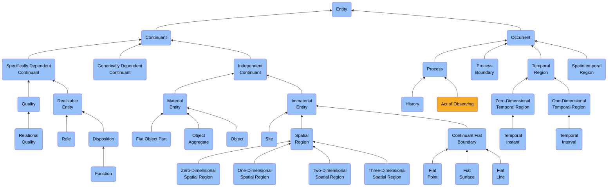
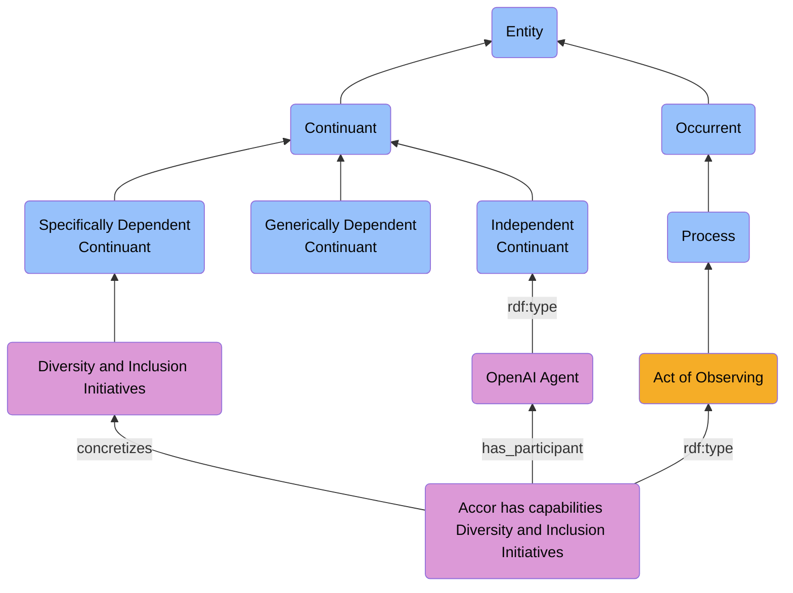

# Act of Observing

## Hierarchy Representation




## Class & subClassOf

```turtle
abi:ActofObserving a owl:Class ;
    rdfs:subClassOf abi:ont00000300 ;
    rdfs:comment "An act of observing is an act of perceiving, which is an act of observing."@en ;
    rdfs:label "Act of Observing"@en ;
    skos:definition "An act of observing is an act of perceiving, which is an act of observing."@en .
```

## Object Properties & subPropertyOf

