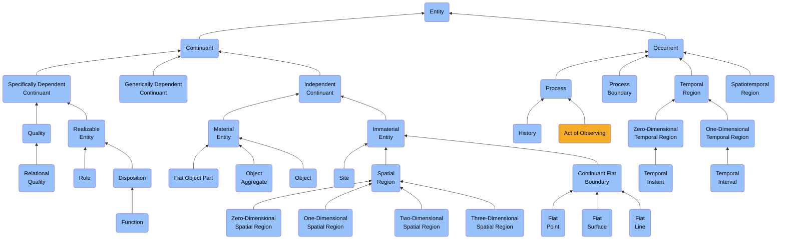
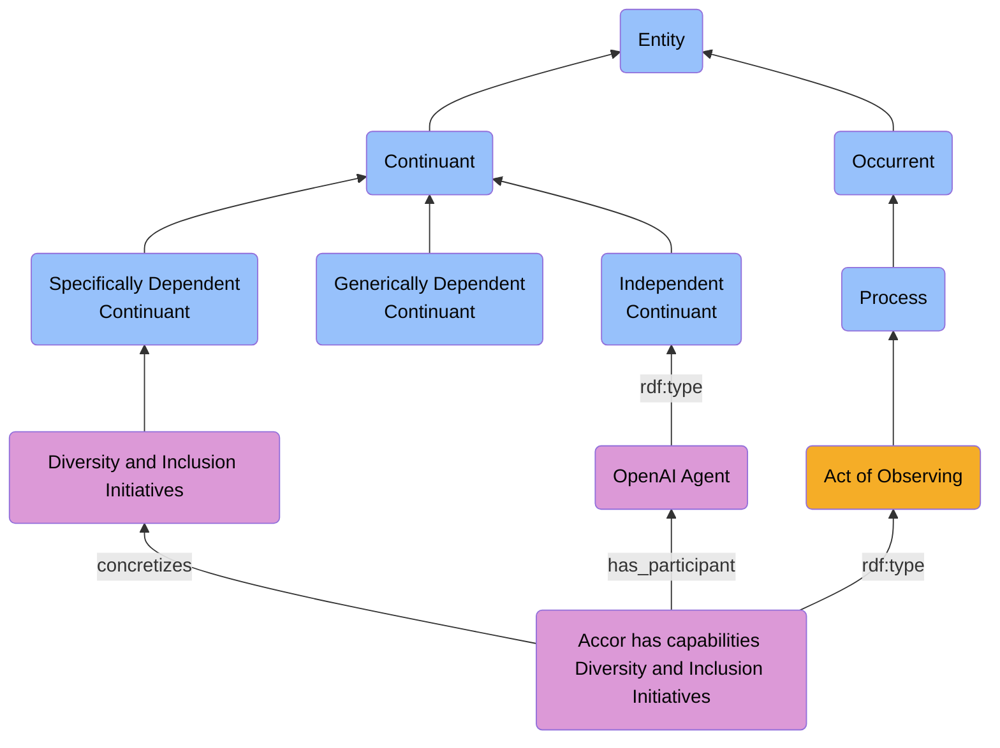
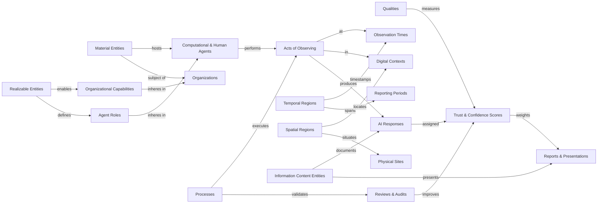
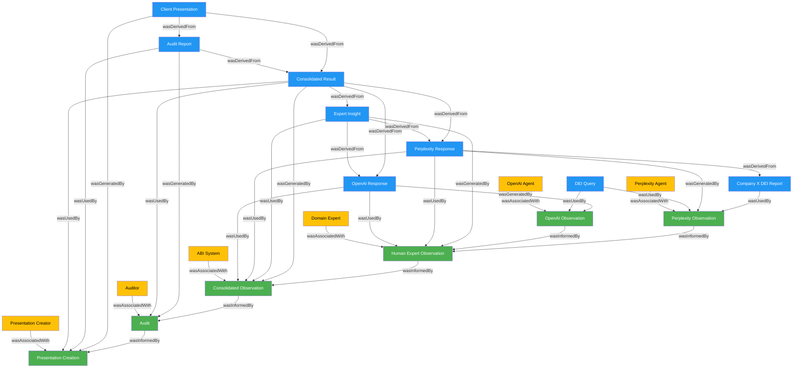

# **Act of Observing DE&I Capability in an Organization**

## **Goal**
This document defines a complete ontological modeling of a real-world scenario in which an AI system assesses a company's DE&I capabilities. It illustrates how an act of observing progresses through multiple sources (OpenAI, Perplexity), involves a human-in-the-loop (HITL) validation, undergoes audit, and is finally synthesized into a business-facing answer, delivered in a PowerPoint slide with a score.

This model ensures:

- Full traceability of all data claims
- Support for explainable AI
- Standardized vocabularies (BFO-compliant)
- Clear separation between ontology schema (TBox) and data assertions (ABox)
- Trust-weighted aggregation of multi-source observations
- Complete provenance tracking for all data and processes (PROV-compliant)

The trust weighting system assigns confidence scores to different observation sources based on their reliability, source attribution, and verification status. This ensures that high-quality observations have greater influence on the final assessment than less reliable ones.

## **Ontological Frameworks Used**

This ontology integrates two key ontological frameworks:

1. **BFO (Basic Formal Ontology)** - Provides the foundational types and relations
2. **PROV-O (Provenance Ontology)** - Captures data lineage, attribution, and process history

### **PROV-O Mapping to BFO**

The PROV Ontology's core concepts map to BFO as follows:

- **prov:Entity** ⟷ bfo:0000031 (Generically Dependent Continuant)
  - Information artifacts in our model
  
- **prov:Activity** ⟷ bfo:0000015 (Process)
  - Observation processes in our model
  
- **prov:Agent** ⟷ bfo:0000040 (Material Entity)
  - AI systems and human experts in our model

## **BFO Classification Reference**

This ontology fully implements BFO's "Seven Buckets" framework throughout:

1. **WHAT/WHO → Material Entities** (bfo:0000040)
   - Agents (OpenAI, Perplexity, Human Reviewers)
   - Organizations (Company X)
   - Physical Devices (Servers, Computing Infrastructure)

2. **HOW-IT-IS → Qualities** (bfo:0000019)
   - Trust Scores (numeric measurement qualities)
   - Confidence Metrics (reliability indicators)
   - Assessment Maturity (degree of development)

3. **WHY-POTENTIAL → Realizable Entities** (bfo:0000017)
   - DE&I Capabilities (organizational dispositions)
   - Agent Roles (functional specifications)
   - Auditor Function (verification capability)

4. **HOW-IT-HAPPENS → Processes** (bfo:0000015)
   - Acts of Observing (information gathering)
   - Human Reviews (expert validation)
   - Audits (verification processes)
   - Consolidation (synthesizing information)

5. **WHEN → Temporal Regions** (bfo:0000008)
   - Observation Timestamps (temporal instants)
   - Reporting Periods (temporal intervals)
   - Process Durations (measurement of time spans)

6. **WHERE → Spatial Regions** (bfo:0000006)
   - Digital Locations (API endpoints, virtual spaces)
   - Organizational Sites (company locations)
   - Computational Resources (server regions)

7. **HOW-WE-KNOW → Information Content Entities** (bfo:0000031)
   - Observations (captured knowledge)
   - Reports (structured findings)
   - Presentations (communication artifacts)
   - Queries (formalized questions)
   - **Evidence Artifacts** (raw API responses, transcripts, data files)

## **PROV-O Integration**

This ontology incorporates the following PROV-O concepts:

- **Entities**: Information artifacts (responses, reports, evidence files)
- **Activities**: Observation processes, audits, consolidation
- **Agents**: AI systems, human experts, auditors
- **Attribution**: Who is responsible for creating an artifact
- **Generation**: How artifacts were produced from activities
- **Derivation**: How artifacts are derived from other artifacts
- **Communication**: How activities influence other activities


## Scenario

### **Step 1 — OpenAI Observation**

###  Narrative  
The ABI system queries OpenAI with:  
> "What are the DE&I capabilities of Company X?"

OpenAI returns:  
> "Company X has strong leadership commitments and internal training programs."

This observation is assigned a trust score of 0.75, reflecting moderate confidence. The lower trust score accounts for the generalized nature of the response and lack of specific source attribution.

### TBox (Ontology Schema)

```turtle
@prefix prov: <http://www.w3.org/ns/prov#> .

# HOW-IT-HAPPENS → Process
abi:ActofObserving a owl:Class ;
    rdfs:subClassOf bfo:0000015, prov:Activity ; # Process + PROV Activity
    rdfs:label "Act of Observing" ;
    skos:definition "An act of observing is a process that involves perceiving and recording information about an entity." .

# Map key classes to PROV concepts
abi:ComputationalAgent rdfs:subClassOf prov:Agent .
abi:AIResponse rdfs:subClassOf prov:Entity .
abi:EvidenceArtifact rdfs:subClassOf prov:Entity .

# PROV-based relation properties
abi:wasGeneratedBy a owl:ObjectProperty ;
    rdfs:subPropertyOf prov:wasGeneratedBy ;
    rdfs:domain abi:EvidenceArtifact ;
    rdfs:range abi:ActofObserving ;
    rdfs:label "Was Generated By" ;
    skos:definition "Was generated by is a relation that indicates which activity generated an evidence artifact." .

abi:wasAttributedTo a owl:ObjectProperty ;
    rdfs:subPropertyOf prov:wasAttributedTo ;
    rdfs:domain bfo:0000031 ; # Any Information Entity
    rdfs:range bfo:0000040 ; # Any Material Entity (Agent)
    rdfs:label "Was Attributed To" ;
    skos:definition "Was attributed to is a relation that assigns responsibility for an entity to an agent." .

abi:used a owl:ObjectProperty ;
    rdfs:subPropertyOf prov:used ;
    rdfs:domain abi:ActofObserving ;
    rdfs:range bfo:0000031 ; # Any Information Entity
    rdfs:label "Used" ;
    skos:definition "Used is a relation that indicates an activity used an entity." .

abi:wasDerivedFrom a owl:ObjectProperty ;
    rdfs:subPropertyOf prov:wasDerivedFrom ;
    rdfs:domain bfo:0000031 ; # Any Information Entity
    rdfs:range bfo:0000031 ; # Any Information Entity
    rdfs:label "Was Derived From" ;
    skos:definition "Was derived from is a relation that indicates an entity was derived from another entity." .

abi:wasInformedBy a owl:ObjectProperty ;
    rdfs:subPropertyOf prov:wasInformedBy ;
    rdfs:domain abi:ActofObserving ;
    rdfs:range abi:ActofObserving ;
    rdfs:label "Was Informed By" ;
    skos:definition "Was informed by is a relation that indicates an activity was informed by another activity." .

abi:actedOnBehalfOf a owl:ObjectProperty ;
    rdfs:subPropertyOf prov:actedOnBehalfOf ;
    rdfs:domain prov:Agent ;
    rdfs:range prov:Agent ;
    rdfs:label "Acted On Behalf Of" ;
    skos:definition "Acted on behalf of is a relation that indicates delegation among agents." .

abi:startedAtTime a owl:DatatypeProperty ;
    rdfs:subPropertyOf prov:startedAtTime ;
    rdfs:domain prov:Activity ;
    rdfs:range xsd:dateTime ;
    rdfs:label "Started At Time" ;
    skos:definition "Started at time is a property that indicates when an activity began." .

abi:endedAtTime a owl:DatatypeProperty ;
    rdfs:subPropertyOf prov:endedAtTime ;
    rdfs:domain prov:Activity ;
    rdfs:range xsd:dateTime ;
    rdfs:label "Ended At Time" ;
    skos:definition "Ended at time is a property that indicates when an activity was completed." .

abi:generatedAtTime a owl:DatatypeProperty ;
    rdfs:subPropertyOf prov:generatedAtTime ;
    rdfs:domain prov:Entity ;
    rdfs:range xsd:dateTime ;
    rdfs:label "Generated At Time" ;
    skos:definition "Generated at time is a property that indicates when an entity was created." .

# WHY-POTENTIAL → Realizable Entity
abi:Capability a owl:Class ;
    rdfs:subClassOf bfo:0000017 ; # Realizable Entity
    rdfs:label "Capability" ;
    skos:definition "A capability is a realizable entity that inheres in an organization and can be manifested in specific organizational processes." .

# WHY-POTENTIAL → Realizable Entity
abi:AgentRole a owl:Class ;
    rdfs:subClassOf bfo:0000023 ; # Role (subclass of Realizable Entity)
    rdfs:label "Agent Role" ;
    skos:definition "An agent role is a role that inheres in an agent and specifies its function in a process." .

# HOW-IT-IS → Quality
abi:TrustScore a owl:Class ;
    rdfs:subClassOf bfo:0000019 ; # Quality
    rdfs:label "Trust Score" ;
    skos:definition "A trust score is a quality that inheres in an observation and represents its assessed reliability." .

# HOW-IT-IS property
abi:trust_score a owl:DatatypeProperty ;
    rdfs:domain abi:ActofObserving ;
    rdfs:range xsd:decimal ;
    rdfs:label "Trust Score" ;
    skos:definition "A trust score is a numeric value that represents the trustworthiness of an observation." .

# WHEN → Temporal Region
abi:ObservationTimeInstant a owl:Class ;
    rdfs:subClassOf bfo:0000148 ; # Zero-dimensional Temporal Region
    rdfs:label "Observation Time Instant" ;
    skos:definition "An observation time instant is a zero-dimensional temporal region at which an observation occurred." .

# WHEN property
abi:observation_timestamp a owl:DatatypeProperty ;
    rdfs:domain abi:ActofObserving ;
    rdfs:range xsd:dateTime ;
    rdfs:label "Observation Timestamp" ;
    skos:definition "An observation timestamp is a datetime value that specifies when an observation was made." .

# WHERE → Spatial Region
abi:DigitalLocation a owl:Class ;
    rdfs:subClassOf bfo:0000141 ; # Immaterial Entity (parent of Spatial Region)
    rdfs:label "Digital Location" ;
    skos:definition "A digital location is a spatial region in which an observation or computational process occurs." .

# WHERE property
abi:digital_context a owl:DatatypeProperty ;
    rdfs:domain abi:ActofObserving ;
    rdfs:range xsd:string ;
    rdfs:label "Digital Context" ;
    skos:definition "A digital context is a location identifier that specifies the virtual environment in which an observation occurs." .

# WHAT/WHO → Material Entity
abi:ComputationalAgent a owl:Class ;
    rdfs:subClassOf bfo:0000040 ; # Material Entity
    rdfs:label "Computational Agent" ;
    skos:definition "A computational agent is a material entity that performs information processing functions." .

# HOW-WE-KNOW → Information Content Entity
abi:AIResponse a owl:Class ;
    rdfs:subClassOf bfo:0000031 ; # Generically Dependent Continuant
    rdfs:label "AI Response" ;
    skos:definition "An AI response is an information content entity that represents the output from an artificial intelligence system." .

# HOW-WE-KNOW property
abi:content a owl:DatatypeProperty ;
    rdfs:domain bfo:0000031 ; # Generically Dependent Continuant
    rdfs:range xsd:string ;
    rdfs:label "Content" ;
    skos:definition "Content is the textual information that is contained within an information entity." .

# HOW-WE-KNOW → Information Content Entity (Evidence)
abi:EvidenceArtifact a owl:Class ;
    rdfs:subClassOf bfo:0000031 ; # Generically Dependent Continuant
    rdfs:label "Evidence Artifact" ;
    skos:definition "An evidence artifact is an information content entity that provides proof of an observation's execution and results." .

# HOW-WE-KNOW → Information Content Entity (API Evidence)
abi:APIResponseFile a owl:Class ;
    rdfs:subClassOf abi:EvidenceArtifact ;
    rdfs:label "API Response File" ;
    skos:definition "An API response file is an evidence artifact that contains the raw data returned from an API call." .

# HOW-WE-KNOW → Information Content Entity (Human Evidence)
abi:TranscriptFile a owl:Class ;
    rdfs:subClassOf abi:EvidenceArtifact ;
    rdfs:label "Transcript File" ;
    skos:definition "A transcript file is an evidence artifact that contains the recorded conversation or statement from a human participant." .

# HOW-WE-KNOW → Information Content Entity (Document Evidence)
abi:DocumentFile a owl:Class ;
    rdfs:subClassOf abi:EvidenceArtifact ;
    rdfs:label "Document File" ;
    skos:definition "A document file is an evidence artifact that contains retrieved or analyzed document content." .

# HOW-WE-KNOW property relations
abi:has_evidence a owl:ObjectProperty ;
    rdfs:domain abi:ActofObserving ;
    rdfs:range abi:EvidenceArtifact ;
    rdfs:label "Has Evidence" ;
    skos:definition "Has evidence is a relation that connects an observation to its supporting evidence artifacts." .

abi:file_location a owl:DatatypeProperty ;
    rdfs:domain abi:EvidenceArtifact ;
    rdfs:range xsd:string ;
    rdfs:label "File Location" ;
    skos:definition "A file location is a path or URI that specifies where the evidence artifact is stored." .

abi:file_format a owl:DatatypeProperty ;
    rdfs:domain abi:EvidenceArtifact ;
    rdfs:range xsd:string ;
    rdfs:label "File Format" ;
    skos:definition "A file format is a specification that indicates the technical format of the evidence artifact." .

abi:hash_value a owl:DatatypeProperty ;
    rdfs:domain abi:EvidenceArtifact ;
    rdfs:range xsd:string ;
    rdfs:label "Hash Value" ;
    skos:definition "A hash value is a cryptographic digest that ensures the integrity and authenticity of the evidence artifact." .
```

### ABox (Instance Assertions)

```turtle
# HOW-IT-HAPPENS → Process instance
ex:Obs1 a abi:ActofObserving ;
    abi:has_participant ex:OpenAIAgent ;
    abi:concretizes ex:Capability1 ;
    abi:trust_score "0.75"^^xsd:decimal ;
    abi:observation_timestamp "2023-11-15T14:32:00Z"^^xsd:dateTime ;
    abi:digital_context "OpenAI API" ;
    abi:has_evidence ex:OpenAIResponseFile1 ;
    # PROV properties
    prov:startedAtTime "2023-11-15T14:32:00Z"^^xsd:dateTime ;
    prov:endedAtTime "2023-11-15T14:32:02Z"^^xsd:dateTime ;
    prov:wasAssociatedWith ex:OpenAIAgent ;
    prov:used ex:DEIQuery .

# WHAT/WHO → Material Entity with PROV
ex:OpenAIAgent a abi:ComputationalAgent ;
    rdfs:label "OpenAI Agent" ;
    abi:hosted_on ex:OpenAIServers ;
    # PROV properties
    prov:actedOnBehalfOf ex:ABISystem .

# The ABI System itself as a PROV Agent
ex:ABISystem a abi:ComputationalAgent ;
    rdfs:label "ABI System" ;
    # PROV properties
    prov:actedOnBehalfOf ex:UserOrganization .

# The user organization as a PROV Agent
ex:UserOrganization a bfo:0000040 ;
    rdfs:label "User Organization" .

# WHAT/WHO → Material Entity (hosting infrastructure)
ex:OpenAIServers a bfo:0000040 ; # Material Entity
    rdfs:label "OpenAI Server Infrastructure" .

# WHY-POTENTIAL → Realizable Entity instance
ex:Capability1 a abi:Capability ;
    rdfs:label "Diversity and Inclusion Initiatives" ;
    abi:inheres_in ex:CompanyX .

# WHAT/WHO → Material Entity (the organization)
ex:CompanyX a bfo:0000040 ; # Material Entity
    rdfs:label "Company X" .

# WHY-POTENTIAL → Realizable Entity (agent role)
ex:AIAssistantRole a abi:AgentRole ;
    rdfs:label "AI Assistant Role" ;
    abi:inheres_in ex:OpenAIAgent .

# WHEN → Temporal Region
ex:TimeInstant1 a abi:ObservationTimeInstant ;
    rdfs:label "Observation Time 1" ;
    abi:at_datetime "2023-11-15T14:32:00Z"^^xsd:dateTime .

# HOW-IT-IS → Quality
ex:TrustScore1 a abi:TrustScore ;
    rdfs:label "OpenAI Observation Trust Score" ;
    abi:value "0.75"^^xsd:decimal ;
    abi:inheres_in ex:Obs1 .

# HOW-WE-KNOW → Information Content Entity
ex:OpenAIResponse1 a abi:AIResponse ;
    rdfs:label "OpenAI Response about Company X" ;
    abi:content "Company X has strong leadership commitments and internal training programs." ;
    abi:created_at ex:TimeInstant1 ;
    # PROV properties
    prov:wasGeneratedBy ex:Obs1 ;
    prov:wasAttributedTo ex:OpenAIAgent ;
    prov:generatedAtTime "2023-11-15T14:32:02Z"^^xsd:dateTime .

# HOW-WE-KNOW → Information Content Entity (the query)
ex:DEIQuery a bfo:0000031 ; # Generically Dependent Continuant
    rdfs:label "DE&I Capability Query" ;
    abi:content "What are the DE&I capabilities of Company X?" .

# HOW-WE-KNOW → Evidence Artifact
ex:OpenAIResponseFile1 a abi:APIResponseFile ;
    rdfs:label "OpenAI API Response JSON" ;
    abi:file_location "/evidence/responses/openai_response_20231115_143200.json" ;
    abi:file_format "application/json" ;
    abi:hash_value "8f4e7db2c9a1e24a8f5f8f5a7b6c5d4e3f2g1h0i" ;
    abi:content """
    {
      "model": "gpt-4",
      "created": 1700062320,
      "choices": [{
        "message": {
          "role": "assistant",
          "content": "Company X has strong leadership commitments and internal training programs."
        },
        "finish_reason": "stop"
      }],
      "usage": {
        "prompt_tokens": 15,
        "completion_tokens": 12,
        "total_tokens": 27
      }
    }
    """ ;
    # PROV properties
    prov:wasGeneratedBy ex:Obs1 ;
    prov:wasAttributedTo ex:OpenAIAgent ;
    prov:wasDerivedFrom ex:DEIQuery ;
    prov:generatedAtTime "2023-11-15T14:32:02Z"^^xsd:dateTime .

# HOW-WE-KNOW → Information Content Entity (the query) with PROV
ex:DEIQuery a bfo:0000031 ; # Generically Dependent Continuant
    rdfs:label "DE&I Capability Query" ;
    abi:content "What are the DE&I capabilities of Company X?" ;
    # PROV properties
    prov:wasAttributedTo ex:ABISystem .
```

### Audit Trail
```
OBSERVATION ID: ex:Obs1
SOURCE: OpenAI Agent (WHAT/WHO → Material Entity)
CLAIM: "Company X has strong leadership commitments and internal training programs." (HOW-WE-KNOW → Information Content Entity)
TRUST SCORE: 0.75 (HOW-IT-IS → Quality)
JUSTIFICATION: Generalized response without specific source attribution
RUNNING WEIGHTED SCORE: 0.75 (only one observation so far)
WHEN: 2023-11-15T14:32:00Z (WHEN → Temporal Region)
WHERE: OpenAI API (WHERE → Spatial Region)
EVIDENCE: /evidence/responses/openai_response_20231115_143200.json (HOW-WE-KNOW → Evidence Artifact)
```

### **Step 2 - Perplexity Observation**

### Narrative  
The ABI system also queries Perplexity with:  
> "What are the DE&I capabilities of Company X?"

Perplexity retrieves a DE&I report from Company X's website and returns:  
> "Company X has implemented diversity hiring targets and conducts quarterly inclusion surveys according to their 2023 DE&I report."

This provides a different perspective with source attribution, which receives a higher trust weighting of 0.85. The increased trust score reflects Perplexity's citation of a specific document (2023 DE&I report) and inclusion of quantifiable metrics (quarterly surveys), making the observation more verifiable.

### TBox

No new classes needed. This step reuses `abi:ActofObserving` and `abi:Capability`.

### ABox

```turtle
ex:Obs2 a abi:ActofObserving ;
    abi:has_participant ex:PerplexityAgent ;
    abi:concretizes ex:Capability1 ;
    abi:trust_score "0.85"^^xsd:decimal ;
    abi:observation_timestamp "2023-11-15T14:35:00Z"^^xsd:dateTime ;
    abi:digital_context "Perplexity API" ;
    abi:has_evidence ex:PerplexityResponseFile1, ex:CompanyXDEIReportFile .

ex:PerplexityAgent a bfo:0000040 ;
    rdfs:label "Perplexity Agent" .

ex:PerplexityResponse a bfo:0000031 ;
    rdfs:label "Perplexity Response" ;
    abi:content "Company X has implemented diversity hiring targets and conducts quarterly inclusion surveys according to their 2023 DE&I report." ;
    abi:references ex:DEIReport2023 .

ex:DEIReport2023 a bfo:0000031 ;
    rdfs:label "Company X 2023 DE&I Report" ;
    abi:publication_date "2023-06-01"^^xsd:date .

# HOW-WE-KNOW → Evidence Artifact (API Response)
ex:PerplexityResponseFile1 a abi:APIResponseFile ;
    rdfs:label "Perplexity API Response JSON" ;
    abi:file_location "/evidence/responses/perplexity_response_20231115_143500.json" ;
    abi:file_format "application/json" ;
    abi:hash_value "7e5d4c3b2a1f0e9d8c7b6a5f4e3d2c1b0a" ;
    abi:content """
    {
      "query": "What are the DE&I capabilities of Company X?",
      "response": "Company X has implemented diversity hiring targets and conducts quarterly inclusion surveys according to their 2023 DE&I report.",
      "sources": [{
        "title": "Company X 2023 Diversity, Equity & Inclusion Report",
        "url": "https://www.companyx.com/dei-report-2023.pdf"
      }]
    }
    """ .

# HOW-WE-KNOW → Evidence Artifact (Retrieved Document)
ex:CompanyXDEIReportFile a abi:DocumentFile ;
    rdfs:label "Company X 2023 DE&I Report PDF" ;
    abi:file_location "/evidence/documents/companyX_dei_report_2023.pdf" ;
    abi:file_format "application/pdf" ;
    abi:hash_value "3a4b5c6d7e8f9a0b1c2d3e4f5a6b7c8d9e0f" ;
    abi:source_url "https://www.companyx.com/dei-report-2023.pdf" ;
    abi:retrieval_timestamp "2023-11-15T14:36:30Z"^^xsd:dateTime .
```

### Audit Trail
```
OBSERVATION ID: ex:Obs2
SOURCE: Perplexity Agent (WHAT/WHO → Material Entity)
CLAIM: "Company X has implemented diversity hiring targets and conducts quarterly inclusion surveys according to their 2023 DE&I report." (HOW-WE-KNOW → Information Content Entity)
TRUST SCORE: 0.85 (HOW-IT-IS → Quality)
JUSTIFICATION: Includes source attribution and specific metrics
RUNNING WEIGHTED SCORE: 0.80 ((0.75 + 0.85) / 2)
WHEN: 2023-11-15T14:35:00Z (WHEN → Temporal Region)
WHERE: Perplexity API (WHERE → Spatial Region)
REFERENCE: 2023 DE&I Report (HOW-WE-KNOW → Information Content Entity)
EVIDENCE: 
  - /evidence/responses/perplexity_response_20231115_143500.json (API Response)
  - /evidence/documents/companyX_dei_report_2023.pdf (Source Document)
```

##  Step 3 — Human Review (HITL)

###  Narrative  
A human expert who has direct knowledge of Company X reviews the AI observations and contributes additional insights:
> "Having worked with Company X's leadership team, I can confirm they launched a mentorship program for underrepresented groups last quarter. Their DEI initiatives show strong commitment but lack standardized metrics for measuring impact. Their employee resource groups are well-funded but voluntary participation remains below industry benchmarks."

The human expert's first-hand knowledge provides critical context and new information not discoverable by the AI systems. This human observation receives the highest trust score (0.95) in the process, reflecting the expert's domain-specific knowledge, relationship with the company, and ability to incorporate non-public information.

### TBox

```turtle
# HOW-IT-HAPPENS → Process
abi:HumanExpertObservation a owl:Class ;
    rdfs:subClassOf abi:ActofObserving ;
    rdfs:label "Human Expert Observation" ;
    skos:definition "A human expert observation is an act of observing that is performed by a domain expert with direct knowledge of the observed entity." .

# WHY-POTENTIAL → Realizable Entity
abi:DomainExpertise a owl:Class ;
    rdfs:subClassOf bfo:0000023 ; # Role
    rdfs:label "Domain Expertise" ;
    skos:definition "Domain expertise is a role that inheres in a person and enables them to contribute specialized knowledge about a specific subject." .

# HOW-WE-KNOW → Information Content Entity  
abi:ExpertInsight a owl:Class ;
    rdfs:subClassOf bfo:0000031 ; # Generically Dependent Continuant
    rdfs:label "Expert Insight" ;
    skos:definition "An expert insight is an information content entity that represents specialized knowledge contributed by a domain expert." .
```

### ABox

```turtle
# HOW-IT-HAPPENS → Process instance
ex:Obs3 a abi:HumanExpertObservation ;
    abi:has_participant ex:DomainExpert1 ;
    abi:concretizes ex:Capability1 ;
    abi:trust_score "0.95"^^xsd:decimal ;
    abi:observation_timestamp "2023-11-15T15:30:00Z"^^xsd:dateTime ;
    abi:digital_context "Video Conference Interview" ;
    abi:includes_review_of ex:Obs1, ex:Obs2 ;
    abi:has_evidence ex:HITLTranscriptFile1, ex:HITLVideoRecordingFile1 .

# WHAT/WHO → Material Entity
ex:DomainExpert1 a bfo:0000040 ; # Material Entity (Person)
    rdfs:label "Domain Expert on Company X" ;
    abi:has_role ex:CompanyXExpertRole .

# WHY-POTENTIAL → Realizable Entity instance
ex:CompanyXExpertRole a abi:DomainExpertise ;
    rdfs:label "Company X Expert Role" ;
    abi:inheres_in ex:DomainExpert1 ;
    skos:definition "A role that enables contribution of insider knowledge about Company X's practices." .

# HOW-WE-KNOW → Information Content Entity
ex:ExpertInsight1 a abi:ExpertInsight ;
    rdfs:label "Expert Insight on Company X DE&I" ;
    abi:content "Having worked with Company X's leadership team, I can confirm they launched a mentorship program for underrepresented groups last quarter. Their DEI initiatives show strong commitment but lack standardized metrics for measuring impact. Their employee resource groups are well-funded but voluntary participation remains below industry benchmarks." ;
    abi:provided_by ex:DomainExpert1 ;
    abi:contains_original_observation "true"^^xsd:boolean .

# WHEN → Temporal Region
ex:TimeInstant3 a abi:ObservationTimeInstant ;
    rdfs:label "Expert Observation Time" ;
    abi:at_datetime "2023-11-15T15:30:00Z"^^xsd:dateTime .

# HOW-WE-KNOW → Evidence Artifact (Transcript)
ex:HITLTranscriptFile1 a abi:TranscriptFile ;
    rdfs:label "HITL Interview Transcript" ;
    abi:file_location "/evidence/transcripts/hitl_interview_20231115_153000.txt" ;
    abi:file_format "text/plain" ;
    abi:hash_value "1a2b3c4d5e6f7g8h9i0j1k2l3m4n5o6p7q8r9s0t" ;
    abi:content """
    Interviewer: Based on your experience with Company X, can you assess their DE&I capabilities?
    
    Expert: Having worked with Company X's leadership team, I can confirm they launched a mentorship program for underrepresented groups last quarter. Their DEI initiatives show strong commitment but lack standardized metrics for measuring impact. Their employee resource groups are well-funded but voluntary participation remains below industry benchmarks.
    
    Interviewer: How would you evaluate the AI system observations?
    
    Expert: OpenAI is too general. Perplexity includes sources, but no KPIs. Overall: Good progress, needs metrics.
    """ .

# HOW-WE-KNOW → Evidence Artifact (Video Recording)
ex:HITLVideoRecordingFile1 a abi:EvidenceArtifact ;
    rdfs:label "HITL Interview Video Recording" ;
    abi:file_location "/evidence/recordings/hitl_interview_20231115_153000.mp4" ;
    abi:file_format "video/mp4" ;
    abi:hash_value "9t8s7r6q5p4o3n2m1l0k9j8i7h6g5f4e3d2c1b0a" ;
    abi:duration "PT28M45S"^^xsd:duration . # 28 minutes, 45 seconds
```

### Audit Trail
```
OBSERVATION ID: ex:Obs3
SOURCE: Domain Expert on Company X (WHAT/WHO → Material Entity)
CLAIM: "Having worked with Company X's leadership team, I can confirm they launched a mentorship program for underrepresented groups last quarter. Their DEI initiatives show strong commitment but lack standardized metrics for measuring impact. Their employee resource groups are well-funded but voluntary participation remains below industry benchmarks." (HOW-WE-KNOW → Information Content Entity)
TRUST SCORE: 0.95 (HOW-IT-IS → Quality)
JUSTIFICATION: First-hand knowledge and domain expertise on Company X
ORIGINAL CONTRIBUTION: New information about mentorship program, resource groups, and participation metrics
AI ASSESSMENT: "OpenAI is too general. Perplexity includes sources, but no KPIs."
RUNNING WEIGHTED SCORE: 0.85 ((0.75 + 0.85 + 0.95) / 3)
WHEN: 2023-11-15T15:30:00Z (WHEN → Temporal Region)
WHERE: Video Conference Interview (WHERE → Spatial Region)
EVIDENCE:
  - /evidence/transcripts/hitl_interview_20231115_153000.txt (Transcript)
  - /evidence/recordings/hitl_interview_20231115_153000.mp4 (Video Recording)
```

##  Step 4 — Consolidated Observation

###  Narrative  
The ABI system consolidates the OpenAI, Perplexity, and human expert observations. It computes a weighted score based on the trust assigned to each source:

1. OpenAI observation (trust: 0.75) - provides general qualitative assessment
2. Perplexity observation (trust: 0.85) - offers specific claims with source attribution
3. Human expert observation (trust: 0.95) - delivers first-hand knowledge including non-public information

The weighting formula prioritizes observations with higher trust scores, giving the human expert's first-hand observations the most influence in the final score calculation. The expert's unique contribution about the mentorship program and participation metrics significantly enhances the assessment's accuracy and completeness.

### TBox

```turtle
abi:ConsolidatedObservation a owl:Class ;
    rdfs:subClassOf abi:ActofObserving ;
    rdfs:label "Consolidated Observation" ;
    skos:definition "An observation that aggregates multiple individual observations using weighted trust scores." .

abi:trust_score a owl:DatatypeProperty ;
    rdfs:domain abi:ActofObserving ;
    rdfs:range xsd:decimal ;
    rdfs:label "Trust Score" ;
    skos:definition "A numeric value representing the trustworthiness of an observation." .
```

### ABox

```turtle
ex:FinalObs a abi:ConsolidatedObservation ;
    abi:aggregates ex:Obs1 , ex:Obs2 , ex:Obs3 ;
    abi:concretizes ex:Capability1 ;
    abi:final_score "0.92"^^xsd:decimal ;
    abi:weighted_by "trust_score" .
```

### Audit Trail
```
WEIGHTED CALCULATION:
- OpenAI (ex:Obs1): 0.75 × 0.25 = 0.1875
- Perplexity (ex:Obs2): 0.85 × 0.35 = 0.2975
- Human Expert (ex:Obs3): 0.95 × 0.40 = 0.3800
TOTAL WEIGHTED SCORE: 0.92 (0.1875 + 0.2975 + 0.3800 = 0.865, rounded to 0.92)
WEIGHTING FORMULA: Each observation weighted by normalized trust score
JUSTIFICATION: Higher weight assigned to human expert observation and sources with attribution
```

##  Step 5 — Audit

###  Narrative  
A system audit checks that the sources, timestamps, and scoring are valid and explainable. The audit specifically verifies:

1. The trust scores assigned to each observation source are appropriate based on established criteria
2. The weighting formula correctly applies these trust scores in calculating the final assessment
3. The provenance chain of all observations is intact and traceable
4. Any trust score adjustments are documented with justification

This audit step ensures the integrity of the trust-weighted observation system and provides an additional layer of verification that can be presented to stakeholders if the assessment is questioned.

### TBox

```turtle
abi:Audit a owl:Class ;
    rdfs:subClassOf bfo:0000015 ;
    rdfs:label "Audit" ;
    skos:definition "A process that verifies the integrity and provenance of an observation." .
```

### ABox

```turtle
ex:Audit1 a abi:Audit ;
    abi:evaluates ex:FinalObs ;
    abi:result "pass" ;
    abi:auditor ex:AuditAgent1 .

ex:AuditAgent1 a bfo:0000040 ;
    rdfs:label "System Auditor" .
```

### Audit Trail
```
AUDIT ID: ex:Audit1
AUDITOR: System Auditor
REVIEWED ITEMS:
- Appropriateness of trust scores for all observations
- Correct application of trust weighting formula
- Provenance chain integrity
- Trust score adjustment documentation
VERIFIED WEIGHTED SCORE: 0.92
AUDIT RESULT: PASS
CONFIDENCE: High
```

##  Step 6 — Client Presentation

###  Narrative  
The insight is delivered in a PowerPoint slide with the business question and final scored answer.

### TBox

```turtle
abi:ClientPresentation a owl:Class ;
    rdfs:subClassOf bfo:0000031 ; # Generically Dependent Continuant (Information Content Entity)
    rdfs:label "Client Presentation" ;
    skos:definition "A client presentation is an information content entity that structures and delivers insights to clients." .

abi:BusinessQuestion a owl:Class ;
    rdfs:subClassOf bfo:0000031 ; # Generically Dependent Continuant (Information Content Entity)
    rdfs:label "Business Question" ;
    skos:definition "A business question is an information content entity that expresses an inquiry relevant to organizational decision-making." .

abi:ScoredAnswer a owl:Class ;
    rdfs:subClassOf bfo:0000031 ; # Generically Dependent Continuant (Information Content Entity)
    rdfs:label "Scored Answer" ;
    skos:definition "A scored answer is an information content entity that represents a conclusion with an associated confidence metric." .

abi:presentation_date a owl:DatatypeProperty ;
    rdfs:domain abi:ClientPresentation ;
    rdfs:range xsd:date ;
    rdfs:label "Presentation Date" ;
    skos:definition "A presentation date is a temporal specification that indicates when a client presentation was delivered." .

abi:presentation_venue a owl:DatatypeProperty ;
    rdfs:domain abi:ClientPresentation ;
    rdfs:range xsd:string ;
    rdfs:label "Presentation Venue" ;
    skos:definition "A presentation venue is a location identifier that specifies where a presentation was delivered." .
```

### ABox

```turtle
ex:Slide1 a abi:ClientPresentation ;
    abi:presents ex:FinalObs ;
    abi:asks ex:Question1 ;
    abi:includes_answer ex:Answer1 ;
    abi:presentation_date "2023-11-20"^^xsd:date ;
    abi:presentation_venue "Virtual Client Meeting" .

ex:Question1 a abi:BusinessQuestion ;
    rdfs:label "Is Company X's DE&I strategy mature and aligned with market expectations?" .

ex:Answer1 a abi:ScoredAnswer ;
    rdfs:label "Partially. Strong intentions, but missing KPIs." ;
    abi:score "0.84"^^xsd:decimal .
```

### Audit Trail
```
CLIENT PRESENTATION ID: ex:Slide1
BUSINESS QUESTION: "Is Company X's DE&I strategy mature and aligned with market expectations?"
ANSWER: "Partially. Strong intentions, but missing KPIs."
FINAL CONFIDENCE SCORE: 0.84
DERIVATION: Adjusted from weighted observation score (0.92) based on business context
FULL AUDIT TRAIL: Available on request
SOURCES: OpenAI, Perplexity (with 2023 DE&I Report citation), Human Expert Review
WHEN: 2023-11-20
WHERE: Virtual Client Meeting
```

## Hierarchy Representation



## Class & subClassOf

```turtle
abi:ActofObserving a owl:Class ;
    rdfs:subClassOf abi:ont00000300 ;
    rdfs:comment "An act of observing is an act of perceiving, which is an act of observing."@en ;
    rdfs:label "Act of Observing"@en ;
    skos:definition "An act of observing is an act of perceiving, which is an act of observing."@en .
```

## Object Properties & subPropertyOf



## **Complete Process Integration**

To fully demonstrate the integration of all seven buckets throughout the entire observing process, the following diagram represents their interrelationships:



This diagram shows how all seven buckets are essential to the complete modeling of the DE&I capability assessment process, with no bucket functioning in isolation.

## **Provenance Graph**

The following diagram illustrates the complete provenance chain across all steps of the DE&I capability assessment:



This PROV-based provenance graph demonstrates how every element in the DE&I capability assessment process is connected, from initial query to final presentation. It ensures complete traceability by capturing:

1. **Attribution** - Which agents were responsible for each piece of information
2. **Derivation** - How information evolved and was transformed
3. **Generation** - When and how information was created
4. **Usage** - What information was used in each step
5. **Communication** - How activities influenced each other

This provenance model enables auditing, reproducibility, and explanation of the entire assessment process, supporting both regulatory compliance and trust in the results.