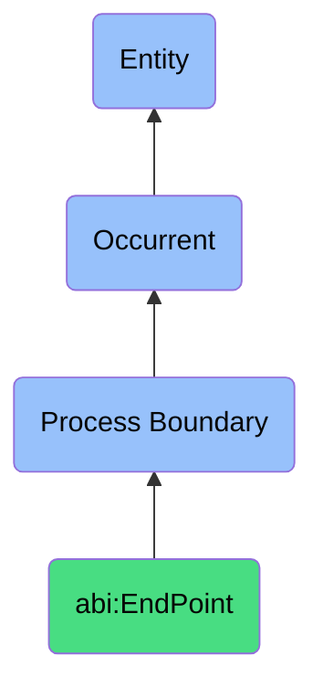

# EndPoint

## Definition
An end point is a specific type of process boundary (bfo:0000035) that marks the temporal conclusion of a process, representing the final moment at which a process ceases to exist, triggered by the fulfillment of process completion criteria, achievement of intended outcomes, or determination by authorized agents that the process has successfully fulfilled its purpose, establishing the final state that represents the process conclusion and providing a reference point for process outcome evaluation and temporal delimitation.

## Hierarchy in BFO


## Ontological Schema (TBox)
```turtle
abi:EndPoint a owl:Class ;
  rdfs:subClassOf bfo:0000035 ;
  rdfs:label "End Point" ;
  skos:definition "A process boundary marking process completion." .

bfo:0000035 a owl:Class ;
  rdfs:label "Process Boundary" ;
  skos:definition "Boundaries that mark the beginning or end of a process." .

abi:concludes_process a owl:ObjectProperty ;
  rdfs:domain abi:EndPoint ;
  rdfs:range bfo:0000015 ;
  rdfs:label "concludes process" .

abi:has_completion_timestamp a owl:DatatypeProperty ;
  rdfs:domain abi:EndPoint ;
  rdfs:range xsd:dateTime ;
  rdfs:label "has completion timestamp" .

abi:has_completion_trigger a owl:ObjectProperty ;
  rdfs:domain abi:EndPoint ;
  rdfs:range abi:CompletionTrigger ;
  rdfs:label "has completion trigger" .

abi:has_concluding_agent a owl:ObjectProperty ;
  rdfs:domain abi:EndPoint ;
  rdfs:range abi:ConcludingAgent ;
  rdfs:label "has concluding agent" .

abi:establishes_final_state a owl:ObjectProperty ;
  rdfs:domain abi:EndPoint ;
  rdfs:range abi:ProcessState ;
  rdfs:label "establishes final state" .

abi:has_completion_context a owl:ObjectProperty ;
  rdfs:domain abi:EndPoint ;
  rdfs:range abi:CompletionContext ;
  rdfs:label "has completion context" .

abi:satisfies_completion_condition a owl:ObjectProperty ;
  rdfs:domain abi:EndPoint ;
  rdfs:range abi:CompletionCondition ;
  rdfs:label "satisfies completion condition" .

abi:produces_process_outcome a owl:ObjectProperty ;
  rdfs:domain abi:EndPoint ;
  rdfs:range abi:ProcessOutcome ;
  rdfs:label "produces process outcome" .
```

## Ontological Instance (ABox)
```turtle
ex:ContractSignatureEnd a abi:EndPoint ;
  rdfs:label "Contract Signature Process End" ;
  abi:concludes_process ex:ContractApprovalProcess ;
  abi:has_completion_timestamp "2023-11-18T15:42:27Z"^^xsd:dateTime ;
  abi:has_completion_trigger ex:SignatureCompletionEvent, ex:FinalApprovalAction ;
  abi:has_concluding_agent ex:LegalDirector, ex:ElectronicSignatureSystem ;
  abi:establishes_final_state ex:ContractFullyExecutedState ;
  abi:has_completion_context ex:QuarterlyContractCycle ;
  abi:satisfies_completion_condition ex:AllPartiesSignedCondition, ex:LegalReviewCompletedCondition ;
  abi:produces_process_outcome ex:ExecutedContractDocument, ex:ContractMetadataRecord .

ex:ProjectDeliveryEnd a abi:EndPoint ;
  rdfs:label "Project Delivery End Point" ;
  abi:concludes_process ex:SoftwareImplementationProject ;
  abi:has_completion_timestamp "2023-11-10T17:00:00Z"^^xsd:dateTime ;
  abi:has_completion_trigger ex:FinalClientAcceptanceEvent, ex:SystemGoLiveEvent ;
  abi:has_concluding_agent ex:ProjectManager, ex:ClientStakeholder ;
  abi:establishes_final_state ex:DeliverableAcceptedState ;
  abi:has_completion_context ex:EnterpriseImplementation ;
  abi:satisfies_completion_condition ex:AllRequirementsMetCondition, ex:AcceptanceCriteriaPassedCondition ;
  abi:produces_process_outcome ex:DeployedSoftwareSystem, ex:ProjectCompletionReport .

ex:DataProcessingEnd a abi:EndPoint ;
  rdfs:label "Data Processing Pipeline End" ;
  abi:concludes_process ex:DataTransformationPipeline ;
  abi:has_completion_timestamp "2023-11-19T00:45:12Z"^^xsd:dateTime ;
  abi:has_completion_trigger ex:AllRecordsProcessedEvent, ex:OutputValidationEvent ;
  abi:has_concluding_agent ex:AutomationSystem ;
  abi:establishes_final_state ex:DataProcessingCompleteState ;
  abi:has_completion_context ex:DailyDataRefresh ;
  abi:satisfies_completion_condition ex:DataQualityThresholdMetCondition, ex:AllTransformationsCompletedCondition ;
  abi:produces_process_outcome ex:TransformedDataset, ex:ProcessingMetrics .
```

## Examples
1. "EndPoint occurred after signature recorded" - The conclusion of a contract approval process occurred when the final required signature was captured.

2. "The project reached its EndPoint with client acceptance" - A project process concluded when the client formally accepted the deliverables.

3. "System deployment process EndPoint was reached when monitoring confirmed stability" - An implementation process ended after post-deployment validation was successful.

4. "Manufacturing process EndPoint was established after quality inspection" - A production process concluded after quality criteria were verified.

5. "Financial review process EndPoint was created upon auditor approval" - An audit process concluded with formal approval from authorized parties.

## Related Classes
- **bfo:0000035 (Process Boundary)** - The parent class of which EndPoint is a subclass.
- **abi:StartPoint** - A process boundary marking the beginning of a process.
- **abi:InterruptionPoint** - A process boundary marking the premature stopping of a process.
- **abi:ProcessCompletionEvent** - Events that trigger the creation of end points.
- **abi:ProcessCompleter** - Agents responsible for creating process end points.
- **bfo:0000015 (Process)** - Processes that are concluded by end points. 