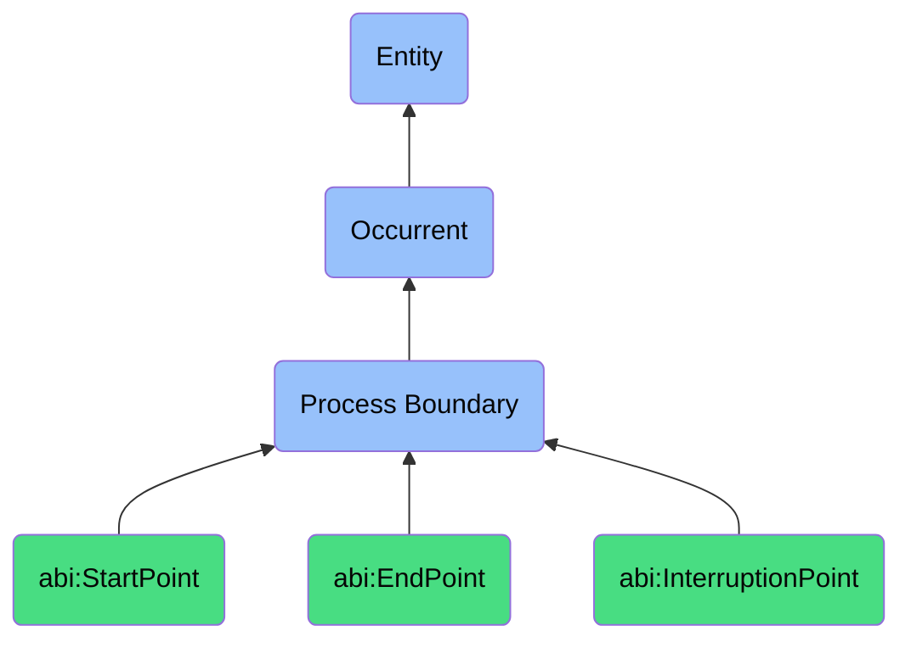

# ProcessBoundary

## Definition
A process boundary (bfo:0000035) is an occurrent that marks the beginning, end, or interruption point of a process, functioning as a temporal delimiter that signifies a transition between the non-existence and existence of a process, the completion of a process, or the premature termination of a process due to internal or external factors.

## Hierarchy in BFO


## Ontological Schema (TBox)
```turtle
bfo:0000035 a owl:Class ;
  rdfs:label "Process Boundary" ;
  skos:definition "Boundaries that mark the beginning or end of a process." .

abi:StartPoint a owl:Class ;
  rdfs:subClassOf bfo:0000035 ;
  rdfs:label "Start Point" ;
  skos:definition "A process boundary marking the beginning of a process." .

abi:EndPoint a owl:Class ;
  rdfs:subClassOf bfo:0000035 ;
  rdfs:label "End Point" ;
  skos:definition "A process boundary marking process completion." .

abi:InterruptionPoint a owl:Class ;
  rdfs:subClassOf bfo:0000035 ;
  rdfs:label "Interruption Point" ;
  skos:definition "A boundary where a process was prematurely stopped." .

abi:bounds_process a owl:ObjectProperty ;
  rdfs:domain bfo:0000035 ;
  rdfs:range bfo:0000015 ;
  rdfs:label "bounds process" .

abi:has_timestamp a owl:DatatypeProperty ;
  rdfs:domain bfo:0000035 ;
  rdfs:range xsd:dateTime ;
  rdfs:label "has timestamp" .

abi:has_trigger a owl:ObjectProperty ;
  rdfs:domain bfo:0000035 ;
  rdfs:range abi:Trigger ;
  rdfs:label "has trigger" .

abi:has_boundary_status a owl:DatatypeProperty ;
  rdfs:domain bfo:0000035 ;
  rdfs:range xsd:string ;
  rdfs:label "has boundary status" .

abi:has_process_state a owl:ObjectProperty ;
  rdfs:domain bfo:0000035 ;
  rdfs:range abi:ProcessState ;
  rdfs:label "has process state" .
```

## Ontological Instance (ABox)
```turtle
ex:PublishingProcessStart a abi:StartPoint ;
  rdfs:label "Publishing Process Start" ;
  abi:bounds_process ex:DocumentPublishingProcess ;
  abi:has_timestamp "2023-11-20T08:00:00Z"^^xsd:dateTime ;
  abi:has_trigger ex:ScheduledTrigger ;
  abi:has_boundary_status "Initiated" ;
  abi:has_process_state ex:ProcessReadyState .

ex:ContractSignatureEnd a abi:EndPoint ;
  rdfs:label "Contract Signature Process End" ;
  abi:bounds_process ex:ContractApprovalProcess ;
  abi:has_timestamp "2023-11-18T15:42:27Z"^^xsd:dateTime ;
  abi:has_trigger ex:SignatureCompletionEvent ;
  abi:has_boundary_status "Completed" ;
  abi:has_process_state ex:ProcessCompletedState .

ex:APIIntegrationInterruption a abi:InterruptionPoint ;
  rdfs:label "API Integration Process Interruption" ;
  abi:bounds_process ex:DataSyncProcess ;
  abi:has_timestamp "2023-11-19T10:23:45Z"^^xsd:dateTime ;
  abi:has_trigger ex:APIFailureEvent ;
  abi:has_boundary_status "Interrupted" ;
  abi:has_process_state ex:ProcessFailedState .
```

## Related Classes
- **bfo:0000015 (Process)** - Entities that unfold in time, having temporal parts that relate to process boundaries.
- **abi:ProcessSupervisor** - An agent that monitors and manages process transitions between boundaries.
- **abi:ProcessTrigger** - An event or condition that initiates a process by creating a start point.
- **abi:ProcessCompletionCondition** - Conditions that must be satisfied for a process to reach its end point.
- **abi:ProcessInterruptionFactor** - Factors that can cause a process to reach an interruption point.
- **abi:ProcessResumptionPoint** - A point from which an interrupted process may be resumed. 