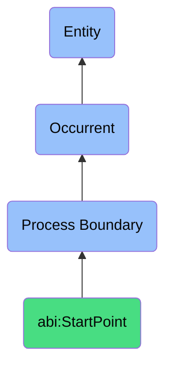

# StartPoint

## Definition
A start point is a specific type of process boundary (bfo:0000035) that marks the temporal beginning of a process, representing the initial moment at which a process comes into existence, triggered by specific events, conditions, or agents that serve as process initiators, establishing the initial state from which the process unfolds and providing a reference point for process tracking, measurement, and temporal delimitation.

## Hierarchy in BFO


## Ontological Schema (TBox)
```turtle
abi:StartPoint a owl:Class ;
  rdfs:subClassOf bfo:0000035 ;
  rdfs:label "Start Point" ;
  skos:definition "A process boundary marking the beginning of a process." .

bfo:0000035 a owl:Class ;
  rdfs:label "Process Boundary" ;
  skos:definition "Boundaries that mark the beginning or end of a process." .

abi:initiates_process a owl:ObjectProperty ;
  rdfs:domain abi:StartPoint ;
  rdfs:range bfo:0000015 ;
  rdfs:label "initiates process" .

abi:has_initiation_timestamp a owl:DatatypeProperty ;
  rdfs:domain abi:StartPoint ;
  rdfs:range xsd:dateTime ;
  rdfs:label "has initiation timestamp" .

abi:has_initiation_trigger a owl:ObjectProperty ;
  rdfs:domain abi:StartPoint ;
  rdfs:range abi:InitiationTrigger ;
  rdfs:label "has initiation trigger" .

abi:has_initiating_agent a owl:ObjectProperty ;
  rdfs:domain abi:StartPoint ;
  rdfs:range abi:InitiatingAgent ;
  rdfs:label "has initiating agent" .

abi:establishes_initial_state a owl:ObjectProperty ;
  rdfs:domain abi:StartPoint ;
  rdfs:range abi:ProcessState ;
  rdfs:label "establishes initial state" .

abi:has_initiation_context a owl:ObjectProperty ;
  rdfs:domain abi:StartPoint ;
  rdfs:range abi:InitiationContext ;
  rdfs:label "has initiation context" .

abi:has_prerequisite_condition a owl:ObjectProperty ;
  rdfs:domain abi:StartPoint ;
  rdfs:range abi:PrerequisiteCondition ;
  rdfs:label "has prerequisite condition" .
```

## Ontological Instance (ABox)
```turtle
ex:PublishingProcessStart a abi:StartPoint ;
  rdfs:label "Publishing Process Start" ;
  abi:initiates_process ex:DocumentPublishingProcess ;
  abi:has_initiation_timestamp "2023-11-20T08:00:00Z"^^xsd:dateTime ;
  abi:has_initiation_trigger ex:ScheduledTrigger, ex:ManualApprovalAction ;
  abi:has_initiating_agent ex:ContentManager, ex:AutomationSystem ;
  abi:establishes_initial_state ex:ContentApprovedState ;
  abi:has_initiation_context ex:QuarterlyReportPublishing ;
  abi:has_prerequisite_condition ex:ContentApprovalComplete, ex:PublishingChannelsReady .

ex:CustomerOnboardingStart a abi:StartPoint ;
  rdfs:label "Customer Onboarding Process Start" ;
  abi:initiates_process ex:EnterpriseCustomerOnboarding ;
  abi:has_initiation_timestamp "2023-11-15T09:30:00Z"^^xsd:dateTime ;
  abi:has_initiation_trigger ex:ContractSigningEvent, ex:SalesHandoffEvent ;
  abi:has_initiating_agent ex:AccountExecutive, ex:OnboardingSystem ;
  abi:establishes_initial_state ex:CustomerReadyForSetup ;
  abi:has_initiation_context ex:EnterpriseDeployment ;
  abi:has_prerequisite_condition ex:ContractFullyExecuted, ex:InitialPaymentReceived, ex:ResourcesAssigned .

ex:SystemAutomationStart a abi:StartPoint ;
  rdfs:label "Automated Data Processing Start" ;
  abi:initiates_process ex:DataProcessingPipeline ;
  abi:has_initiation_timestamp "2023-11-19T00:00:00Z"^^xsd:dateTime ;
  abi:has_initiation_trigger ex:ScheduledDailyTrigger, ex:DataThresholdCrossed ;
  abi:has_initiating_agent ex:SchedulerSystem ;
  abi:establishes_initial_state ex:DataSourcesReady ;
  abi:has_initiation_context ex:OvernightBatchProcessing ;
  abi:has_prerequisite_condition ex:PreviousRunCompleted, ex:InputDataAvailable .
```

## Examples
1. "StartPoint of publishing was triggered at 08:00" - A scheduled automatic trigger initiated a document publishing process at a specific time.

2. "The project StartPoint occurred when the contract was signed" - A contractual milestone served as the initiation point for a project process.

3. "System monitoring StartPoint was established after successful deployment" - A deployment event created the beginning boundary for a continuous monitoring process.

4. "API request processing StartPoint was created at request receipt time" - An external request established a process beginning.

5. "The manufacturing process StartPoint occurred when materials were staged" - A physical preparation action established the beginning of a manufacturing process.

## Related Classes
- **bfo:0000035 (Process Boundary)** - The parent class of which StartPoint is a subclass.
- **abi:EndPoint** - A process boundary marking the completion of a process.
- **abi:InterruptionPoint** - A process boundary marking the premature stopping of a process.
- **abi:ProcessInitiationEvent** - Events that trigger the creation of start points.
- **abi:ProcessInitiator** - Agents responsible for creating process start points.
- **bfo:0000015 (Process)** - Processes that are initiated by start points. 