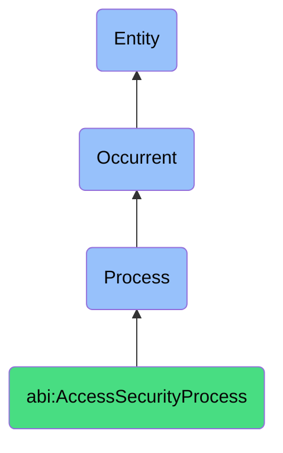

# AccessSecurityProcess

## Definition
An access security process is an occurrent that unfolds through time, involving the systematic management, verification, control, and governance of authentication credentials, authorization permissions, access rights, and access verification mechanisms for digital or physical resources, ensuring that only authorized entities can access specific resources under appropriate conditions, through standardized procedures that establish, verify, modify, and revoke access while maintaining security, compliance, and operational efficiency.

## Hierarchy in BFO


## Ontological Schema (TBox)
```turtle
abi:AccessSecurityProcess a owl:Class ;
  rdfs:subClassOf bfo:0000015 ;
  rdfs:label "Access Security Process" ;
  skos:definition "A time-bound process focused on securing and governing who/what can access what and how that access is authenticated." .

abi:has_access_agent a owl:ObjectProperty ;
  rdfs:domain abi:AccessSecurityProcess ;
  rdfs:range abi:AccessAgent ;
  rdfs:label "has access agent" .

abi:manages_access_subject a owl:ObjectProperty ;
  rdfs:domain abi:AccessSecurityProcess ;
  rdfs:range abi:AccessSubject ;
  rdfs:label "manages access subject" .

abi:involves_access_resource a owl:ObjectProperty ;
  rdfs:domain abi:AccessSecurityProcess ;
  rdfs:range abi:AccessResource ;
  rdfs:label "involves access resource" .

abi:follows_access_policy a owl:ObjectProperty ;
  rdfs:domain abi:AccessSecurityProcess ;
  rdfs:range abi:AccessPolicy ;
  rdfs:label "follows access policy" .

abi:applies_security_control a owl:ObjectProperty ;
  rdfs:domain abi:AccessSecurityProcess ;
  rdfs:range abi:SecurityControl ;
  rdfs:label "applies security control" .

abi:uses_access_mechanism a owl:ObjectProperty ;
  rdfs:domain abi:AccessSecurityProcess ;
  rdfs:range abi:AccessMechanism ;
  rdfs:label "uses access mechanism" .

abi:produces_access_record a owl:ObjectProperty ;
  rdfs:domain abi:AccessSecurityProcess ;
  rdfs:range abi:AccessRecord ;
  rdfs:label "produces access record" .

abi:has_process_timestamp a owl:DatatypeProperty ;
  rdfs:domain abi:AccessSecurityProcess ;
  rdfs:range xsd:dateTime ;
  rdfs:label "has process timestamp" .

abi:has_process_status a owl:DatatypeProperty ;
  rdfs:domain abi:AccessSecurityProcess ;
  rdfs:range xsd:string ;
  rdfs:label "has process status" .

abi:has_security_impact a owl:DatatypeProperty ;
  rdfs:domain abi:AccessSecurityProcess ;
  rdfs:range xsd:string ;
  rdfs:label "has security impact" .
```

## Ontological Instance (ABox)
```turtle
# AccessSecurityProcess is a parent class with subclasses:
# - abi:ActofFacilityAccessReview
# - abi:ActofServerAccessReview
# - abi:ActofCredentialRotation
# - abi:ActofCredentialIssuance
# - abi:ActofCredentialRevocation
# - abi:ActofCredentialAudit
# and other access security-related processes
```

## Related Classes
- **abi:ActofFacilityAccessReview** - A process for auditing and updating badge-level or location-based access permissions.
- **abi:ActofServerAccessReview** - A process for checking digital accounts and machine-level access.
- **abi:ActofCredentialRotation** - A process that refreshes, revokes, or replaces credentials.
- **abi:ActofCredentialIssuance** - A process that generates and delivers new credentials to authorized parties.
- **abi:ActofCredentialRevocation** - A process that disables or removes access rights tied to credentials.
- **abi:ActofCredentialAudit** - A process that checks secrets and credentials for hygiene, expiration, exposure, or redundancy.
- **abi:IdentityManagementProcess** - A broader process that encompasses identity lifecycle and access security. 