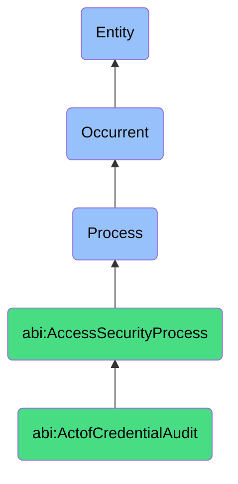

# ActofCredentialAudit

## Definition
An act of credential audit is an occurrent process that unfolds through time, involving the systematic examination, assessment, and validation of authentication materials, access tokens, security certificates, or digital credentials throughout their lifecycle to verify adherence to security policies, identify potential vulnerabilities, detect unauthorized access or credential misuse, ensure proper credential management practices, and validate the effectiveness of credential controls through structured verification mechanisms that produce evidence of credential hygiene, compliance status, and remediation requirements.

## Hierarchy in BFO


## Ontological Schema (TBox)
```turtle
abi:ActofCredentialAudit a owl:Class ;
  rdfs:subClassOf abi:AccessSecurityProcess ;
  rdfs:label "Act of Credential Audit" ;
  skos:definition "A process that checks secrets and credentials for hygiene, expiration, exposure, or redundancy." .

abi:AccessSecurityProcess a owl:Class ;
  rdfs:subClassOf bfo:0000015 ;
  rdfs:label "Access Security Process" ;
  skos:definition "A time-bound process focused on securing and governing who/what can access what and how that access is authenticated." .

abi:has_audit_executor a owl:ObjectProperty ;
  rdfs:domain abi:ActofCredentialAudit ;
  rdfs:range abi:AuditExecutor ;
  rdfs:label "has audit executor" .

abi:examines_credential_inventory a owl:ObjectProperty ;
  rdfs:domain abi:ActofCredentialAudit ;
  rdfs:range abi:CredentialInventory ;
  rdfs:label "examines credential inventory" .

abi:applies_audit_criteria a owl:ObjectProperty ;
  rdfs:domain abi:ActofCredentialAudit ;
  rdfs:range abi:AuditCriteria ;
  rdfs:label "applies audit criteria" .

abi:verifies_credential_status a owl:ObjectProperty ;
  rdfs:domain abi:ActofCredentialAudit ;
  rdfs:range abi:CredentialStatus ;
  rdfs:label "verifies credential status" .

abi:uses_audit_technique a owl:ObjectProperty ;
  rdfs:domain abi:ActofCredentialAudit ;
  rdfs:range abi:AuditTechnique ;
  rdfs:label "uses audit technique" .

abi:detects_credential_issue a owl:ObjectProperty ;
  rdfs:domain abi:ActofCredentialAudit ;
  rdfs:range abi:CredentialIssue ;
  rdfs:label "detects credential issue" .

abi:produces_audit_finding a owl:ObjectProperty ;
  rdfs:domain abi:ActofCredentialAudit ;
  rdfs:range abi:AuditFinding ;
  rdfs:label "produces audit finding" .

abi:has_audit_date a owl:DatatypeProperty ;
  rdfs:domain abi:ActofCredentialAudit ;
  rdfs:range xsd:date ;
  rdfs:label "has audit date" .

abi:has_audit_scope a owl:DatatypeProperty ;
  rdfs:domain abi:ActofCredentialAudit ;
  rdfs:range xsd:string ;
  rdfs:label "has audit scope" .

abi:has_finding_count a owl:DatatypeProperty ;
  rdfs:domain abi:ActofCredentialAudit ;
  rdfs:range xsd:integer ;
  rdfs:label "has finding count" .
```

## Ontological Instance (ABox)
```turtle
ex:CodeRepositorySecretAudit a abi:ActofCredentialAudit ;
  rdfs:label "Git Repository Hardcoded Secrets Audit" ;
  abi:has_audit_executor ex:SecurityAIAgent, ex:ApplicationSecurityTeam ;
  abi:examines_credential_inventory ex:SourceCodeRepositories, ex:ConfigurationFiles, ex:BuildScripts ;
  abi:applies_audit_criteria ex:SecretDetectionPatterns, ex:FalsePositiveRules, ex:CredentialExposurePolicy ;
  abi:verifies_credential_status ex:SecretExposureStatus, ex:CredentialEncryptionStatus ;
  abi:uses_audit_technique ex:StaticCodeAnalysis, ex:PatternMatching, ex:EntropyAnalysis, ex:CommitHistoryScanning ;
  abi:detects_credential_issue ex:HardcodedAPIKey, ex:PlaintextPassword, ex:ExposedAccessToken ;
  abi:produces_audit_finding ex:SecretExposureReport, ex:RemediationGuidelines, ex:HistoricalSecretAnalysis ;
  abi:has_audit_date "2023-11-15"^^xsd:date ;
  abi:has_audit_scope "All active code repositories" ;
  abi:has_finding_count "7"^^xsd:integer .

ex:MonthlyCredentialHygieneAudit a abi:ActofCredentialAudit ;
  rdfs:label "Monthly Credential Hygiene and Compliance Audit" ;
  abi:has_audit_executor ex:SecurityComplianceOfficer, ex:AutomatedAuditSystem ;
  abi:examines_credential_inventory ex:UserCredentials, ex:ServiceAccountCredentials, ex:ThirdPartyIntegrationTokens ;
  abi:applies_audit_criteria ex:CredentialLifecyclePolicy, ex:RotationRequirements, ex:InactivityStandards ;
  abi:verifies_credential_status ex:PasswordStrength, ex:ExpirationStatus, ex:RotationCompliance ;
  abi:uses_audit_technique ex:MetadataAnalysis, ex:CredentialAgeAssessment, ex:ComplianceChecking ;
  abi:detects_credential_issue ex:ExpiredCredential, ex:NonCompliantPassword, ex:OverdueRotation, ex:UnusedCredential ;
  abi:produces_audit_finding ex:CredentialComplianceReport, ex:RemediationRequirements, ex:SecurityMetricsDashboard ;
  abi:has_audit_date "2023-11-01"^^xsd:date ;
  abi:has_audit_scope "All production credentials and authentication systems" ;
  abi:has_finding_count "23"^^xsd:integer .
```

## Related Classes
- **abi:ActofFacilityAccessReview** - A process that may follow or precede credential audits for physical access.
- **abi:ActofServerAccessReview** - A process that may follow or precede credential audits for digital access.
- **abi:ActofCredentialRotation** - A process that may be triggered by findings from credential audits.
- **abi:ActofCredentialIssuance** - A process that creates credentials later evaluated in audits.
- **abi:ActofCredentialRevocation** - A process that may be triggered by audit findings.
- **abi:ComplianceAssessmentProcess** - A broader process that includes credential audits as a component.
- **abi:VulnerabilityManagementProcess** - A related process that addresses vulnerabilities found in credentials. 