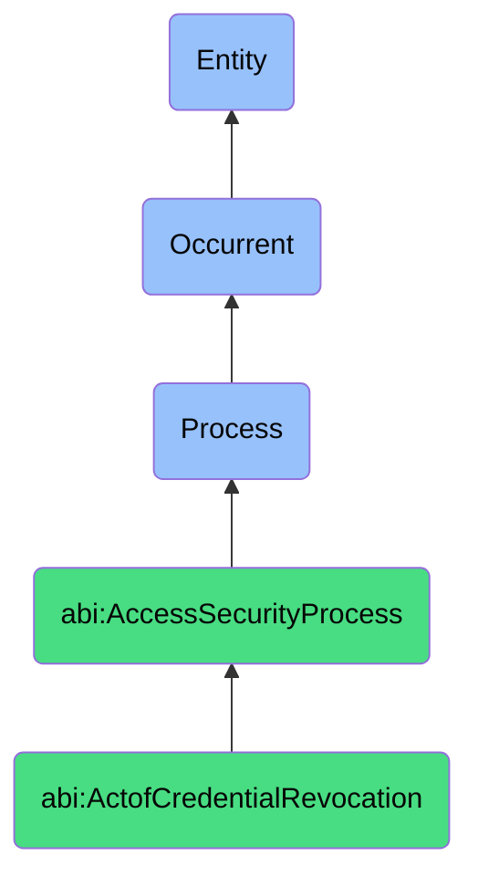

# ActofCredentialRevocation

## Definition
An act of credential revocation is an occurrent process that unfolds through time, involving the systematic invalidation, deactivation, deletion, or disablement of authentication materials, access tokens, security certificates, or digital credentials to prevent further authentication or resource access by previously authorized entities, typically triggered by security concerns, policy violations, employment changes, or operational requirements, and executed through procedures that ensure timely termination of access capabilities across all relevant systems while maintaining proper documentation and verification of effective access removal.

## Hierarchy in BFO


## Ontological Schema (TBox)
```turtle
abi:ActofCredentialRevocation a owl:Class ;
  rdfs:subClassOf abi:AccessSecurityProcess ;
  rdfs:label "Act of Credential Revocation" ;
  skos:definition "A process that disables or removes access rights tied to credentials, either manually or automatically." .

abi:AccessSecurityProcess a owl:Class ;
  rdfs:subClassOf bfo:0000015 ;
  rdfs:label "Access Security Process" ;
  skos:definition "A time-bound process focused on securing and governing who/what can access what and how that access is authenticated." .

abi:has_revocation_authority a owl:ObjectProperty ;
  rdfs:domain abi:ActofCredentialRevocation ;
  rdfs:range abi:RevocationAuthority ;
  rdfs:label "has revocation authority" .

abi:revokes_credential_type a owl:ObjectProperty ;
  rdfs:domain abi:ActofCredentialRevocation ;
  rdfs:range abi:CredentialType ;
  rdfs:label "revokes credential type" .

abi:removes_from_subject a owl:ObjectProperty ;
  rdfs:domain abi:ActofCredentialRevocation ;
  rdfs:range abi:RevocationSubject ;
  rdfs:label "removes from subject" .

abi:terminates_resource_access a owl:ObjectProperty ;
  rdfs:domain abi:ActofCredentialRevocation ;
  rdfs:range abi:ResourceAccess ;
  rdfs:label "terminates resource access" .

abi:follows_revocation_policy a owl:ObjectProperty ;
  rdfs:domain abi:ActofCredentialRevocation ;
  rdfs:range abi:RevocationPolicy ;
  rdfs:label "follows revocation policy" .

abi:implements_revocation_method a owl:ObjectProperty ;
  rdfs:domain abi:ActofCredentialRevocation ;
  rdfs:range abi:RevocationMethod ;
  rdfs:label "implements revocation method" .

abi:produces_revocation_record a owl:ObjectProperty ;
  rdfs:domain abi:ActofCredentialRevocation ;
  rdfs:range abi:RevocationRecord ;
  rdfs:label "produces revocation record" .

abi:has_revocation_timestamp a owl:DatatypeProperty ;
  rdfs:domain abi:ActofCredentialRevocation ;
  rdfs:range xsd:dateTime ;
  rdfs:label "has revocation timestamp" .

abi:has_revocation_trigger a owl:DatatypeProperty ;
  rdfs:domain abi:ActofCredentialRevocation ;
  rdfs:range xsd:string ;
  rdfs:label "has revocation trigger" .

abi:has_finalization_status a owl:DatatypeProperty ;
  rdfs:domain abi:ActofCredentialRevocation ;
  rdfs:range xsd:string ;
  rdfs:label "has finalization status" .
```

## Ontological Instance (ABox)
```turtle
ex:PostIncidentCredentialRevocation a abi:ActofCredentialRevocation ;
  rdfs:label "CI Pipeline Credential Revocation Post-Incident" ;
  abi:has_revocation_authority ex:SecurityIncidentResponder, ex:CISystemAdministrator ;
  abi:revokes_credential_type ex:BuildPipelineToken, ex:RepositoryDeployKey ;
  abi:removes_from_subject ex:CompromisedCIPipeline, ex:ExposedBuildEnvironment ;
  abi:terminates_resource_access ex:ProductionDeploymentSystem, ex:InfrastructureProvisioningService ;
  abi:follows_revocation_policy ex:SecurityIncidentResponseProcedure, ex:EmergencyRevocationProcess ;
  abi:implements_revocation_method ex:TokenInvalidation, ex:DeployKeyDeletion, ex:AccessRightTermination ;
  abi:produces_revocation_record ex:SecurityIncidentTicket, ex:RevocationActionLog, ex:ComplianceDocumentation ;
  abi:has_revocation_timestamp "2023-11-18T08:45:00Z"^^xsd:dateTime ;
  abi:has_revocation_trigger "Security Incident - Credential Exposure" ;
  abi:has_finalization_status "Complete - Verified" .

ex:InactiveUserCredentialRevocation a abi:ActofCredentialRevocation ;
  rdfs:label "Automatic Revocation of Dormant AWS IAM Users" ;
  abi:has_revocation_authority ex:CloudSecurityAutomation, ex:AccessGovernanceSystem ;
  abi:revokes_credential_type ex:AWSAccessKey, ex:IAMUserCredential ;
  abi:removes_from_subject ex:InactiveCloudUsers, ex:DormantServiceAccounts ;
  abi:terminates_resource_access ex:AWSConsoleAccess, ex:AWSAPI, ex:CloudResourceAccess ;
  abi:follows_revocation_policy ex:AutomatedInactivityPolicy, ex:CloudCredentialHygieneStandard ;
  abi:implements_revocation_method ex:AccountDisablement, ex:AccessKeyDeactivation, ex:PermissionRemoval ;
  abi:produces_revocation_record ex:CloudAccessChangeLog, ex:ComplianceAuditTrail, ex:UserNotification ;
  abi:has_revocation_timestamp "2023-11-01T02:00:00Z"^^xsd:dateTime ;
  abi:has_revocation_trigger "90+ Days of Inactivity" ;
  abi:has_finalization_status "Complete - Automated" .
```

## Related Classes
- **abi:ActofFacilityAccessReview** - A process that may identify physical credentials requiring revocation.
- **abi:ActofServerAccessReview** - A process that may identify digital credentials requiring revocation.
- **abi:ActofCredentialRotation** - A process that replaces credentials rather than fully revoking them.
- **abi:ActofCredentialIssuance** - A process that creates credentials that may later require revocation.
- **abi:ActofCredentialAudit** - A process that may verify effective credential revocation.
- **abi:UserDecommissioningProcess** - A broader process that includes credential revocation for departing users.
- **abi:AccessRightReviewProcess** - A process that reviews access rights and may trigger revocation. 