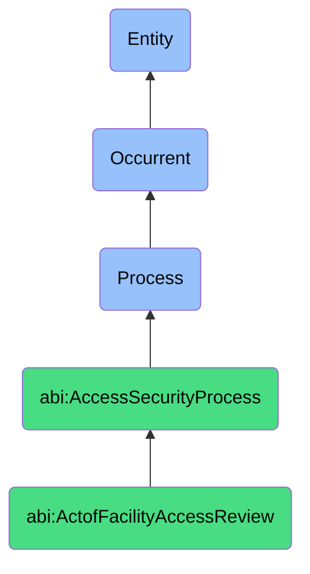

# ActofFacilityAccessReview

## Definition
An act of facility access review is an occurrent process that unfolds through time, involving the systematic examination, evaluation, and modification of physical access rights and permissions to organizational premises, buildings, rooms, or restricted areas, ensuring that only authorized individuals possess appropriate access levels based on current roles, responsibilities, and security requirements while identifying and remediating inappropriate, excessive, or outdated physical access privileges through structured verification against established access control policies.

## Hierarchy in BFO


## Ontological Schema (TBox)
```turtle
abi:ActofFacilityAccessReview a owl:Class ;
  rdfs:subClassOf abi:AccessSecurityProcess ;
  rdfs:label "Act of Facility Access Review" ;
  skos:definition "A process that audits and updates badge-level or location-based access permissions." .

abi:AccessSecurityProcess a owl:Class ;
  rdfs:subClassOf bfo:0000015 ;
  rdfs:label "Access Security Process" ;
  skos:definition "A time-bound process focused on securing and governing who/what can access what and how that access is authenticated." .

abi:has_review_coordinator a owl:ObjectProperty ;
  rdfs:domain abi:ActofFacilityAccessReview ;
  rdfs:range abi:ReviewCoordinator ;
  rdfs:label "has review coordinator" .

abi:reviews_access_holder a owl:ObjectProperty ;
  rdfs:domain abi:ActofFacilityAccessReview ;
  rdfs:range abi:AccessHolder ;
  rdfs:label "reviews access holder" .

abi:evaluates_physical_access a owl:ObjectProperty ;
  rdfs:domain abi:ActofFacilityAccessReview ;
  rdfs:range abi:PhysicalAccess ;
  rdfs:label "evaluates physical access" .

abi:applies_access_standard a owl:ObjectProperty ;
  rdfs:domain abi:ActofFacilityAccessReview ;
  rdfs:range abi:AccessStandard ;
  rdfs:label "applies access standard" .

abi:verifies_access_justification a owl:ObjectProperty ;
  rdfs:domain abi:ActofFacilityAccessReview ;
  rdfs:range abi:AccessJustification ;
  rdfs:label "verifies access justification" .

abi:identifies_access_anomaly a owl:ObjectProperty ;
  rdfs:domain abi:ActofFacilityAccessReview ;
  rdfs:range abi:AccessAnomaly ;
  rdfs:label "identifies access anomaly" .

abi:performs_access_adjustment a owl:ObjectProperty ;
  rdfs:domain abi:ActofFacilityAccessReview ;
  rdfs:range abi:AccessAdjustment ;
  rdfs:label "performs access adjustment" .

abi:has_review_date a owl:DatatypeProperty ;
  rdfs:domain abi:ActofFacilityAccessReview ;
  rdfs:range xsd:date ;
  rdfs:label "has review date" .

abi:has_access_changes_count a owl:DatatypeProperty ;
  rdfs:domain abi:ActofFacilityAccessReview ;
  rdfs:range xsd:integer ;
  rdfs:label "has access changes count" .

abi:has_next_review_date a owl:DatatypeProperty ;
  rdfs:domain abi:ActofFacilityAccessReview ;
  rdfs:range xsd:date ;
  rdfs:label "has next review date" .
```

## Ontological Instance (ABox)
```turtle
ex:QuarterlyDataCenterAccessReview a abi:ActofFacilityAccessReview ;
  rdfs:label "Quarterly Data Center Access Review" ;
  abi:has_review_coordinator ex:FacilitiesManager, ex:SecurityDirector, ex:ComplianceOfficer ;
  abi:reviews_access_holder ex:TechnicalStaff, ex:MaintenancePersonnel, ex:SecurityTeam ;
  abi:evaluates_physical_access ex:DataCenterAccessCards, ex:BiometricIdentification, ex:SecureAreaKeys ;
  abi:applies_access_standard ex:LeastPrivilegePolicy, ex:JobRoleAccessMatrix, ex:RegulatoryRequirements ;
  abi:verifies_access_justification ex:OperationalResponsibilities, ex:MaintenanceRequirements, ex:SecurityDuties ;
  abi:identifies_access_anomaly ex:UnusedAccess, ex:ExcessiveZoneAccess, ex:InappropriateTimeAccess ;
  abi:performs_access_adjustment ex:CardDeactivation, ex:ZoneRestriction, ex:ScheduleLimitation ;
  abi:has_review_date "2023-09-15"^^xsd:date ;
  abi:has_access_changes_count "12"^^xsd:integer ;
  abi:has_next_review_date "2023-12-15"^^xsd:date .

ex:AnnualOfficeAccessReview a abi:ActofFacilityAccessReview ;
  rdfs:label "Annual Corporate Office Access Review" ;
  abi:has_review_coordinator ex:HumanResources, ex:OfficeManager, ex:SecurityTeam ;
  abi:reviews_access_holder ex:Employees, ex:Contractors, ex:TemporaryWorkers ;
  abi:evaluates_physical_access ex:BuildingAccessCards, ex:ParkingPermits, ex:SecureFloorAccess ;
  abi:applies_access_standard ex:DepartmentAccessPolicy, ex:WorkingHoursPolicy, ex:ContractorSecurityPolicy ;
  abi:verifies_access_justification ex:EmploymentStatus, ex:DepartmentAssignment, ex:ProjectInvolvement ;
  abi:identifies_access_anomaly ex:TerminatedEmployeeAccess, ex:AfterHoursAnomalies, ex:CrossDepartmentalAccess ;
  abi:performs_access_adjustment ex:BadgeDeactivation, ex:AccessTimeRestriction, ex:ZoneReconfiguration ;
  abi:has_review_date "2023-11-01"^^xsd:date ;
  abi:has_access_changes_count "47"^^xsd:integer ;
  abi:has_next_review_date "2024-11-01"^^xsd:date .
```

## Related Classes
- **abi:ActofServerAccessReview** - A parallel process focusing on digital rather than physical access.
- **abi:ActofCredentialRotation** - A process often triggered by findings from facility access reviews.
- **abi:ActofCredentialIssuance** - A process for providing new physical access credentials.
- **abi:ActofCredentialRevocation** - A process for removing physical access credentials.
- **abi:ActofCredentialAudit** - A broader audit that may include physical access credential checks.
- **abi:PhysicalSecurityAssessmentProcess** - A broader process that includes facility access reviews.
- **abi:EmployeeOnboardingProcess** - A process that initiates facility access permissions. 