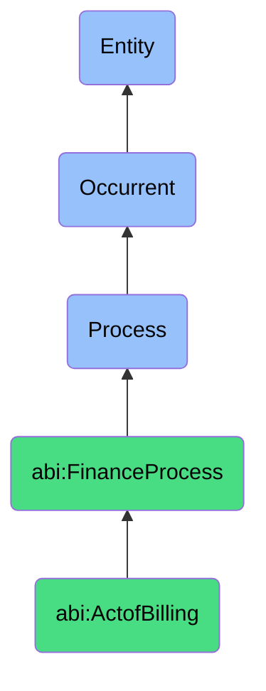

# ActofBilling

## Definition
An act of billing is an occurrent process that unfolds through time, involving the issuance of formal financial documents (invoices) that request payment for products delivered or services rendered, specifying amounts owed, payment terms, line items, and other transaction details, serving as both a financial record and a prompt for monetary collection from customers or clients.

## Hierarchy in BFO


## Ontological Schema (TBox)
```turtle
abi:ActofBilling a owl:Class ;
  rdfs:subClassOf abi:FinanceProcess ;
  rdfs:label "Act of Billing" ;
  skos:definition "A process of issuing financial documents (invoices) to request payment for services." .

abi:FinanceProcess a owl:Class ;
  rdfs:subClassOf bfo:0000015 ;
  rdfs:label "Finance Process" ;
  skos:definition "A time-bound activity related to the management, tracking, and optimization of financial resources and obligations." .

abi:has_billing_agent a owl:ObjectProperty ;
  rdfs:domain abi:ActofBilling ;
  rdfs:range abi:BillingAgent ;
  rdfs:label "has billing agent" .

abi:bills_customer a owl:ObjectProperty ;
  rdfs:domain abi:ActofBilling ;
  rdfs:range abi:Customer ;
  rdfs:label "bills customer" .

abi:references_contract a owl:ObjectProperty ;
  rdfs:domain abi:ActofBilling ;
  rdfs:range abi:Contract ;
  rdfs:label "references contract" .

abi:includes_line_item a owl:ObjectProperty ;
  rdfs:domain abi:ActofBilling ;
  rdfs:range abi:LineItem ;
  rdfs:label "includes line item" .

abi:applies_billing_schedule a owl:ObjectProperty ;
  rdfs:domain abi:ActofBilling ;
  rdfs:range abi:BillingSchedule ;
  rdfs:label "applies billing schedule" .

abi:generates_invoice a owl:ObjectProperty ;
  rdfs:domain abi:ActofBilling ;
  rdfs:range abi:Invoice ;
  rdfs:label "generates invoice" .

abi:facilitates_payment_method a owl:ObjectProperty ;
  rdfs:domain abi:ActofBilling ;
  rdfs:range abi:PaymentMethod ;
  rdfs:label "facilitates payment method" .

abi:has_invoice_date a owl:DatatypeProperty ;
  rdfs:domain abi:ActofBilling ;
  rdfs:range xsd:date ;
  rdfs:label "has invoice date" .

abi:has_payment_due_date a owl:DatatypeProperty ;
  rdfs:domain abi:ActofBilling ;
  rdfs:range xsd:date ;
  rdfs:label "has payment due date" .

abi:has_invoice_amount a owl:DatatypeProperty ;
  rdfs:domain abi:ActofBilling ;
  rdfs:range xsd:decimal ;
  rdfs:label "has invoice amount" .
```

## Ontological Instance (ABox)
```turtle
ex:MonthlyMSABillingProcess a abi:ActofBilling ;
  rdfs:label "Monthly MSA Billing Process" ;
  abi:has_billing_agent ex:FinanceAssistant ;
  abi:bills_customer ex:EnterpriseSubscriptionClient ;
  abi:references_contract ex:MasterServicesAgreement ;
  abi:includes_line_item ex:SoftwareLicenseItem, ex:PremiumSupportItem, ex:APIUsageItem ;
  abi:applies_billing_schedule ex:MonthlyRecurringSchedule ;
  abi:generates_invoice ex:MonthlySubscriptionInvoice ;
  abi:facilitates_payment_method ex:CorporateCreditCard, ex:ACHTransfer ;
  abi:has_invoice_date "2023-10-01"^^xsd:date ;
  abi:has_payment_due_date "2023-10-30"^^xsd:date ;
  abi:has_invoice_amount "12500.00"^^xsd:decimal .

ex:ProjectMilestoneBillingProcess a abi:ActofBilling ;
  rdfs:label "Project Milestone Billing Process" ;
  abi:has_billing_agent ex:AccountingDepartment ;
  abi:bills_customer ex:ConsultingClient ;
  abi:references_contract ex:StatementOfWork ;
  abi:includes_line_item ex:DesignPhaseCompletionItem, ex:ConsultantHoursItem, ex:DeliverableReviewItem ;
  abi:applies_billing_schedule ex:MilestoneBasedSchedule ;
  abi:generates_invoice ex:ProjectMilestoneInvoice ;
  abi:facilitates_payment_method ex:BankWireTransfer ;
  abi:has_invoice_date "2023-11-15"^^xsd:date ;
  abi:has_payment_due_date "2023-12-15"^^xsd:date ;
  abi:has_invoice_amount "45000.00"^^xsd:decimal .
```

## Related Classes
- **abi:ActofContracting** - A process that establishes the agreement upon which billing is based.
- **abi:ActofRevenueRecognition** - A process that follows billing to recognize revenue from invoiced amounts.
- **abi:ActofAccountsReceivableMonitoring** - A process that tracks payment status of issued invoices.
- **abi:InvoiceGenerationProcess** - A specialized subprocess within the billing process.
- **abi:PaymentCollectionProcess** - A process that follows billing to collect and process payments. 