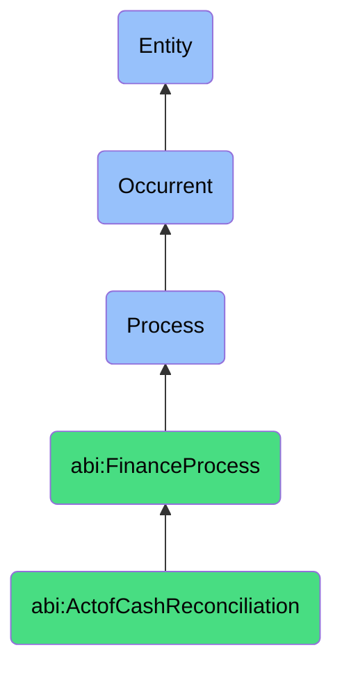

# ActofCashReconciliation

## Definition
An act of cash reconciliation is an occurrent process that unfolds through time, involving the systematic comparison, verification, and alignment of internal cash transaction records with external financial statements from banks or payment processors, identifying and resolving discrepancies to ensure accuracy, completeness, and proper classification of monetary activities in financial systems.

## Hierarchy in BFO


## Ontological Schema (TBox)
```turtle
abi:ActofCashReconciliation a owl:Class ;
  rdfs:subClassOf abi:FinanceProcess ;
  rdfs:label "Act of Cash Reconciliation" ;
  skos:definition "A process that aligns internal accounting records with external bank statements or payment providers." .

abi:FinanceProcess a owl:Class ;
  rdfs:subClassOf bfo:0000015 ;
  rdfs:label "Finance Process" ;
  skos:definition "A time-bound activity related to the management, tracking, and optimization of financial resources and obligations." .

abi:has_reconciliation_agent a owl:ObjectProperty ;
  rdfs:domain abi:ActofCashReconciliation ;
  rdfs:range abi:ReconciliationAgent ;
  rdfs:label "has reconciliation agent" .

abi:compares_internal_record a owl:ObjectProperty ;
  rdfs:domain abi:ActofCashReconciliation ;
  rdfs:range abi:InternalRecord ;
  rdfs:label "compares internal record" .

abi:matches_external_statement a owl:ObjectProperty ;
  rdfs:domain abi:ActofCashReconciliation ;
  rdfs:range abi:ExternalStatement ;
  rdfs:label "matches external statement" .

abi:identifies_transaction a owl:ObjectProperty ;
  rdfs:domain abi:ActofCashReconciliation ;
  rdfs:range abi:FinancialTransaction ;
  rdfs:label "identifies transaction" .

abi:resolves_discrepancy a owl:ObjectProperty ;
  rdfs:domain abi:ActofCashReconciliation ;
  rdfs:range abi:ReconciliationDiscrepancy ;
  rdfs:label "resolves discrepancy" .

abi:produces_reconciliation_report a owl:ObjectProperty ;
  rdfs:domain abi:ActofCashReconciliation ;
  rdfs:range abi:ReconciliationReport ;
  rdfs:label "produces reconciliation report" .

abi:updates_financial_record a owl:ObjectProperty ;
  rdfs:domain abi:ActofCashReconciliation ;
  rdfs:range abi:FinancialRecord ;
  rdfs:label "updates financial record" .

abi:has_reconciliation_date a owl:DatatypeProperty ;
  rdfs:domain abi:ActofCashReconciliation ;
  rdfs:range xsd:date ;
  rdfs:label "has reconciliation date" .

abi:has_reconciliation_period a owl:DatatypeProperty ;
  rdfs:domain abi:ActofCashReconciliation ;
  rdfs:range xsd:string ;
  rdfs:label "has reconciliation period" .

abi:has_transaction_count a owl:DatatypeProperty ;
  rdfs:domain abi:ActofCashReconciliation ;
  rdfs:range xsd:integer ;
  rdfs:label "has transaction count" .
```

## Ontological Instance (ABox)
```turtle
ex:DailyStripePayoutReconciliation a abi:ActofCashReconciliation ;
  rdfs:label "Daily Stripe Payout Reconciliation Process" ;
  abi:has_reconciliation_agent ex:FinanceAssistant ;
  abi:compares_internal_record ex:AccountingSystemInvoices, ex:CRMReceipts ;
  abi:matches_external_statement ex:StripePayoutStatement, ex:BankDepositTransaction ;
  abi:identifies_transaction ex:SubscriptionPayment, ex:RefundTransaction, ex:DisputeResolution ;
  abi:resolves_discrepancy ex:TimingDifference, ex:MissingTransaction, ex:AmountVariance ;
  abi:produces_reconciliation_report ex:DailyPaymentGatewayReport, ex:UnreconciledItemsList ;
  abi:updates_financial_record ex:GeneralLedgerEntry, ex:CustomerPaymentRecord ;
  abi:has_reconciliation_date "2023-11-03"^^xsd:date ;
  abi:has_reconciliation_period "Daily - November 3, 2023" ;
  abi:has_transaction_count "12"^^xsd:integer .

ex:MonthlyBankAccountReconciliation a abi:ActofCashReconciliation ;
  rdfs:label "Monthly Bank Account Reconciliation Process" ;
  abi:has_reconciliation_agent ex:AccountingManager ;
  abi:compares_internal_record ex:CashDisbursementJournal, ex:AccountsPayableSubledger, ex:DepositRegister ;
  abi:matches_external_statement ex:CommercialBankStatement, ex:ElectronicFundsTransferReport ;
  abi:identifies_transaction ex:VendorPayment, ex:PayrollDisbursement, ex:CustomerDeposit, ex:BankFee ;
  abi:resolves_discrepancy ex:OutstandingCheck, ex:UncategorizedDeposit, ex:DuplicateEntry ;
  abi:produces_reconciliation_report ex:MonthEndReconciliationWorksheet, ex:BankReconciliationSummary ;
  abi:updates_financial_record ex:MonthEndClosingEntry, ex:CashPositionReport ;
  abi:has_reconciliation_date "2023-10-31"^^xsd:date ;
  abi:has_reconciliation_period "October 2023" ;
  abi:has_transaction_count "187"^^xsd:integer .
```

## Related Classes
- **abi:ActofAccountsReceivableMonitoring** - A process tracking inbound payments linked to reconciliation.
- **abi:ActofAccountsPayableMonitoring** - A process tracking outbound payments linked to reconciliation.
- **abi:ActofForecasting** - A process that uses reconciled financial data for projections.
- **abi:FinancialAuditProcess** - A process that verifies the accuracy of reconciliation activities.
- **abi:MonthlyClosingProcess** - A process that incorporates reconciled data into period-end reporting. 