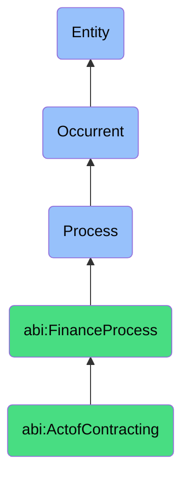

# ActofContracting

## Definition
An act of contracting is an occurrent process that unfolds through time, involving the formalization of a legally binding agreement between two or more parties with explicitly defined terms, obligations, considerations, and conditions that establish mutual commitments, rights, and responsibilities, resulting in an executed contract that serves as the foundation for a commercial relationship.

## Hierarchy in BFO


## Ontological Schema (TBox)
```turtle
abi:ActofContracting a owl:Class ;
  rdfs:subClassOf abi:FinanceProcess ;
  rdfs:label "Act of Contracting" ;
  skos:definition "A process that formalizes legal agreement between two parties with defined terms and obligations." .

abi:FinanceProcess a owl:Class ;
  rdfs:subClassOf bfo:0000015 ;
  rdfs:label "Finance Process" ;
  skos:definition "A time-bound activity related to the management, tracking, and optimization of financial resources and obligations." .

abi:has_contract_initiator a owl:ObjectProperty ;
  rdfs:domain abi:ActofContracting ;
  rdfs:range abi:ContractInitiator ;
  rdfs:label "has contract initiator" .

abi:has_contract_counterparty a owl:ObjectProperty ;
  rdfs:domain abi:ActofContracting ;
  rdfs:range abi:ContractCounterparty ;
  rdfs:label "has contract counterparty" .

abi:defines_contract_terms a owl:ObjectProperty ;
  rdfs:domain abi:ActofContracting ;
  rdfs:range abi:ContractTerms ;
  rdfs:label "defines contract terms" .

abi:specifies_payment_structure a owl:ObjectProperty ;
  rdfs:domain abi:ActofContracting ;
  rdfs:range abi:PaymentStructure ;
  rdfs:label "specifies payment structure" .

abi:includes_contract_clause a owl:ObjectProperty ;
  rdfs:domain abi:ActofContracting ;
  rdfs:range abi:ContractClause ;
  rdfs:label "includes contract clause" .

abi:produces_contract_document a owl:ObjectProperty ;
  rdfs:domain abi:ActofContracting ;
  rdfs:range abi:ContractDocument ;
  rdfs:label "produces contract document" .

abi:establishes_legal_relationship a owl:ObjectProperty ;
  rdfs:domain abi:ActofContracting ;
  rdfs:range abi:LegalRelationship ;
  rdfs:label "establishes legal relationship" .

abi:has_contract_effective_date a owl:DatatypeProperty ;
  rdfs:domain abi:ActofContracting ;
  rdfs:range xsd:date ;
  rdfs:label "has contract effective date" .

abi:has_contract_value a owl:DatatypeProperty ;
  rdfs:domain abi:ActofContracting ;
  rdfs:range xsd:decimal ;
  rdfs:label "has contract value" .

abi:has_contract_duration a owl:DatatypeProperty ;
  rdfs:domain abi:ActofContracting ;
  rdfs:range xsd:duration ;
  rdfs:label "has contract duration" .
```

## Ontological Instance (ABox)
```turtle
ex:ProposalToStatementOfWorkContracting a abi:ActofContracting ;
  rdfs:label "Proposal to Statement of Work Contracting Process" ;
  abi:has_contract_initiator ex:SalesOrganization ;
  abi:has_contract_counterparty ex:EnterpriseClient ;
  abi:defines_contract_terms ex:DeliverableTimelines, ex:AcceptanceCriteria, ex:ResourceAllocation ;
  abi:specifies_payment_structure ex:MilestoneBasedPayments, ex:NetThirtyTerms ;
  abi:includes_contract_clause ex:ConfidentialityClause, ex:IntellectualPropertyRights, ex:TerminationClause ;
  abi:produces_contract_document ex:SignedStatementOfWork, ex:MasterServicesAgreement ;
  abi:establishes_legal_relationship ex:ServiceProviderRelationship ;
  abi:has_contract_effective_date "2023-11-01"^^xsd:date ;
  abi:has_contract_value "175000.00"^^xsd:decimal ;
  abi:has_contract_duration "P1Y"^^xsd:duration .

ex:SoftwareSubscriptionContracting a abi:ActofContracting ;
  rdfs:label "Software Subscription Contracting Process" ;
  abi:has_contract_initiator ex:SoftwareVendor ;
  abi:has_contract_counterparty ex:MidMarketCustomer ;
  abi:defines_contract_terms ex:LicenseScope, ex:SupportLevel, ex:UserLimitations ;
  abi:specifies_payment_structure ex:AnnualSubscriptionBilling, ex:AutoRenewal ;
  abi:includes_contract_clause ex:ServiceLevelAgreement, ex:DataPrivacyCompliance, ex:DisputeResolution ;
  abi:produces_contract_document ex:SubscriptionAgreement, ex:OrderForm ;
  abi:establishes_legal_relationship ex:SoftwareLicensorRelationship ;
  abi:has_contract_effective_date "2023-10-15"^^xsd:date ;
  abi:has_contract_value "45000.00"^^xsd:decimal ;
  abi:has_contract_duration "P2Y"^^xsd:duration .
```

## Related Classes
- **abi:ActofBilling** - A process that follows contracting to invoice for contractually agreed services.
- **abi:ActofRevenueRecognition** - A process that allocates revenue from contracts based on delivery milestones.
- **abi:ActofClosing** - A sales process that often precedes or coincides with contracting.
- **abi:ContractReviewProcess** - A legal process that ensures contract accuracy and compliance.
- **abi:ContractManagementProcess** - A process that maintains and monitors contracts throughout their lifecycle. 