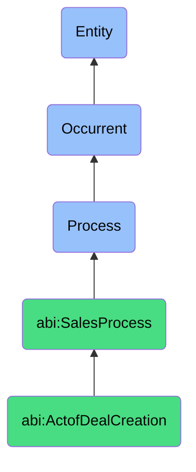

# ActofDealCreation

## Definition
An act of deal creation is an occurrent process that unfolds through time, involving the formal structuring, configuration, and documentation of a sales opportunity with specific parameters including pricing, product mix, terms, timelines, and scope, resulting in a defined commercial proposal that serves as the foundation for negotiation and potential transaction.

## Hierarchy in BFO


## Ontological Schema (TBox)
```turtle
abi:ActofDealCreation a owl:Class ;
  rdfs:subClassOf abi:SalesProcess ;
  rdfs:label "Act of Deal Creation" ;
  skos:definition "A process where a sales opportunity is structured, priced, and entered into the CRM." .

abi:SalesProcess a owl:Class ;
  rdfs:subClassOf bfo:0000015 ;
  rdfs:label "Sales Process" ;
  skos:definition "A time-bound interaction or conversion of relationships into economic transactions." .

abi:has_deal_creator a owl:ObjectProperty ;
  rdfs:domain abi:ActofDealCreation ;
  rdfs:range abi:DealCreator ;
  rdfs:label "has deal creator" .

abi:configures_deal_for_prospect a owl:ObjectProperty ;
  rdfs:domain abi:ActofDealCreation ;
  rdfs:range abi:DealProspect ;
  rdfs:label "configures deal for prospect" .

abi:includes_product_configuration a owl:ObjectProperty ;
  rdfs:domain abi:ActofDealCreation ;
  rdfs:range abi:ProductConfiguration ;
  rdfs:label "includes product configuration" .

abi:applies_pricing_model a owl:ObjectProperty ;
  rdfs:domain abi:ActofDealCreation ;
  rdfs:range abi:PricingModel ;
  rdfs:label "applies pricing model" .

abi:specifies_deal_terms a owl:ObjectProperty ;
  rdfs:domain abi:ActofDealCreation ;
  rdfs:range abi:DealTerms ;
  rdfs:label "specifies deal terms" .

abi:generates_deal_document a owl:ObjectProperty ;
  rdfs:domain abi:ActofDealCreation ;
  rdfs:range abi:DealDocument ;
  rdfs:label "generates deal document" .

abi:records_opportunity_in_system a owl:ObjectProperty ;
  rdfs:domain abi:ActofDealCreation ;
  rdfs:range abi:OpportunitySystem ;
  rdfs:label "records opportunity in system" .

abi:has_deal_creation_timestamp a owl:DatatypeProperty ;
  rdfs:domain abi:ActofDealCreation ;
  rdfs:range xsd:dateTime ;
  rdfs:label "has deal creation timestamp" .

abi:has_deal_value a owl:DatatypeProperty ;
  rdfs:domain abi:ActofDealCreation ;
  rdfs:range xsd:decimal ;
  rdfs:label "has deal value" .

abi:has_expected_close_date a owl:DatatypeProperty ;
  rdfs:domain abi:ActofDealCreation ;
  rdfs:range xsd:date ;
  rdfs:label "has expected close date" .
```

## Ontological Instance (ABox)
```turtle
ex:EnterpriseContractDealCreationProcess a abi:ActofDealCreation ;
  rdfs:label "Enterprise Contract Deal Creation Process" ;
  abi:has_deal_creator ex:SalesAssistant ;
  abi:configures_deal_for_prospect ex:EnterpriseClient ;
  abi:includes_product_configuration ex:EnterpriseProductSuite, ex:PremiumSupportPackage, ex:CustomImplementationService ;
  abi:applies_pricing_model ex:TieredSubscriptionPricing, ex:VolumeDiscountStructure ;
  abi:specifies_deal_terms ex:ThreeYearContractTerm, ex:QuarterlyPaymentSchedule, ex:ServiceLevelAgreement ;
  abi:generates_deal_document ex:MasterServiceAgreementDraft, ex:StatementOfWork, ex:PricingProposal ;
  abi:records_opportunity_in_system ex:SalesforceCRM ;
  abi:has_deal_creation_timestamp "2023-10-18T15:45:00Z"^^xsd:dateTime ;
  abi:has_deal_value "450000.00"^^xsd:decimal ;
  abi:has_expected_close_date "2023-12-15"^^xsd:date .

ex:MidMarketSolutionDealCreationProcess a abi:ActofDealCreation ;
  rdfs:label "Mid-Market Solution Deal Creation Process" ;
  abi:has_deal_creator ex:AccountExecutive ;
  abi:configures_deal_for_prospect ex:GrowthStageCompany ;
  abi:includes_product_configuration ex:CorePlatformLicense, ex:StandardOnboardingPackage, ex:IntegrationsBundle ;
  abi:applies_pricing_model ex:PerUserPricing, ex:AnnualCommitmentDiscount ;
  abi:specifies_deal_terms ex:OneYearContractTerm, ex:UpfrontPaymentOption, ex:StandardSLA ;
  abi:generates_deal_document ex:ProposalDocument, ex:LicenseAgreement, ex:OnboardingPlan ;
  abi:records_opportunity_in_system ex:HubSpotCRM ;
  abi:has_deal_creation_timestamp "2023-09-28T11:30:00Z"^^xsd:dateTime ;
  abi:has_deal_value "78500.00"^^xsd:decimal ;
  abi:has_expected_close_date "2023-10-31"^^xsd:date .
```

## Related Classes
- **abi:ActofMeeting** - A process that often precedes deal creation to gather requirements.
- **abi:ActofNegotiation** - A process that typically follows deal creation to refine terms.
- **abi:ActofClosing** - A process that finalizes deals created through this process.
- **abi:PricingConfigurationProcess** - A specialized process for determining optimal pricing structure.
- **abi:ContractGenerationProcess** - A process that produces formal agreement documents following deal creation. 