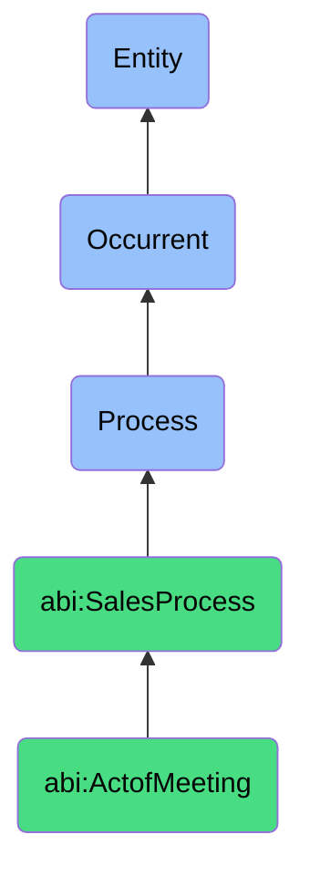

# ActofMeeting

## Definition
An act of meeting is an occurrent process that unfolds through time, involving a structured or semi-structured synchronous or asynchronous exchange between sales representatives and prospects or customers to discuss needs, explore solutions, assess mutual fit, exchange information, address concerns, and advance relationships toward specific business outcomes.

## Hierarchy in BFO


## Ontological Schema (TBox)
```turtle
abi:ActofMeeting a owl:Class ;
  rdfs:subClassOf abi:SalesProcess ;
  rdfs:label "Act of Meeting" ;
  skos:definition "A process involving a synchronous or asynchronous exchange between sales and prospect to assess fit and value." .

abi:SalesProcess a owl:Class ;
  rdfs:subClassOf bfo:0000015 ;
  rdfs:label "Sales Process" ;
  skos:definition "A time-bound interaction or conversion of relationships into economic transactions." .

abi:has_meeting_host a owl:ObjectProperty ;
  rdfs:domain abi:ActofMeeting ;
  rdfs:range abi:MeetingHost ;
  rdfs:label "has meeting host" .

abi:has_meeting_participant a owl:ObjectProperty ;
  rdfs:domain abi:ActofMeeting ;
  rdfs:range abi:MeetingParticipant ;
  rdfs:label "has meeting participant" .

abi:occurs_via_meeting_channel a owl:ObjectProperty ;
  rdfs:domain abi:ActofMeeting ;
  rdfs:range abi:MeetingChannel ;
  rdfs:label "occurs via meeting channel" .

abi:follows_meeting_agenda a owl:ObjectProperty ;
  rdfs:domain abi:ActofMeeting ;
  rdfs:range abi:MeetingAgenda ;
  rdfs:label "follows meeting agenda" .

abi:discusses_topic a owl:ObjectProperty ;
  rdfs:domain abi:ActofMeeting ;
  rdfs:range abi:DiscussionTopic ;
  rdfs:label "discusses topic" .

abi:generates_meeting_artifact a owl:ObjectProperty ;
  rdfs:domain abi:ActofMeeting ;
  rdfs:range abi:MeetingArtifact ;
  rdfs:label "generates meeting artifact" .

abi:results_in_next_step a owl:ObjectProperty ;
  rdfs:domain abi:ActofMeeting ;
  rdfs:range abi:NextStep ;
  rdfs:label "results in next step" .

abi:has_meeting_duration a owl:DatatypeProperty ;
  rdfs:domain abi:ActofMeeting ;
  rdfs:range xsd:duration ;
  rdfs:label "has meeting duration" .

abi:has_meeting_timestamp a owl:DatatypeProperty ;
  rdfs:domain abi:ActofMeeting ;
  rdfs:range xsd:dateTime ;
  rdfs:label "has meeting timestamp" .

abi:has_meeting_outcome_status a owl:DatatypeProperty ;
  rdfs:domain abi:ActofMeeting ;
  rdfs:range xsd:string ;
  rdfs:label "has meeting outcome status" .
```

## Ontological Instance (ABox)
```turtle
ex:SolutionDiscoveryMeetingProcess a abi:ActofMeeting ;
  rdfs:label "Solution Discovery Meeting Process" ;
  abi:has_meeting_host ex:SalesRepresentative ;
  abi:has_meeting_participant ex:ProspectDecisionMaker, ex:ProspectTechnicalEvaluator, ex:ProductSpecialist ;
  abi:occurs_via_meeting_channel ex:VideoConference ;
  abi:follows_meeting_agenda ex:DiscoveryCallStructure, ex:NeedsAssessmentFramework ;
  abi:discusses_topic ex:CashflowTopic, ex:AIAuditTopic, ex:IntegrationTopic ;
  abi:generates_meeting_artifact ex:DiscoveryCallNotes, ex:RequirementsSummary, ex:PresentationSlides ;
  abi:results_in_next_step ex:TechnicalDeepDive, ex:ProposalPreparation ;
  abi:has_meeting_duration "PT1H30M"^^xsd:duration ;
  abi:has_meeting_timestamp "2023-10-15T14:00:00Z"^^xsd:dateTime ;
  abi:has_meeting_outcome_status "Positive - Advancing to Solution Design" .

ex:ProductDemonstrationMeetingProcess a abi:ActofMeeting ;
  rdfs:label "Product Demonstration Meeting Process" ;
  abi:has_meeting_host ex:SolutionConsultant ;
  abi:has_meeting_participant ex:ProspectITManager, ex:ProspectEndUser, ex:AccountExecutive ;
  abi:occurs_via_meeting_channel ex:InPersonMeeting ;
  abi:follows_meeting_agenda ex:CustomDemoScript, ex:InteractiveWorkflowShowcase ;
  abi:discusses_topic ex:UserExperienceTopic, ex:SecurityFeaturesTopic, ex:APICapabilitiesTopic ;
  abi:generates_meeting_artifact ex:CustomDemoRecording, ex:FeatureComparisonDocument, ex:ConfigurationOptions ;
  abi:results_in_next_step ex:TechnicalValidation, ex:PricingDiscussion ;
  abi:has_meeting_duration "PT2H15M"^^xsd:duration ;
  abi:has_meeting_timestamp "2023-11-08T10:30:00Z"^^xsd:dateTime ;
  abi:has_meeting_outcome_status "Highly Positive - Solution Alignment Confirmed" .
```

## Related Classes
- **abi:ActofLeadQualification** - A process that often precedes meetings to qualify prospects.
- **abi:ActofDealCreation** - A process that may follow successful meetings to formalize opportunities.
- **abi:ActofNegotiation** - A process that often includes multiple meetings to refine terms.
- **abi:ActofGenerating** - A process that creates content for use during meetings.
- **abi:MeetingPreparationProcess** - A process for preparing materials and strategy prior to meetings. 