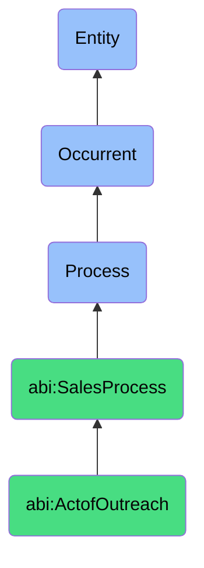

# ActofOutreach

## Definition
An act of outreach is an occurrent process that unfolds through time, involving the deliberate initiation of communication or contact with identified prospects through selected channels, leveraging appropriate messaging, timing, and approach to establish initial engagement, introduce value propositions, and create opportunities for further dialogue or relationship development.

## Hierarchy in BFO


## Ontological Schema (TBox)
```turtle
abi:ActofOutreach a owl:Class ;
  rdfs:subClassOf abi:SalesProcess ;
  rdfs:label "Act of Outreach" ;
  skos:definition "A process of initiating communication with a prospect via email, messaging, or calls." .

abi:SalesProcess a owl:Class ;
  rdfs:subClassOf bfo:0000015 ;
  rdfs:label "Sales Process" ;
  skos:definition "A time-bound interaction or conversion of relationships into economic transactions." .

abi:has_outreach_agent a owl:ObjectProperty ;
  rdfs:domain abi:ActofOutreach ;
  rdfs:range abi:OutreachAgent ;
  rdfs:label "has outreach agent" .

abi:targets_prospect a owl:ObjectProperty ;
  rdfs:domain abi:ActofOutreach ;
  rdfs:range abi:Prospect ;
  rdfs:label "targets prospect" .

abi:utilizes_outreach_channel a owl:ObjectProperty ;
  rdfs:domain abi:ActofOutreach ;
  rdfs:range abi:OutreachChannel ;
  rdfs:label "utilizes outreach channel" .

abi:applies_outreach_template a owl:ObjectProperty ;
  rdfs:domain abi:ActofOutreach ;
  rdfs:range abi:OutreachTemplate ;
  rdfs:label "applies outreach template" .

abi:personalizes_message a owl:ObjectProperty ;
  rdfs:domain abi:ActofOutreach ;
  rdfs:range abi:PersonalizationElement ;
  rdfs:label "personalizes message" .

abi:sequences_communication a owl:ObjectProperty ;
  rdfs:domain abi:ActofOutreach ;
  rdfs:range abi:CommunicationSequence ;
  rdfs:label "sequences communication" .

abi:records_outreach_result a owl:ObjectProperty ;
  rdfs:domain abi:ActofOutreach ;
  rdfs:range abi:OutreachResult ;
  rdfs:label "records outreach result" .

abi:has_outreach_timing a owl:DatatypeProperty ;
  rdfs:domain abi:ActofOutreach ;
  rdfs:range xsd:dateTime ;
  rdfs:label "has outreach timing" .

abi:has_response_rate a owl:DatatypeProperty ;
  rdfs:domain abi:ActofOutreach ;
  rdfs:range xsd:decimal ;
  rdfs:label "has response rate" .

abi:has_follow_up_count a owl:DatatypeProperty ;
  rdfs:domain abi:ActofOutreach ;
  rdfs:range xsd:integer ;
  rdfs:label "has follow up count" .
```

## Ontological Instance (ABox)
```turtle
ex:AIFirstIntroOutreachProcess a abi:ActofOutreach ;
  rdfs:label "AI-First Introduction Outreach Process" ;
  abi:has_outreach_agent ex:SalesAssistant ;
  abi:targets_prospect ex:QualifiedEnterpriseLead, ex:HighScoringSaaSTechnicalBuyer ;
  abi:utilizes_outreach_channel ex:BusinessEmail, ex:LinkedInMessageChannel ;
  abi:applies_outreach_template ex:AIFirstIntroTemplate ;
  abi:personalizes_message ex:CompanySpecificInsight, ex:RoleBasedValueProposition, ex:IndustryTrendReference ;
  abi:sequences_communication ex:ThreeTouchSequence, ex:MultiChannelApproach ;
  abi:records_outreach_result ex:EmailOpenEvent, ex:LinkClickAnalytics, ex:ReplyMetrics ;
  abi:has_outreach_timing "2023-10-05T09:30:00Z"^^xsd:dateTime ;
  abi:has_response_rate "0.28"^^xsd:decimal ;
  abi:has_follow_up_count "2"^^xsd:integer .

ex:EventFollowUpOutreachProcess a abi:ActofOutreach ;
  rdfs:label "Event Follow-Up Outreach Process" ;
  abi:has_outreach_agent ex:MarketingAutomationSystem ;
  abi:targets_prospect ex:ConferenceAttendee, ex:WebinarParticipant ;
  abi:utilizes_outreach_channel ex:PersonalizedEmail, ex:SMSFollowUp ;
  abi:applies_outreach_template ex:EventRecapTemplate, ex:NextStepsInvitationTemplate ;
  abi:personalizes_message ex:EventSpecificInteraction, ex:ContentDownloadHistory, ex:SpeakerReference ;
  abi:sequences_communication ex:ImmediateFollowUpSequence, ex:ThirtyDayNurtureSequence ;
  abi:records_outreach_result ex:MeetingBookingRate, ex:ContentDownloadConversion, ex:ResponseSentiment ;
  abi:has_outreach_timing "2023-11-12T14:00:00Z"^^xsd:dateTime ;
  abi:has_response_rate "0.35"^^xsd:decimal ;
  abi:has_follow_up_count "3"^^xsd:integer .
```

## Related Classes
- **abi:ActofProspecting** - A process that identifies potential clients who become targets for outreach.
- **abi:ActofLeadQualification** - A process that often follows successful outreach to determine fit.
- **abi:ActofMeeting** - A process that may result from successful outreach activities.
- **abi:ActofGenerating** - A process that creates content used in outreach communications.
- **abi:ActofTrackingEngagement** - A process that monitors responses to outreach attempts. 