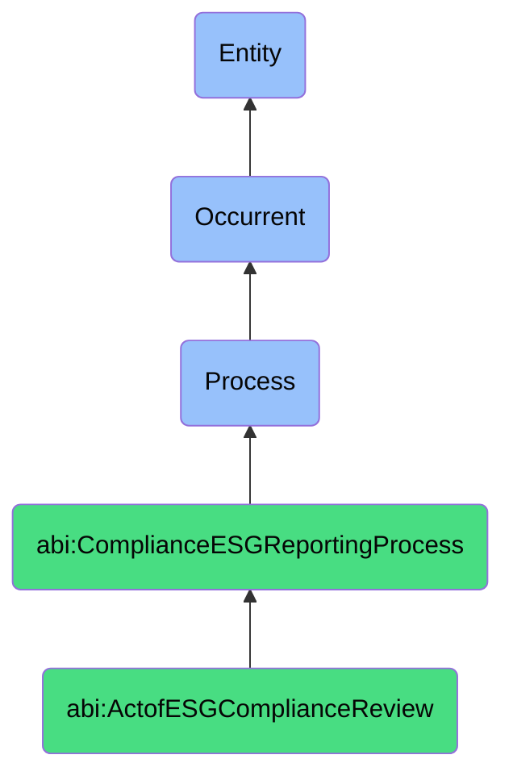

# ActofESGComplianceReview

## Definition
An act of ESG compliance review is an occurrent process that unfolds through time, involving the systematic assessment, evaluation, and verification of organizational activities, operations, or outputs against established environmental, social, and governance standards, frameworks, metrics, or regulatory requirements, to determine conformance, identify gaps, measure performance, or validate disclosures through structured methodologies that incorporate data collection, analysis, and comparison against relevant benchmarks, industry practices, or sustainability commitments.

## Hierarchy in BFO


## Ontological Schema (TBox)
```turtle
abi:ActofESGComplianceReview a owl:Class ;
  rdfs:subClassOf abi:ComplianceESGReportingProcess ;
  rdfs:label "Act of ESG Compliance Review" ;
  skos:definition "A process that compares operational practices against ESG benchmarks, policies, or regulations." .

abi:ComplianceESGReportingProcess a owl:Class ;
  rdfs:subClassOf bfo:0000015 ;
  rdfs:label "Compliance ESG Reporting Process" ;
  skos:definition "A time-bound process related to the evaluation, documentation, or verification of organizational practices against regulatory requirements, industry standards, or ESG frameworks." .

abi:has_review_executor a owl:ObjectProperty ;
  rdfs:domain abi:ActofESGComplianceReview ;
  rdfs:range abi:ReviewExecutor ;
  rdfs:label "has review executor" .

abi:assesses_esg_dimension a owl:ObjectProperty ;
  rdfs:domain abi:ActofESGComplianceReview ;
  rdfs:range abi:ESGDimension ;
  rdfs:label "assesses esg dimension" .

abi:evaluates_organizational_activity a owl:ObjectProperty ;
  rdfs:domain abi:ActofESGComplianceReview ;
  rdfs:range abi:OrganizationalActivity ;
  rdfs:label "evaluates organizational activity" .

abi:applies_esg_framework a owl:ObjectProperty ;
  rdfs:domain abi:ActofESGComplianceReview ;
  rdfs:range abi:ESGFramework ;
  rdfs:label "applies esg framework" .

abi:measures_sustainability_metric a owl:ObjectProperty ;
  rdfs:domain abi:ActofESGComplianceReview ;
  rdfs:range abi:SustainabilityMetric ;
  rdfs:label "measures sustainability metric" .

abi:identifies_compliance_gap a owl:ObjectProperty ;
  rdfs:domain abi:ActofESGComplianceReview ;
  rdfs:range abi:ComplianceGap ;
  rdfs:label "identifies compliance gap" .

abi:produces_esg_report a owl:ObjectProperty ;
  rdfs:domain abi:ActofESGComplianceReview ;
  rdfs:range abi:ESGReport ;
  rdfs:label "produces esg report" .

abi:has_review_period a owl:DatatypeProperty ;
  rdfs:domain abi:ActofESGComplianceReview ;
  rdfs:range xsd:string ;
  rdfs:label "has review period" .

abi:has_compliance_score a owl:DatatypeProperty ;
  rdfs:domain abi:ActofESGComplianceReview ;
  rdfs:range xsd:decimal ;
  rdfs:label "has compliance score" .

abi:has_disclosure_requirement a owl:DatatypeProperty ;
  rdfs:domain abi:ActofESGComplianceReview ;
  rdfs:range xsd:string ;
  rdfs:label "has disclosure requirement" .
```

## Ontological Instance (ABox)
```turtle
ex:QuarterlyCarbonEmissionsReview a abi:ActofESGComplianceReview ;
  rdfs:label "Quarterly Scope 2 Emissions Compliance Review" ;
  abi:has_review_executor ex:SustainabilityManager, ex:ESGConsultant, ex:EnergyDataAnalyst ;
  abi:assesses_esg_dimension ex:EnvironmentalDimension, ex:CarbonEmissions, ex:EnergyEfficiency ;
  abi:evaluates_organizational_activity ex:DataCenterOperations, ex:OfficeEnergyUsage, ex:ProductionFacilities ;
  abi:applies_esg_framework ex:GHGProtocol, ex:ScienceBasedTargets, ex:TCFDGuidelines ;
  abi:measures_sustainability_metric ex:Scope2Emissions, ex:ElectricityCarbonIntensity, ex:RenewableEnergyPercentage ;
  abi:identifies_compliance_gap ex:EmissionsTargetDeviation, ex:DataCollectionInconsistency, ex:MeasurementMethodologyGap ;
  abi:produces_esg_report ex:QuarterlyEmissionsDisclosure, ex:SustainabilityDashboardUpdate, ex:RegulatoryFilingData ;
  abi:has_review_period "Q3 2023" ;
  abi:has_compliance_score "0.87"^^xsd:decimal ;
  abi:has_disclosure_requirement "Quarterly investor sustainability report" .

ex:AnnualSocialResponsibilityReview a abi:ActofESGComplianceReview ;
  rdfs:label "Annual Social Responsibility and Labor Practices Review" ;
  abi:has_review_executor ex:HumanResourcesDirector, ex:ComplianceOfficer, ex:SocialImpactSpecialist ;
  abi:assesses_esg_dimension ex:SocialDimension, ex:LaborPractices, ex:DiversityInclusion, ex:HumanRights ;
  abi:evaluates_organizational_activity ex:WorkforceManagement, ex:SupplierRelationships, ex:CommunityEngagement ;
  abi:applies_esg_framework ex:UNGlobalCompact, ex:SAStandards, ex:ISOSocialResponsibility ;
  abi:measures_sustainability_metric ex:WorkforceDiversity, ex:PayEquityRatios, ex:SupplierCodeComplianceRate ;
  abi:identifies_compliance_gap ex:DiversityTargetShortfall, ex:SupplierComplianceDocumentation, ex:TrainingCompletion ;
  abi:produces_esg_report ex:AnnualSocialResponsibilityReport, ex:BoardDiversityDisclosure, ex:HumanRightsStatement ;
  abi:has_review_period "FY 2023" ;
  abi:has_compliance_score "0.92"^^xsd:decimal ;
  abi:has_disclosure_requirement "Annual corporate responsibility report" .
```

## Related Classes
- **abi:ActofSafetyInspection** - A process that may overlap with social aspects of ESG compliance.
- **abi:RegulatoryReportingProcess** - A process that utilizes ESG compliance review findings for regulatory filings.
- **abi:SustainabilityMetricsProcess** - A process that provides data inputs for ESG compliance reviews.
- **abi:ESGFrameworkSelectionProcess** - A process for determining which standards to apply in compliance reviews.
- **abi:StakeholderEngagementProcess** - A process for involving stakeholders in ESG compliance priorities.
- **abi:ESGRiskAssessmentProcess** - A process for evaluating ESG-related risks based on compliance findings.
- **abi:SustainabilityImprovementPlanningProcess** - A process that addresses gaps identified in ESG compliance reviews. 