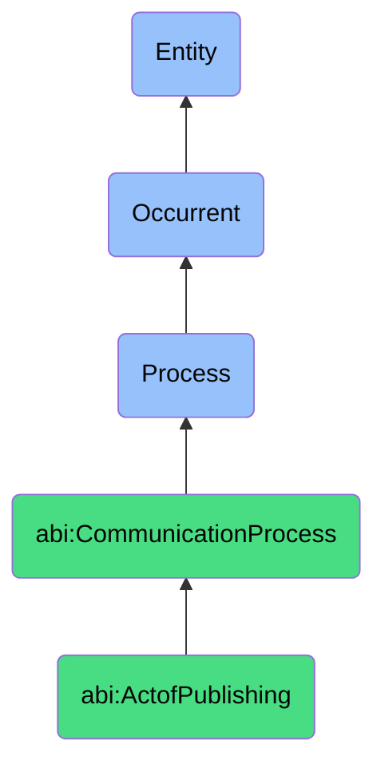

# ActofPublishing

## Definition
An act of publishing is an occurrent process that unfolds through time, involving the release, distribution, or dissemination of content, information, or digital assets through specific channels or platforms to make them accessible to intended audiences, characterized by formal transmission from a controlled or private state to a public or targeted availability.

## Hierarchy in BFO


## Ontological Schema (TBox)
```turtle
abi:ActofPublishing a owl:Class ;
  rdfs:subClassOf abi:CommunicationProcess ;
  rdfs:label "Act of Publishing" ;
  skos:definition "A process that makes content or outputs public in a given channel." .

abi:CommunicationProcess a owl:Class ;
  rdfs:subClassOf bfo:0000015 ;
  rdfs:label "Communication Process" ;
  skos:definition "A process involving the creation, transformation, or dissemination of information or content to convey meaning or prompt action." .

abi:has_publisher a owl:ObjectProperty ;
  rdfs:domain abi:ActofPublishing ;
  rdfs:range abi:Publisher ;
  rdfs:label "has publisher" .

abi:distributes_content a owl:ObjectProperty ;
  rdfs:domain abi:ActofPublishing ;
  rdfs:range abi:PublishableContent ;
  rdfs:label "distributes content" .

abi:publishes_to_channel a owl:ObjectProperty ;
  rdfs:domain abi:ActofPublishing ;
  rdfs:range abi:PublicationChannel ;
  rdfs:label "publishes to channel" .

abi:follows_publication_policy a owl:ObjectProperty ;
  rdfs:domain abi:ActofPublishing ;
  rdfs:range abi:PublicationPolicy ;
  rdfs:label "follows publication policy" .

abi:creates_published_artifact a owl:ObjectProperty ;
  rdfs:domain abi:ActofPublishing ;
  rdfs:range abi:PublishedArtifact ;
  rdfs:label "creates published artifact" .

abi:targets_readership a owl:ObjectProperty ;
  rdfs:domain abi:ActofPublishing ;
  rdfs:range abi:TargetReadership ;
  rdfs:label "targets readership" .

abi:configures_distribution_settings a owl:ObjectProperty ;
  rdfs:domain abi:ActofPublishing ;
  rdfs:range abi:DistributionSettings ;
  rdfs:label "configures distribution settings" .

abi:has_publication_timestamp a owl:DatatypeProperty ;
  rdfs:domain abi:ActofPublishing ;
  rdfs:range xsd:dateTime ;
  rdfs:label "has publication timestamp" .

abi:has_distribution_scope a owl:DatatypeProperty ;
  rdfs:domain abi:ActofPublishing ;
  rdfs:range xsd:string ;
  rdfs:label "has distribution scope" .

abi:has_visibility_setting a owl:DatatypeProperty ;
  rdfs:domain abi:ActofPublishing ;
  rdfs:range xsd:string ;
  rdfs:label "has visibility setting" .
```

## Ontological Instance (ABox)
```turtle
ex:LinkedInSlidePublishingProcess a abi:ActofPublishing ;
  rdfs:label "LinkedIn Slide Publishing Process" ;
  abi:has_publisher ex:MarketingSpecialist ;
  abi:distributes_content ex:IndustryTrendsSlide, ex:CompanyAnnouncementGraphic ;
  abi:publishes_to_channel ex:LinkedInCompanyPage, ex:LinkedInGroupForum ;
  abi:follows_publication_policy ex:BrandingGuidelines, ex:SocialMediaPolicy ;
  abi:creates_published_artifact ex:LinkedInPost ;
  abi:targets_readership ex:IndustryProfessionals, ex:PotentialClients ;
  abi:configures_distribution_settings ex:HashtagConfiguration, ex:AudienceTargetingSettings ;
  abi:has_publication_timestamp "2023-09-15T10:30:00Z"^^xsd:dateTime ;
  abi:has_distribution_scope "Public with targeted promotion" ;
  abi:has_visibility_setting "Public" .

ex:WebsiteArticlePublishingProcess a abi:ActofPublishing ;
  rdfs:label "Website Article Publishing Process" ;
  abi:has_publisher ex:ContentManager ;
  abi:distributes_content ex:TechnicalWhitepaper, ex:ResearchFindings ;
  abi:publishes_to_channel ex:CorporateWebsite, ex:IndustryNewsletter ;
  abi:follows_publication_policy ex:EditorialGuidelines, ex:ComplianceRequirements ;
  abi:creates_published_artifact ex:WebPageArticle, ex:DownloadablePDF ;
  abi:targets_readership ex:ExistingCustomers, ex:IndustryResearchers ;
  abi:configures_distribution_settings ex:SEOConfiguration, ex:GatedContentSettings ;
  abi:has_publication_timestamp "2023-08-22T08:15:00Z"^^xsd:dateTime ;
  abi:has_distribution_scope "Public with registration required for full access" ;
  abi:has_visibility_setting "Search indexed with partial paywall" .
```

## Related Classes
- **abi:ActofGenerating** - A process that often creates the content that is subsequently published.
- **abi:ActofTranslating** - A process that may transform content to make it suitable for different audiences or channels.
- **abi:ContentSchedulingProcess** - A process that determines optimal timing for publishing activities.
- **abi:MetadataEnrichmentProcess** - A process that enhances content with metadata to improve discoverability when published.
- **abi:AudienceEngagementMonitoringProcess** - A process that tracks responses and interactions after content is published. 