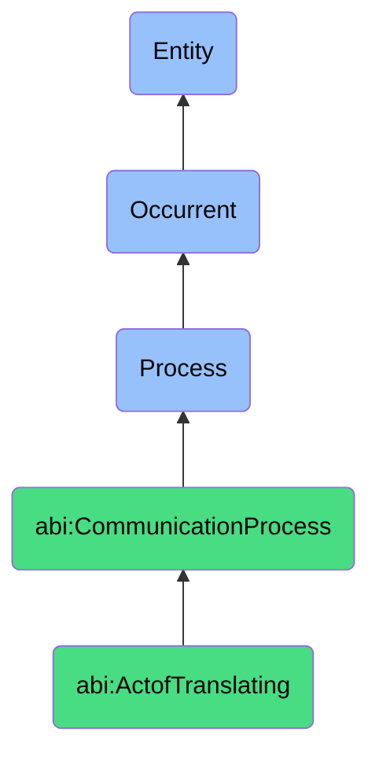

# ActofTranslating

## Definition
An act of translating is an occurrent process that unfolds through time, involving the transformation of content from one linguistic, technical, or representational form to another while preserving the original meaning, context, and intent, requiring both source and target language or framework competencies to facilitate understanding and accessibility across different audience contexts.

## Hierarchy in BFO


## Ontological Schema (TBox)
```turtle
abi:ActofTranslating a owl:Class ;
  rdfs:subClassOf abi:CommunicationProcess ;
  rdfs:label "Act of Translating" ;
  skos:definition "A process that transforms content between human or machine languages." .

abi:CommunicationProcess a owl:Class ;
  rdfs:subClassOf bfo:0000015 ;
  rdfs:label "Communication Process" ;
  skos:definition "A process involving the creation, transformation, or dissemination of information or content to convey meaning or prompt action." .

abi:has_translator a owl:ObjectProperty ;
  rdfs:domain abi:ActofTranslating ;
  rdfs:range abi:Translator ;
  rdfs:label "has translator" .

abi:transforms_source_content a owl:ObjectProperty ;
  rdfs:domain abi:ActofTranslating ;
  rdfs:range abi:SourceContent ;
  rdfs:label "transforms source content" .

abi:applies_translation_method a owl:ObjectProperty ;
  rdfs:domain abi:ActofTranslating ;
  rdfs:range abi:TranslationMethod ;
  rdfs:label "applies translation method" .

abi:produces_translated_content a owl:ObjectProperty ;
  rdfs:domain abi:ActofTranslating ;
  rdfs:range abi:TranslatedContent ;
  rdfs:label "produces translated content" .

abi:preserves_meaning a owl:ObjectProperty ;
  rdfs:domain abi:ActofTranslating ;
  rdfs:range abi:SourceMeaning ;
  rdfs:label "preserves meaning" .

abi:accommodates_cultural_context a owl:ObjectProperty ;
  rdfs:domain abi:ActofTranslating ;
  rdfs:range abi:CulturalContext ;
  rdfs:label "accommodates cultural context" .

abi:follows_translation_standards a owl:ObjectProperty ;
  rdfs:domain abi:ActofTranslating ;
  rdfs:range abi:TranslationStandard ;
  rdfs:label "follows translation standards" .

abi:has_source_language a owl:DatatypeProperty ;
  rdfs:domain abi:ActofTranslating ;
  rdfs:range xsd:string ;
  rdfs:label "has source language" .

abi:has_target_language a owl:DatatypeProperty ;
  rdfs:domain abi:ActofTranslating ;
  rdfs:range xsd:string ;
  rdfs:label "has target language" .

abi:has_fidelity_score a owl:DatatypeProperty ;
  rdfs:domain abi:ActofTranslating ;
  rdfs:range xsd:decimal ;
  rdfs:label "has fidelity score" .
```

## Ontological Instance (ABox)
```turtle
ex:DEIReportTranslationProcess a abi:ActofTranslating ;
  rdfs:label "DE&I Report Translation Process" ;
  abi:has_translator ex:TranslationBot ;
  abi:transforms_source_content ex:DiversityEquityInclusionReport ;
  abi:applies_translation_method ex:NeuralMachineTranslation, ex:ContextSensitiveTranslation ;
  abi:produces_translated_content ex:GermanDEIReport, ex:FrenchDEIReport, ex:SpanishDEIReport ;
  abi:preserves_meaning ex:InclusionPolicyMeaning, ex:DiversityMetricsMeaning ;
  abi:accommodates_cultural_context ex:EuropeanCorporateContext, ex:RegionalComplianceContext ;
  abi:follows_translation_standards ex:ISO17100TranslationStandard, ex:CorporateTerminologyStandard ;
  abi:has_source_language "English (US)" ;
  abi:has_target_language "German, French, Spanish" ;
  abi:has_fidelity_score "0.94"^^xsd:decimal .

ex:TechnicalDocumentationTranslationProcess a abi:ActofTranslating ;
  rdfs:label "Technical Documentation Translation Process" ;
  abi:has_translator ex:TechnicalTranslationTeam ;
  abi:transforms_source_content ex:ProductSpecification, ex:UserManual, ex:APIDocumentation ;
  abi:applies_translation_method ex:TechnicalTermMatching, ex:GlossaryBasedTranslation ;
  abi:produces_translated_content ex:JapaneseUserManual, ex:KoreanAPIDocumentation ;
  abi:preserves_meaning ex:TechnicalConceptMeaning, ex:ProcessInstructionMeaning ;
  abi:accommodates_cultural_context ex:AsianTechnicalStandardsContext, ex:LocalRegulatoryContext ;
  abi:follows_translation_standards ex:TechnicalTranslationGuidelines, ex:IndustryTerminologyStandards ;
  abi:has_source_language "English (Technical)" ;
  abi:has_target_language "Japanese, Korean" ;
  abi:has_fidelity_score "0.96"^^xsd:decimal .
```

## Related Classes
- **abi:ActofGenerating** - A process that creates content that may subsequently require translation.
- **abi:ActofPublishing** - A process that distributes translated content to different audience segments.
- **abi:ContentLocalizationProcess** - A specialized translation process that adapts content for specific regional contexts.
- **abi:TerminologyStandardizationProcess** - A process that establishes consistent terminology across translations.
- **abi:TranslationQualityAssuranceProcess** - A process that evaluates and ensures the quality of translations. 