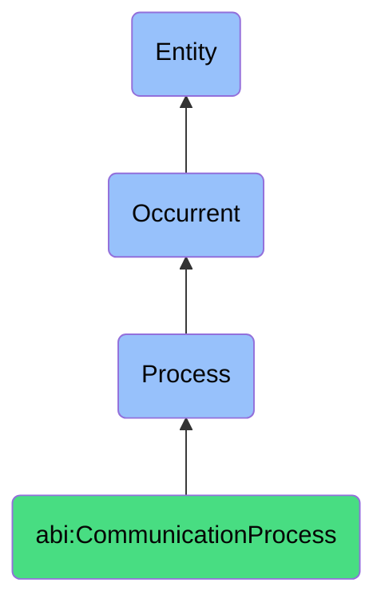

# CommunicationProcess

## Definition
A communication process is an occurrent that unfolds through time, involving the creation, transformation, transmission, or dissemination of information, messages, or content between agents, systems, or channels to convey meaning, share knowledge, influence understanding, or prompt action within specific contexts and audiences.

## Hierarchy in BFO


## Ontological Schema (TBox)
```turtle
abi:CommunicationProcess a owl:Class ;
  rdfs:subClassOf bfo:0000015 ;
  rdfs:label "Communication Process" ;
  skos:definition "A process involving the creation, transformation, or dissemination of information or content to convey meaning or prompt action." .

abi:has_communicator a owl:ObjectProperty ;
  rdfs:domain abi:CommunicationProcess ;
  rdfs:range abi:Communicator ;
  rdfs:label "has communicator" .

abi:processes_content a owl:ObjectProperty ;
  rdfs:domain abi:CommunicationProcess ;
  rdfs:range abi:Content ;
  rdfs:label "processes content" .

abi:applies_communication_method a owl:ObjectProperty ;
  rdfs:domain abi:CommunicationProcess ;
  rdfs:range abi:CommunicationMethod ;
  rdfs:label "applies communication method" .

abi:produces_communication_output a owl:ObjectProperty ;
  rdfs:domain abi:CommunicationProcess ;
  rdfs:range abi:CommunicationOutput ;
  rdfs:label "produces communication output" .

abi:targets_audience a owl:ObjectProperty ;
  rdfs:domain abi:CommunicationProcess ;
  rdfs:range abi:TargetAudience ;
  rdfs:label "targets audience" .

abi:occurs_in_context a owl:ObjectProperty ;
  rdfs:domain abi:CommunicationProcess ;
  rdfs:range abi:CommunicationContext ;
  rdfs:label "occurs in context" .

abi:utilizes_channel a owl:ObjectProperty ;
  rdfs:domain abi:CommunicationProcess ;
  rdfs:range abi:CommunicationChannel ;
  rdfs:label "utilizes channel" .

abi:has_duration a owl:DatatypeProperty ;
  rdfs:domain abi:CommunicationProcess ;
  rdfs:range xsd:duration ;
  rdfs:label "has duration" .

abi:has_complexity_level a owl:DatatypeProperty ;
  rdfs:domain abi:CommunicationProcess ;
  rdfs:range xsd:string ;
  rdfs:label "has complexity level" .

abi:has_effectiveness_metric a owl:DatatypeProperty ;
  rdfs:domain abi:CommunicationProcess ;
  rdfs:range xsd:decimal ;
  rdfs:label "has effectiveness metric" .
```

## Ontological Instance (ABox)
```turtle
# CommunicationProcess is a parent class with subclasses:
# - abi:ActofGenerating
# - abi:ActofPublishing
# - abi:ActofTranslating
# and other communication-related processes
```

## Related Classes
- **abi:ActofGenerating** - A specialized process for creating new textual or multimedia content.
- **abi:ActofPublishing** - A specialized process for making content public in a given channel.
- **abi:ActofTranslating** - A specialized process for transforming content between languages.
- **abi:AnalysisProcess** - A process that often precedes communication to develop insights to be shared.
- **abi:FeedbackProcess** - A process that captures responses to communicated content. 