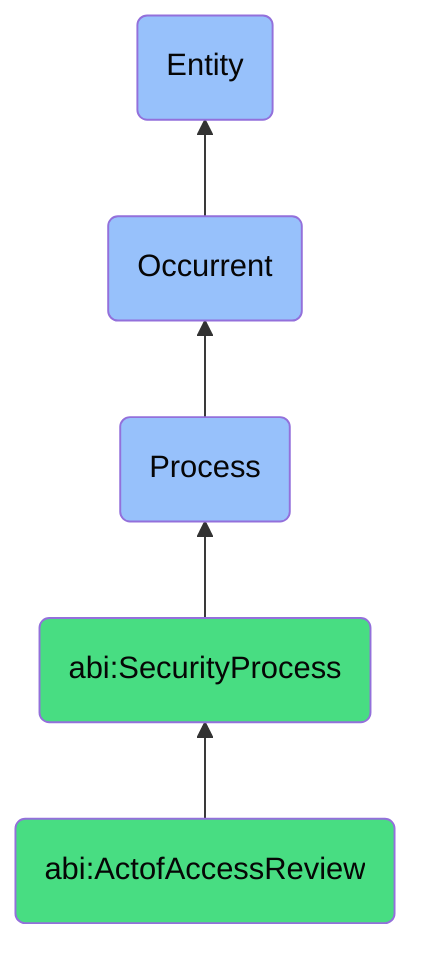

# ActofAccessReview

## Definition
An act of access review is an occurrent process that unfolds through time, involving the systematic examination, validation, and adjustment of user, group, service, or system access rights, permissions, and privileges across digital resources, applications, systems, and data repositories to enforce the principle of least privilege, identify excessive or inappropriate access, mitigate access-related risks, and ensure access controls align with organizational security policies, business needs, and regulatory requirements.

## Hierarchy in BFO


## Ontological Schema (TBox)
```turtle
abi:ActofAccessReview a owl:Class ;
  rdfs:subClassOf abi:SecurityProcess ;
  rdfs:label "Act of Access Review" ;
  skos:definition "A process that checks and adjusts user/system access rights to ensure minimum privilege." .

abi:SecurityProcess a owl:Class ;
  rdfs:subClassOf bfo:0000015 ;
  rdfs:label "Security Process" ;
  skos:definition "A time-bound process related to the protection, monitoring, and management of digital assets, systems, and information against security threats and vulnerabilities." .

abi:has_access_reviewer a owl:ObjectProperty ;
  rdfs:domain abi:ActofAccessReview ;
  rdfs:range abi:AccessReviewer ;
  rdfs:label "has access reviewer" .

abi:reviews_access_subject a owl:ObjectProperty ;
  rdfs:domain abi:ActofAccessReview ;
  rdfs:range abi:AccessSubject ;
  rdfs:label "reviews access subject" .

abi:examines_resource_permission a owl:ObjectProperty ;
  rdfs:domain abi:ActofAccessReview ;
  rdfs:range abi:ResourcePermission ;
  rdfs:label "examines resource permission" .

abi:applies_access_policy a owl:ObjectProperty ;
  rdfs:domain abi:ActofAccessReview ;
  rdfs:range abi:AccessPolicy ;
  rdfs:label "applies access policy" .

abi:validates_access_requirement a owl:ObjectProperty ;
  rdfs:domain abi:ActofAccessReview ;
  rdfs:range abi:AccessRequirement ;
  rdfs:label "validates access requirement" .

abi:identifies_access_issue a owl:ObjectProperty ;
  rdfs:domain abi:ActofAccessReview ;
  rdfs:range abi:AccessIssue ;
  rdfs:label "identifies access issue" .

abi:implements_access_change a owl:ObjectProperty ;
  rdfs:domain abi:ActofAccessReview ;
  rdfs:range abi:AccessChange ;
  rdfs:label "implements access change" .

abi:has_review_start_date a owl:DatatypeProperty ;
  rdfs:domain abi:ActofAccessReview ;
  rdfs:range xsd:date ;
  rdfs:label "has review start date" .

abi:has_review_completion_date a owl:DatatypeProperty ;
  rdfs:domain abi:ActofAccessReview ;
  rdfs:range xsd:date ;
  rdfs:label "has review completion date" .

abi:has_permissions_adjusted_count a owl:DatatypeProperty ;
  rdfs:domain abi:ActofAccessReview ;
  rdfs:range xsd:integer ;
  rdfs:label "has permissions adjusted count" .
```

## Ontological Instance (ABox)
```turtle
ex:EngineeringRolesAccessReview a abi:ActofAccessReview ;
  rdfs:label "Engineering Roles Quarterly Access Review" ;
  abi:has_access_reviewer ex:SecurityAssistant, ex:EngineeringDirector, ex:IAMAdministrator ;
  abi:reviews_access_subject ex:DeveloperRoles, ex:DevOpsRoles, ex:QARoles ;
  abi:examines_resource_permission ex:ProductionEnvironmentAccess, ex:CodeRepositoryPermissions, ex:DatabaseCredentials, ex:CloudResourcePermissions ;
  abi:applies_access_policy ex:LeastPrivilegePrinciple, ex:SeparationOfDutiesPolicy, ex:JustInTimeAccessStandard ;
  abi:validates_access_requirement ex:DevelopmentWorkflowNeeds, ex:DeploymentResponsibilities, ex:MaintenanceRequirements ;
  abi:identifies_access_issue ex:UnusedPermissionsExpansion, ex:PermissionsMismatchWithRole, ex:AccessCreepOccurrence ;
  abi:implements_access_change ex:RevokedUnusedRights, ex:RoleScopeNarrowing, ex:TemporaryAccessImplementation ;
  abi:has_review_start_date "2023-11-01"^^xsd:date ;
  abi:has_review_completion_date "2023-11-10"^^xsd:date ;
  abi:has_permissions_adjusted_count "37"^^xsd:integer .

ex:FinancialSystemsAccessReview a abi:ActofAccessReview ;
  rdfs:label "Financial Systems Semi-Annual Access Review" ;
  abi:has_access_reviewer ex:ComplianceOfficer, ex:FinanceDirector, ex:SecurityManager ;
  abi:reviews_access_subject ex:AccountingRoles, ex:FinanceAnalystRoles, ex:VendorManagementRoles ;
  abi:examines_resource_permission ex:ERPSystemAccess, ex:PaymentSystemsPermissions, ex:FinancialReportingAccess, ex:InvestmentPlatformRights ;
  abi:applies_access_policy ex:ComplianceRequirements, ex:SegregationOfFinancialDutiesPolicy, ex:PrivilegedAccessPolicy ;
  abi:validates_access_requirement ex:AuditingNeeds, ex:ReportingResponsibilities, ex:TransactionApprovalWorkflow ;
  abi:identifies_access_issue ex:ExcessiveApprovalRights, ex:UnauthorizedReportAccess, ex:OutdatedAccessGroupMembership ;
  abi:implements_access_change ex:RoleReassignment, ex:ApprovalLimitAdjustments, ex:AccessGroupRestructuring ;
  abi:has_review_start_date "2023-09-15"^^xsd:date ;
  abi:has_review_completion_date "2023-09-30"^^xsd:date ;
  abi:has_permissions_adjusted_count "22"^^xsd:integer .
```

## Related Classes
- **abi:ActofSecurityAudit** - A broader process that may include access review as one component.
- **abi:ActofThreatDetection** - A process that may identify suspicious access patterns requiring review.
- **abi:ActofIncidentResponse** - A process that may be triggered by critical access control issues.
- **abi:ActofCredentialRotation** - A process often executed in conjunction with access reviews.
- **abi:IdentityManagementProcess** - A broader process that encompasses access review activities.
- **abi:PrivilegeEscalationAssessmentProcess** - A specialized process focused on detecting improper privilege paths.
- **abi:AccessRecertificationProcess** - A formalized process for periodic verification of access rights. 