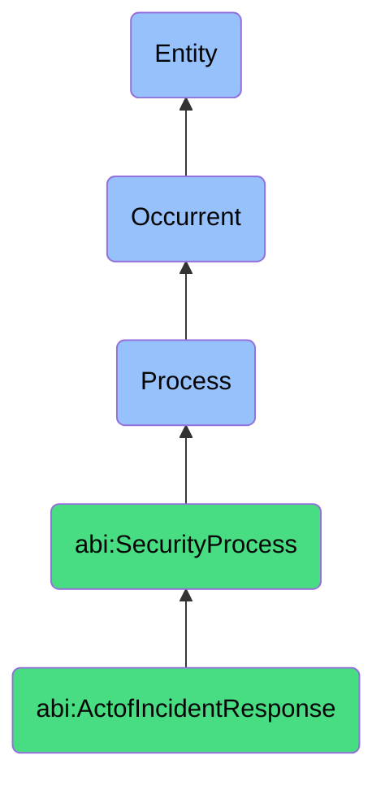

# ActofIncidentResponse

## Definition
An act of incident response is an occurrent process that unfolds through time, involving the coordinated series of activities initiated after detection of a cybersecurity or privacy breach, including the identification, analysis, containment, eradication, recovery, and documentation phases of handling security incidents, with the aim of minimizing damage, reducing recovery time and costs, preserving evidence, and restoring normal operations while learning from the event to prevent future occurrences.

## Hierarchy in BFO


## Ontological Schema (TBox)
```turtle
abi:ActofIncidentResponse a owl:Class ;
  rdfs:subClassOf abi:SecurityProcess ;
  rdfs:label "Act of Incident Response" ;
  skos:definition "A process that is initiated after detection of a cybersecurity or privacy breach to contain, resolve, and document the event." .

abi:SecurityProcess a owl:Class ;
  rdfs:subClassOf bfo:0000015 ;
  rdfs:label "Security Process" ;
  skos:definition "A time-bound process related to the protection, monitoring, and management of digital assets, systems, and information against security threats and vulnerabilities." .

abi:has_incident_responder a owl:ObjectProperty ;
  rdfs:domain abi:ActofIncidentResponse ;
  rdfs:range abi:IncidentResponder ;
  rdfs:label "has incident responder" .

abi:addresses_security_incident a owl:ObjectProperty ;
  rdfs:domain abi:ActofIncidentResponse ;
  rdfs:range abi:SecurityIncident ;
  rdfs:label "addresses security incident" .

abi:follows_response_playbook a owl:ObjectProperty ;
  rdfs:domain abi:ActofIncidentResponse ;
  rdfs:range abi:ResponsePlaybook ;
  rdfs:label "follows response playbook" .

abi:implements_containment_action a owl:ObjectProperty ;
  rdfs:domain abi:ActofIncidentResponse ;
  rdfs:range abi:ContainmentAction ;
  rdfs:label "implements containment action" .

abi:conducts_forensic_analysis a owl:ObjectProperty ;
  rdfs:domain abi:ActofIncidentResponse ;
  rdfs:range abi:ForensicAnalysis ;
  rdfs:label "conducts forensic analysis" .

abi:executes_remediation_step a owl:ObjectProperty ;
  rdfs:domain abi:ActofIncidentResponse ;
  rdfs:range abi:RemediationStep ;
  rdfs:label "executes remediation step" .

abi:produces_incident_documentation a owl:ObjectProperty ;
  rdfs:domain abi:ActofIncidentResponse ;
  rdfs:range abi:IncidentDocumentation ;
  rdfs:label "produces incident documentation" .

abi:has_incident_start_time a owl:DatatypeProperty ;
  rdfs:domain abi:ActofIncidentResponse ;
  rdfs:range xsd:dateTime ;
  rdfs:label "has incident start time" .

abi:has_response_time a owl:DatatypeProperty ;
  rdfs:domain abi:ActofIncidentResponse ;
  rdfs:range xsd:duration ;
  rdfs:label "has response time" .

abi:has_incident_severity a owl:DatatypeProperty ;
  rdfs:domain abi:ActofIncidentResponse ;
  rdfs:range xsd:string ;
  rdfs:label "has incident severity" .
```

## Ontological Instance (ABox)
```turtle
ex:DataAnomalyIncidentResponse a abi:ActofIncidentResponse ;
  rdfs:label "Data Exfiltration Alert Response" ;
  abi:has_incident_responder ex:SecurityOperationsTeam, ex:IncidentResponseManager, ex:DataPrivacyOfficer ;
  abi:addresses_security_incident ex:DataExfiltrationAttempt ;
  abi:follows_response_playbook ex:DataBreachResponsePlan, ex:ExfiltrationContainmentProcedure ;
  abi:implements_containment_action ex:NetworkSegmentIsolation, ex:CredentialReset, ex:EndpointQuarantine ;
  abi:conducts_forensic_analysis ex:NetworkTrafficAnalysis, ex:LogCorrelationAnalysis, ex:EndpointForensics ;
  abi:executes_remediation_step ex:MalwareRemoval, ex:SecurityPatchDeployment, ex:AccessControlUpdate ;
  abi:produces_incident_documentation ex:IncidentTimelineReport, ex:ForensicAnalysisReport, ex:RemediationActionLog ;
  abi:has_incident_start_time "2023-11-14T02:18:45Z"^^xsd:dateTime ;
  abi:has_response_time "PT4H30M"^^xsd:duration ;
  abi:has_incident_severity "High" .

ex:RansomwareIncidentResponse a abi:ActofIncidentResponse ;
  rdfs:label "Ransomware Attack Response" ;
  abi:has_incident_responder ex:CyberSecurityTeam, ex:ForensicInvestigator, ex:ITRecoverySpecialist, ex:ExecutiveLeadership ;
  abi:addresses_security_incident ex:RansomwareInfection ;
  abi:follows_response_playbook ex:RansomwareResponsePlan, ex:BusinessContinuityProcedure ;
  abi:implements_containment_action ex:SystemIsolation, ex:NetworkDisconnection, ex:BackupSegregation ;
  abi:conducts_forensic_analysis ex:MalwareReverseEngineering, ex:InfectionVectorAnalysis, ex:ImpactAssessment ;
  abi:executes_remediation_step ex:SystemRestoration, ex:CleanImageDeployment, ex:SecureReconfiguration ;
  abi:produces_incident_documentation ex:AttackVectorReport, ex:ImpactAssessmentDocument, ex:LessonsLearnedReport ;
  abi:has_incident_start_time "2023-10-30T18:07:22Z"^^xsd:dateTime ;
  abi:has_response_time "P2D8H"^^xsd:duration ;
  abi:has_incident_severity "Critical" .
```

## Related Classes
- **abi:ActofThreatDetection** - A process that often precedes and triggers incident response.
- **abi:ActofSecurityAudit** - A process that may review incident response effectiveness.
- **abi:ActofAccessReview** - A process that may be triggered as part of incident response remediation.
- **abi:ActofCredentialRotation** - A process commonly executed during incident response.
- **abi:ForensicInvestigationProcess** - A specialized process within incident response.
- **abi:BreachNotificationProcess** - A process that may be required following certain incidents.
- **abi:IncidentPostmortemProcess** - A process that follows incident closure to capture lessons learned. 