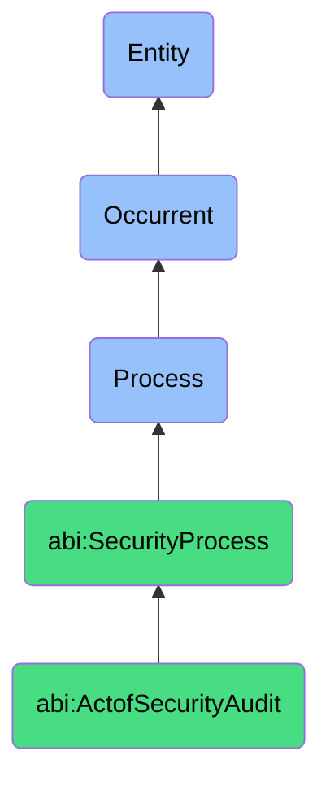

# ActofSecurityAudit

## Definition
An act of security audit is an occurrent process that unfolds through time, involving the systematic, methodical assessment and evaluation of an organization's security posture, controls, configurations, policies, and procedures against established security standards, requirements, or best practices, through evidence collection, testing, verification, and analysis to identify vulnerabilities, compliance gaps, or control weaknesses, resulting in documented findings, risk assessments, and recommendations for improvement.

## Hierarchy in BFO


## Ontological Schema (TBox)
```turtle
abi:ActofSecurityAudit a owl:Class ;
  rdfs:subClassOf abi:SecurityProcess ;
  rdfs:label "Act of Security Audit" ;
  skos:definition "A systematic process that reviews configurations, access controls, and protocol adherence." .

abi:SecurityProcess a owl:Class ;
  rdfs:subClassOf bfo:0000015 ;
  rdfs:label "Security Process" ;
  skos:definition "A time-bound process related to the protection, monitoring, and management of digital assets, systems, and information against security threats and vulnerabilities." .

abi:has_audit_performer a owl:ObjectProperty ;
  rdfs:domain abi:ActofSecurityAudit ;
  rdfs:range abi:AuditPerformer ;
  rdfs:label "has audit performer" .

abi:audits_security_domain a owl:ObjectProperty ;
  rdfs:domain abi:ActofSecurityAudit ;
  rdfs:range abi:SecurityDomain ;
  rdfs:label "audits security domain" .

abi:follows_audit_methodology a owl:ObjectProperty ;
  rdfs:domain abi:ActofSecurityAudit ;
  rdfs:range abi:AuditMethodology ;
  rdfs:label "follows audit methodology" .

abi:evaluates_security_control a owl:ObjectProperty ;
  rdfs:domain abi:ActofSecurityAudit ;
  rdfs:range abi:SecurityControl ;
  rdfs:label "evaluates security control" .

abi:verifies_compliance_requirement a owl:ObjectProperty ;
  rdfs:domain abi:ActofSecurityAudit ;
  rdfs:range abi:ComplianceRequirement ;
  rdfs:label "verifies compliance requirement" .

abi:identifies_security_finding a owl:ObjectProperty ;
  rdfs:domain abi:ActofSecurityAudit ;
  rdfs:range abi:SecurityFinding ;
  rdfs:label "identifies security finding" .

abi:produces_audit_artifact a owl:ObjectProperty ;
  rdfs:domain abi:ActofSecurityAudit ;
  rdfs:range abi:AuditArtifact ;
  rdfs:label "produces audit artifact" .

abi:has_audit_start_date a owl:DatatypeProperty ;
  rdfs:domain abi:ActofSecurityAudit ;
  rdfs:range xsd:date ;
  rdfs:label "has audit start date" .

abi:has_audit_completion_date a owl:DatatypeProperty ;
  rdfs:domain abi:ActofSecurityAudit ;
  rdfs:range xsd:date ;
  rdfs:label "has audit completion date" .

abi:has_audit_scope a owl:DatatypeProperty ;
  rdfs:domain abi:ActofSecurityAudit ;
  rdfs:range xsd:string ;
  rdfs:label "has audit scope" .
```

## Ontological Instance (ABox)
```turtle
ex:QuarterlyPermissionReviewAudit a abi:ActofSecurityAudit ;
  rdfs:label "Quarterly IAM Permissions and Encryption Standards Review" ;
  abi:has_audit_performer ex:SecurityComplianceTeam, ex:IAMSpecialist, ex:ExternalAuditor ;
  abi:audits_security_domain ex:IdentityAccessManagement, ex:DataEncryption, ex:CloudResources ;
  abi:follows_audit_methodology ex:NISTFrameworkMethodology, ex:SystematicSamplingApproach ;
  abi:evaluates_security_control ex:AccessControlMechanisms, ex:EncryptionImplementation, ex:PrivilegeManagement ;
  abi:verifies_compliance_requirement ex:LeastPrivilegePolicy, ex:DataAtRestEncryptionStandard, ex:AccessReviewProcedure ;
  abi:identifies_security_finding ex:ExcessivePermissionsIssue, ex:EncryptionKeyRotationLapse, ex:InactiveAccountRetention ;
  abi:produces_audit_artifact ex:IAMComplianceReport, ex:RemediationRecommendations, ex:RiskAssessmentMatrix ;
  abi:has_audit_start_date "2023-10-01"^^xsd:date ;
  abi:has_audit_completion_date "2023-10-14"^^xsd:date ;
  abi:has_audit_scope "All production cloud resources, engineering roles, and sensitive data repositories" .

ex:AnnualSecurityControlsAudit a abi:ActofSecurityAudit ;
  rdfs:label "Annual Security Controls and Compliance Audit" ;
  abi:has_audit_performer ex:ChiefInformationSecurityOfficer, ex:ComplianceManager, ex:ThirdPartyAuditTeam ;
  abi:audits_security_domain ex:NetworkSecurity, ex:EndpointProtection, ex:VulnerabilityManagement, ex:IncidentResponse ;
  abi:follows_audit_methodology ex:ISO27001Framework, ex:ComprehensiveAssessmentMethod ;
  abi:evaluates_security_control ex:FirewallRules, ex:EndpointDetection, ex:PatchManagement, ex:IncidentResponseProcedures ;
  abi:verifies_compliance_requirement ex:RegulatoryComplianceRequirements, ex:IndustryStandards, ex:OrganizationalPolicies ;
  abi:identifies_security_finding ex:FirewallMisconfiguration, ex:IncompleteAssetInventory, ex:OutdatedRecoveryProcedure ;
  abi:produces_audit_artifact ex:ComprehensiveAuditReport, ex:ComplianceCertification, ex:SecurityScorecard ;
  abi:has_audit_start_date "2023-08-15"^^xsd:date ;
  abi:has_audit_completion_date "2023-09-30"^^xsd:date ;
  abi:has_audit_scope "All organizational security controls, processes, and systems subject to ISO27001 and industry regulations" .
```

## Related Classes
- **abi:ActofThreatDetection** - A process that implements continuous monitoring compared to audit's point-in-time assessment.
- **abi:ActofIncidentResponse** - A process that may be evaluated during security audits for effectiveness.
- **abi:ActofAccessReview** - A specialized audit process focused specifically on access controls.
- **abi:ActofCredentialRotation** - A process that may be triggered by findings from security audits.
- **abi:ComplianceAssessmentProcess** - A related process focused specifically on regulatory requirements.
- **abi:VulnerabilityAssessmentProcess** - A process often conducted alongside security audits.
- **abi:SecurityRemediationProcess** - A process that addresses issues identified during security audits. 