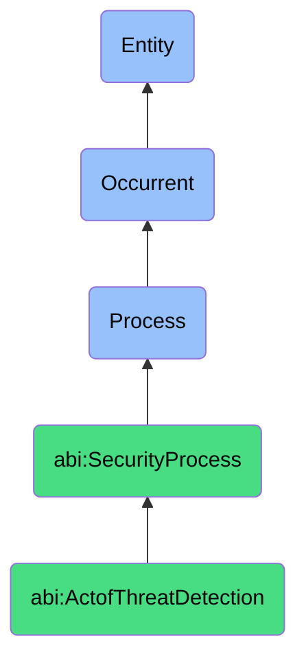

# ActofThreatDetection

## Definition
An act of threat detection is an occurrent process that unfolds through time, involving the continuous or periodic monitoring, scanning, and analysis of digital environments, network traffic, system logs, user behaviors, and other data sources to identify patterns, anomalies, indicators of compromise, or malicious activities that may signal potential security threats, breaches, or attacks against organizational assets, enabling timely awareness and response to security incidents.

## Hierarchy in BFO


## Ontological Schema (TBox)
```turtle
abi:ActofThreatDetection a owl:Class ;
  rdfs:subClassOf abi:SecurityProcess ;
  rdfs:label "Act of Threat Detection" ;
  skos:definition "A process of monitoring digital environments for signs of compromise or attack." .

abi:SecurityProcess a owl:Class ;
  rdfs:subClassOf bfo:0000015 ;
  rdfs:label "Security Process" ;
  skos:definition "A time-bound process related to the protection, monitoring, and management of digital assets, systems, and information against security threats and vulnerabilities." .

abi:has_detection_agent a owl:ObjectProperty ;
  rdfs:domain abi:ActofThreatDetection ;
  rdfs:range abi:DetectionAgent ;
  rdfs:label "has detection agent" .

abi:monitors_environment a owl:ObjectProperty ;
  rdfs:domain abi:ActofThreatDetection ;
  rdfs:range abi:MonitoredEnvironment ;
  rdfs:label "monitors environment" .

abi:applies_detection_rule a owl:ObjectProperty ;
  rdfs:domain abi:ActofThreatDetection ;
  rdfs:range abi:DetectionRule ;
  rdfs:label "applies detection rule" .

abi:uses_detection_method a owl:ObjectProperty ;
  rdfs:domain abi:ActofThreatDetection ;
  rdfs:range abi:DetectionMethod ;
  rdfs:label "uses detection method" .

abi:analyzes_security_data a owl:ObjectProperty ;
  rdfs:domain abi:ActofThreatDetection ;
  rdfs:range abi:SecurityData ;
  rdfs:label "analyzes security data" .

abi:identifies_threat_indicator a owl:ObjectProperty ;
  rdfs:domain abi:ActofThreatDetection ;
  rdfs:range abi:ThreatIndicator ;
  rdfs:label "identifies threat indicator" .

abi:generates_security_alert a owl:ObjectProperty ;
  rdfs:domain abi:ActofThreatDetection ;
  rdfs:range abi:SecurityAlert ;
  rdfs:label "generates security alert" .

abi:has_detection_timestamp a owl:DatatypeProperty ;
  rdfs:domain abi:ActofThreatDetection ;
  rdfs:range xsd:dateTime ;
  rdfs:label "has detection timestamp" .

abi:has_detection_frequency a owl:DatatypeProperty ;
  rdfs:domain abi:ActofThreatDetection ;
  rdfs:range xsd:duration ;
  rdfs:label "has detection frequency" .

abi:has_alert_confidence a owl:DatatypeProperty ;
  rdfs:domain abi:ActofThreatDetection ;
  rdfs:range xsd:decimal ;
  rdfs:label "has alert confidence" .
```

## Ontological Instance (ABox)
```turtle
ex:NetworkPortScanningDetection a abi:ActofThreatDetection ;
  rdfs:label "Network Port Scanning Detection" ;
  abi:has_detection_agent ex:SecurityOperationsCenter, ex:NetworkMonitoringSystem ;
  abi:monitors_environment ex:PerimeterNetwork, ex:OpenPorts, ex:FirewallLogs ;
  abi:applies_detection_rule ex:ConnectionAttemptThresholdRule, ex:PortSweepPatternRule, ex:UnusualSourceIPRule ;
  abi:uses_detection_method ex:StatisticalAnomaly, ex:SignatureBasedDetection, ex:BehaviorProfiling ;
  abi:analyzes_security_data ex:NetworkFlowLogs, ex:FirewallBlockEvents, ex:ConnectionTimingData ;
  abi:identifies_threat_indicator ex:SequentialPortProbing, ex:HighVolumeConnectionAttempts, ex:TimingCorrelation ;
  abi:generates_security_alert ex:PotentialReconnaissanceAlert, ex:SuspiciousIPNotification ;
  abi:has_detection_timestamp "2023-11-15T03:45:12Z"^^xsd:dateTime ;
  abi:has_detection_frequency "PT10M"^^xsd:duration ;
  abi:has_alert_confidence "0.85"^^xsd:decimal .

ex:UserBehaviorAnomalyDetection a abi:ActofThreatDetection ;
  rdfs:label "User Behavior Anomaly Detection" ;
  abi:has_detection_agent ex:UserBehaviorAnalytics, ex:IdentityProtectionSystem ;
  abi:monitors_environment ex:CloudApplications, ex:AuthenticationSystems, ex:ResourceAccess ;
  abi:applies_detection_rule ex:UnusualLogInTimeRule, ex:GeographicalImpossibilityRule, ex:AccessPatternDeviationRule ;
  abi:uses_detection_method ex:MachineLearningAnomaly, ex:BaselineDeviation, ex:PeerGroupComparison ;
  abi:analyzes_security_data ex:AuthenticationLogs, ex:UserActivityAudit, ex:ResourceAccessData ;
  abi:identifies_threat_indicator ex:UnusualLoginLocation, ex:ExcessiveAccessAttempts, ex:SensitiveDataAccess ;
  abi:generates_security_alert ex:PotentialAccountCompromiseAlert, ex:UserRiskScoreElevation ;
  abi:has_detection_timestamp "2023-11-14T22:17:03Z"^^xsd:dateTime ;
  abi:has_detection_frequency "PT1H"^^xsd:duration ;
  abi:has_alert_confidence "0.72"^^xsd:decimal .
```

## Related Classes
- **abi:ActofIncidentResponse** - A process that follows threat detection when security incidents are confirmed.
- **abi:ActofSecurityAudit** - A process that may uncover configurations that affect threat detection capabilities.
- **abi:ActofAccessReview** - A process for evaluating access patterns that may inform threat detection rules.
- **abi:ThreatIntelligenceProcess** - A process that provides indicators of compromise for detection rules.
- **abi:SecurityMonitoringProcess** - A broader process that includes continuous threat detection activities.
- **abi:FalsePositiveAnalysisProcess** - A process for evaluating and tuning threat detection accuracy.
- **abi:SecurityInstrumentationProcess** - A process for implementing monitoring tools used in threat detection. 