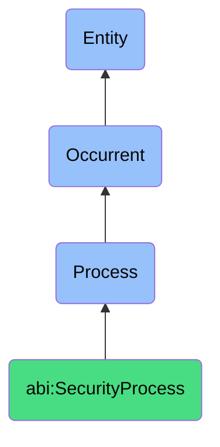

# SecurityProcess

## Definition
A security process is an occurrent that unfolds through time, involving the systematic monitoring, assessment, response, or management of digital assets, systems, and information to protect against threats, vulnerabilities, and unauthorized access, ensuring the confidentiality, integrity, and availability of organizational resources through proactive and reactive measures that identify, mitigate, and remediate security risks.

## Hierarchy in BFO


## Ontological Schema (TBox)
```turtle
abi:SecurityProcess a owl:Class ;
  rdfs:subClassOf bfo:0000015 ;
  rdfs:label "Security Process" ;
  skos:definition "A time-bound process related to the protection, monitoring, and management of digital assets, systems, and information against security threats and vulnerabilities." .

abi:has_security_agent a owl:ObjectProperty ;
  rdfs:domain abi:SecurityProcess ;
  rdfs:range abi:SecurityAgent ;
  rdfs:label "has security agent" .

abi:monitors_security_subject a owl:ObjectProperty ;
  rdfs:domain abi:SecurityProcess ;
  rdfs:range abi:SecuritySubject ;
  rdfs:label "monitors security subject" .

abi:applies_security_control a owl:ObjectProperty ;
  rdfs:domain abi:SecurityProcess ;
  rdfs:range abi:SecurityControl ;
  rdfs:label "applies security control" .

abi:follows_security_policy a owl:ObjectProperty ;
  rdfs:domain abi:SecurityProcess ;
  rdfs:range abi:SecurityPolicy ;
  rdfs:label "follows security policy" .

abi:uses_security_tool a owl:ObjectProperty ;
  rdfs:domain abi:SecurityProcess ;
  rdfs:range abi:SecurityTool ;
  rdfs:label "uses security tool" .

abi:produces_security_artifact a owl:ObjectProperty ;
  rdfs:domain abi:SecurityProcess ;
  rdfs:range abi:SecurityArtifact ;
  rdfs:label "produces security artifact" .

abi:addresses_security_risk a owl:ObjectProperty ;
  rdfs:domain abi:SecurityProcess ;
  rdfs:range abi:SecurityRisk ;
  rdfs:label "addresses security risk" .

abi:has_security_timestamp a owl:DatatypeProperty ;
  rdfs:domain abi:SecurityProcess ;
  rdfs:range xsd:dateTime ;
  rdfs:label "has security timestamp" .

abi:has_security_status a owl:DatatypeProperty ;
  rdfs:domain abi:SecurityProcess ;
  rdfs:range xsd:string ;
  rdfs:label "has security status" .

abi:has_security_severity a owl:DatatypeProperty ;
  rdfs:domain abi:SecurityProcess ;
  rdfs:range xsd:string ;
  rdfs:label "has security severity" .
```

## Ontological Instance (ABox)
```turtle
# SecurityProcess is a parent class with subclasses:
# - abi:ActofThreatDetection
# - abi:ActofIncidentResponse
# - abi:ActofSecurityAudit
# - abi:ActofAccessReview
# - abi:ActofCredentialRotation
# and other security-related processes
```

## Related Classes
- **abi:ActofThreatDetection** - A process of monitoring digital environments for signs of compromise or attack.
- **abi:ActofIncidentResponse** - A process initiated after detection of a cybersecurity breach to contain and resolve the event.
- **abi:ActofSecurityAudit** - A systematic process that reviews configurations, access controls, and protocol adherence.
- **abi:ActofAccessReview** - A process that checks and adjusts user/system access rights.
- **abi:ActofCredentialRotation** - A process that rotates or invalidates secrets, keys, or credentials.
- **abi:VulnerabilityManagementProcess** - A process for identifying, classifying, and mitigating vulnerabilities.
- **abi:ComplianceAssessmentProcess** - A process for evaluating alignment with security standards and regulations. 