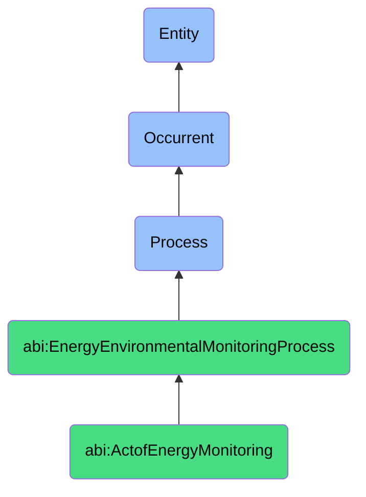

# ActofEnergyMonitoring

## Definition
An act of energy monitoring is an occurrent process that unfolds through time, involving the systematic collection, measurement, aggregation, and analysis of energy consumption data across physical spaces, infrastructure systems, or operational components, to track usage patterns, identify anomalies, measure efficiency, or validate conservation efforts through continuous or periodic observation of energy flows, typically enabled by sensor networks, metering infrastructure, or monitoring technologies that generate actionable insights regarding energy utilization.

## Hierarchy in BFO


## Ontological Schema (TBox)
```turtle
abi:ActofEnergyMonitoring a owl:Class ;
  rdfs:subClassOf abi:EnergyEnvironmentalMonitoringProcess ;
  rdfs:label "Act of Energy Monitoring" ;
  skos:definition "A recurring process that collects, analyzes, and reports energy usage across spaces or systems." .

abi:EnergyEnvironmentalMonitoringProcess a owl:Class ;
  rdfs:subClassOf bfo:0000015 ;
  rdfs:label "Energy Environmental Monitoring Process" ;
  skos:definition "A time-bound process related to the measurement, analysis, and management of energy consumption, resource utilization, or environmental impacts across systems or spaces." .

abi:has_monitoring_operator a owl:ObjectProperty ;
  rdfs:domain abi:ActofEnergyMonitoring ;
  rdfs:range abi:MonitoringOperator ;
  rdfs:label "has monitoring operator" .

abi:monitors_energy_source a owl:ObjectProperty ;
  rdfs:domain abi:ActofEnergyMonitoring ;
  rdfs:range abi:EnergySource ;
  rdfs:label "monitors energy source" .

abi:tracks_consumption_pattern a owl:ObjectProperty ;
  rdfs:domain abi:ActofEnergyMonitoring ;
  rdfs:range abi:ConsumptionPattern ;
  rdfs:label "tracks consumption pattern" .

abi:employs_monitoring_device a owl:ObjectProperty ;
  rdfs:domain abi:ActofEnergyMonitoring ;
  rdfs:range abi:MonitoringDevice ;
  rdfs:label "employs monitoring device" .

abi:implements_measurement_methodology a owl:ObjectProperty ;
  rdfs:domain abi:ActofEnergyMonitoring ;
  rdfs:range abi:MeasurementMethodology ;
  rdfs:label "implements measurement methodology" .

abi:detects_energy_anomaly a owl:ObjectProperty ;
  rdfs:domain abi:ActofEnergyMonitoring ;
  rdfs:range abi:EnergyAnomaly ;
  rdfs:label "detects energy anomaly" .

abi:generates_energy_report a owl:ObjectProperty ;
  rdfs:domain abi:ActofEnergyMonitoring ;
  rdfs:range abi:EnergyReport ;
  rdfs:label "generates energy report" .

abi:has_data_collection_frequency a owl:DatatypeProperty ;
  rdfs:domain abi:ActofEnergyMonitoring ;
  rdfs:range xsd:string ;
  rdfs:label "has data collection frequency" .

abi:has_data_aggregation_level a owl:DatatypeProperty ;
  rdfs:domain abi:ActofEnergyMonitoring ;
  rdfs:range xsd:string ;
  rdfs:label "has data aggregation level" .

abi:has_trigger_condition a owl:DatatypeProperty ;
  rdfs:domain abi:ActofEnergyMonitoring ;
  rdfs:range xsd:string ;
  rdfs:label "has trigger condition" .
```

## Ontological Instance (ABox)
```turtle
ex:ServerRoomCoolingAnomalyMonitoring a abi:ActofEnergyMonitoring ;
  rdfs:label "Server Room Cooling Energy Spike Monitoring" ;
  abi:has_monitoring_operator ex:FacilitiesTeam, ex:AutomatedMonitoringSystem, ex:DataCenterManager ;
  abi:monitors_energy_source ex:ServerRoomHVAC, ex:CoolingInfrastructure, ex:BackupCoolingSystems ;
  abi:tracks_consumption_pattern ex:PeakUsagePeriods, ex:BaselineConsumption, ex:AnomalyThresholds ;
  abi:employs_monitoring_device ex:IoTSensors, ex:SmartMeters, ex:TemperatureSensors, ex:PowerMonitors ;
  abi:implements_measurement_methodology ex:RealTimeMonitoring, ex:BaselineDeviation, ex:AlertThresholding ;
  abi:detects_energy_anomaly ex:CoolingEnergySpike, ex:AbnormalConsumptionPattern, ex:SystemEfficiencyDecline ;
  abi:generates_energy_report ex:AnomalyReport, ex:EnergyDashboard, ex:AlertNotification ;
  abi:has_data_collection_frequency "Continuous (1-minute intervals)" ;
  abi:has_data_aggregation_level "Per-system with building-level comparison" ;
  abi:has_trigger_condition "IoT dashboard anomaly detection" .

ex:QuarterlyFacilityEnergyReporting a abi:ActofEnergyMonitoring ;
  rdfs:label "Quarterly Facility-Wide Energy Consumption Monitoring" ;
  abi:has_monitoring_operator ex:SustainabilityTeam, ex:BuildingManagementSystem, ex:EnergyConsultant ;
  abi:monitors_energy_source ex:ElectricalSystems, ex:HeatingSystem, ex:LightingInfrastructure, ex:OfficeEquipment ;
  abi:tracks_consumption_pattern ex:SeasonalVariations, ex:OccupancyCorrelation, ex:BusinessHoursUsage, ex:WeekendConsumption ;
  abi:employs_monitoring_device ex:BuildingManagementSystem, ex:UtilityMeters, ex:SubMeters, ex:EnergyManagementSoftware ;
  abi:implements_measurement_methodology ex:UtilityDataIntegration, ex:TimeSeriesAnalysis, ex:ComparativeReporting ;
  abi:detects_energy_anomaly ex:AfterHoursConsumption, ex:InefficientEquipmentOperation, ex:GradualEfficiencyDecline ;
  abi:generates_energy_report ex:QuarterlyEnergyReport, ex:ConsumptionTrendAnalysis, ex:SustainabilityMetrics ;
  abi:has_data_collection_frequency "Hourly, aggregated quarterly" ;
  abi:has_data_aggregation_level "Building-level with department breakdowns" ;
  abi:has_trigger_condition "Scheduled quarterly reporting cycle" .
```

## Related Classes
- **abi:ActofResourceEfficiencyReview** - A process that evaluates findings from energy monitoring for efficiency improvements.
- **abi:EnvironmentalComplianceProcess** - A process that uses energy monitoring data to verify regulatory compliance.
- **abi:EnergyAuditProcess** - A more comprehensive process that may incorporate energy monitoring data.
- **abi:EnergyConservationProcess** - A process for implementing actions based on energy monitoring insights.
- **abi:AnomalyResponseProcess** - A process triggered by anomalies detected during energy monitoring.
- **abi:ConsumptionForecastingProcess** - A process that uses monitoring data to predict future energy needs.
- **abi:BenchmarkingProcess** - A process that compares monitoring results against industry or historical standards. 