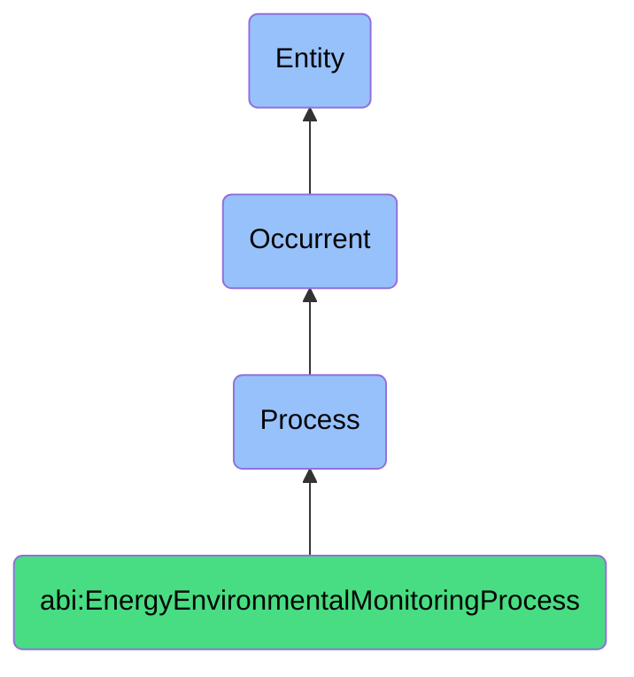

# EnergyEnvironmentalMonitoringProcess

## Definition
An energy environmental monitoring process is an occurrent that unfolds through time, involving the systematic observation, measurement, analysis, and management of energy consumption, resource utilization, environmental impacts, or sustainability metrics across physical spaces, systems, or organizational operations, facilitating informed decision-making about resource efficiency, conservation measures, compliance with environmental standards, or sustainability initiatives through structured data collection, interpretation, and reporting mechanisms.

## Hierarchy in BFO


## Ontological Schema (TBox)
```turtle
abi:EnergyEnvironmentalMonitoringProcess a owl:Class ;
  rdfs:subClassOf bfo:0000015 ;
  rdfs:label "Energy Environmental Monitoring Process" ;
  skos:definition "A time-bound process related to the measurement, analysis, and management of energy consumption, resource utilization, or environmental impacts across systems or spaces." .

abi:has_monitoring_agent a owl:ObjectProperty ;
  rdfs:domain abi:EnergyEnvironmentalMonitoringProcess ;
  rdfs:range abi:MonitoringAgent ;
  rdfs:label "has monitoring agent" .

abi:observes_resource_consumption a owl:ObjectProperty ;
  rdfs:domain abi:EnergyEnvironmentalMonitoringProcess ;
  rdfs:range abi:ResourceConsumption ;
  rdfs:label "observes resource consumption" .

abi:monitors_physical_system a owl:ObjectProperty ;
  rdfs:domain abi:EnergyEnvironmentalMonitoringProcess ;
  rdfs:range abi:PhysicalSystem ;
  rdfs:label "monitors physical system" .

abi:follows_measurement_protocol a owl:ObjectProperty ;
  rdfs:domain abi:EnergyEnvironmentalMonitoringProcess ;
  rdfs:range abi:MeasurementProtocol ;
  rdfs:label "follows measurement protocol" .

abi:applies_sustainability_standard a owl:ObjectProperty ;
  rdfs:domain abi:EnergyEnvironmentalMonitoringProcess ;
  rdfs:range abi:SustainabilityStandard ;
  rdfs:label "applies sustainability standard" .

abi:utilizes_monitoring_technology a owl:ObjectProperty ;
  rdfs:domain abi:EnergyEnvironmentalMonitoringProcess ;
  rdfs:range abi:MonitoringTechnology ;
  rdfs:label "utilizes monitoring technology" .

abi:produces_environmental_report a owl:ObjectProperty ;
  rdfs:domain abi:EnergyEnvironmentalMonitoringProcess ;
  rdfs:range abi:EnvironmentalReport ;
  rdfs:label "produces environmental report" .

abi:has_monitoring_period_start a owl:DatatypeProperty ;
  rdfs:domain abi:EnergyEnvironmentalMonitoringProcess ;
  rdfs:range xsd:dateTime ;
  rdfs:label "has monitoring period start" .

abi:has_monitoring_period_end a owl:DatatypeProperty ;
  rdfs:domain abi:EnergyEnvironmentalMonitoringProcess ;
  rdfs:range xsd:dateTime ;
  rdfs:label "has monitoring period end" .

abi:has_measurement_frequency a owl:DatatypeProperty ;
  rdfs:domain abi:EnergyEnvironmentalMonitoringProcess ;
  rdfs:range xsd:string ;
  rdfs:label "has measurement frequency" .
```

## Ontological Instance (ABox)
```turtle
# EnergyEnvironmentalMonitoringProcess is a parent class with subclasses:
# - abi:ActofEnergyMonitoring
# - abi:ActofResourceEfficiencyReview
# and other energy and environmental monitoring-related processes
```

## Related Classes
- **abi:ActofEnergyMonitoring** - A recurring process that collects, analyzes, and reports energy usage across spaces or systems.
- **abi:ActofResourceEfficiencyReview** - A process that evaluates operational efficiency of utilities like electricity, heating, or water.
- **abi:EnvironmentalComplianceProcess** - A process for ensuring adherence to environmental regulations and standards.
- **abi:CarbonFootprintAssessmentProcess** - A process for measuring and analyzing organizational carbon emissions.
- **abi:SustainabilityReportingProcess** - A process for documenting and communicating environmental performance.
- **abi:EnergyAuditProcess** - A process for comprehensive evaluation of energy usage and efficiency opportunities.
- **abi:ResourceConservationPlanningProcess** - A process for developing strategies to reduce resource consumption.