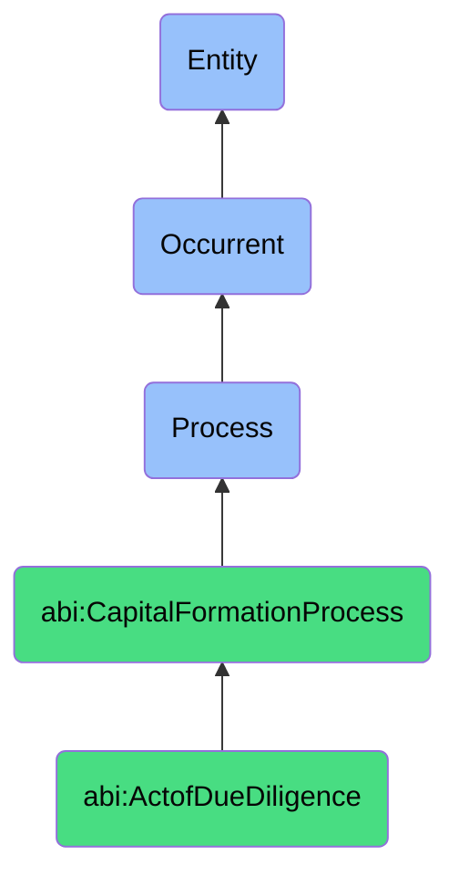

# ActofDueDiligence

## Definition
An act of due diligence is an occurrent process that unfolds through time, involving the comprehensive examination, verification, and analysis of a company's legal, financial, operational, technological, and market information by potential investors to evaluate investment risks and opportunities, validate claims, and inform investment decisions, typically conducted through document reviews, interviews, audits, and data analysis.

## Hierarchy in BFO


## Ontological Schema (TBox)
```turtle
abi:ActofDueDiligence a owl:Class ;
  rdfs:subClassOf abi:CapitalFormationProcess ;
  rdfs:label "Act of Due Diligence" ;
  skos:definition "A process in which legal, financial, and operational documents are shared and reviewed by potential investors." .

abi:CapitalFormationProcess a owl:Class ;
  rdfs:subClassOf bfo:0000015 ;
  rdfs:label "Capital Formation Process" ;
  skos:definition "A time-bound process related to attracting, securing, and managing financial investments from external sources." .

abi:has_due_diligence_conductor a owl:ObjectProperty ;
  rdfs:domain abi:ActofDueDiligence ;
  rdfs:range abi:DueDiligenceConductor ;
  rdfs:label "has due diligence conductor" .

abi:examines_company_information a owl:ObjectProperty ;
  rdfs:domain abi:ActofDueDiligence ;
  rdfs:range abi:CompanyInformation ;
  rdfs:label "examines company information" .

abi:reviews_diligence_document a owl:ObjectProperty ;
  rdfs:domain abi:ActofDueDiligence ;
  rdfs:range abi:DiligenceDocument ;
  rdfs:label "reviews diligence document" .

abi:involves_verification_method a owl:ObjectProperty ;
  rdfs:domain abi:ActofDueDiligence ;
  rdfs:range abi:VerificationMethod ;
  rdfs:label "involves verification method" .

abi:assesses_investment_risk a owl:ObjectProperty ;
  rdfs:domain abi:ActofDueDiligence ;
  rdfs:range abi:InvestmentRisk ;
  rdfs:label "assesses investment risk" .

abi:generates_diligence_finding a owl:ObjectProperty ;
  rdfs:domain abi:ActofDueDiligence ;
  rdfs:range abi:DiligenceFinding ;
  rdfs:label "generates diligence finding" .

abi:produces_diligence_report a owl:ObjectProperty ;
  rdfs:domain abi:ActofDueDiligence ;
  rdfs:range abi:DiligenceReport ;
  rdfs:label "produces diligence report" .

abi:has_diligence_start_date a owl:DatatypeProperty ;
  rdfs:domain abi:ActofDueDiligence ;
  rdfs:range xsd:date ;
  rdfs:label "has diligence start date" .

abi:has_diligence_duration a owl:DatatypeProperty ;
  rdfs:domain abi:ActofDueDiligence ;
  rdfs:range xsd:duration ;
  rdfs:label "has diligence duration" .

abi:has_diligence_outcome a owl:DatatypeProperty ;
  rdfs:domain abi:ActofDueDiligence ;
  rdfs:range xsd:string ;
  rdfs:label "has diligence outcome" .
```

## Ontological Instance (ABox)
```turtle
ex:VentureCapitalSeriesBDueDiligence a abi:ActofDueDiligence ;
  rdfs:label "Venture Capital Series B Due Diligence" ;
  abi:has_due_diligence_conductor ex:LeadInvestorDiligenceTeam, ex:ExternalLegalCounsel, ex:FinancialAuditor ;
  abi:examines_company_information ex:FinancialRecords, ex:CustomerContracts, ex:IntellectualPropertyPortfolio, ex:TeamBackgrounds ;
  abi:reviews_diligence_document ex:CorporateFormationDocuments, ex:CapitalizationTable, ex:CustomerAgreements, ex:PatentFilings ;
  abi:involves_verification_method ex:CustomerInterviews, ex:SystemAudit, ex:MarketSizeAnalysis, ex:BackgroundChecks ;
  abi:assesses_investment_risk ex:ExecutionRisk, ex:CompetitiveRisk, ex:TechnicalRisk, ex:RegulatoryRisk ;
  abi:generates_diligence_finding ex:PositiveCustomerFeedback, ex:UncertainRegulatoryEnvironment, ex:StrongIPPosition ;
  abi:produces_diligence_report ex:ComprehensiveDiligenceMemo, ex:InvestmentCommitteeSummary ;
  abi:has_diligence_start_date "2023-09-05"^^xsd:date ;
  abi:has_diligence_duration "P3W"^^xsd:duration ;
  abi:has_diligence_outcome "Favorable with minor conditions" .

ex:StrategicInvestorTechnicalDueDiligence a abi:ActofDueDiligence ;
  rdfs:label "Strategic Investor Technical Due Diligence" ;
  abi:has_due_diligence_conductor ex:CorporateVCTechTeam, ex:ProductIntegrationSpecialist, ex:SecurityAuditor ;
  abi:examines_company_information ex:TechnicalArchitecture, ex:CodeRepository, ex:DevOpsProcesses, ex:SecurityProtocols ;
  abi:reviews_diligence_document ex:APIDocumentation, ex:SystemDiagrams, ex:SecurityCertifications, ex:ScalabilityTests ;
  abi:involves_verification_method ex:CodeReview, ex:LoadTesting, ex:SecurityPenetrationTesting, ex:ArchitectureWorkshop ;
  abi:assesses_investment_risk ex:TechnicalDebtRisk, ex:ScalabilityRisk, ex:SecurityComplianceRisk ;
  abi:generates_diligence_finding ex:ScalableArchitecture, ex:MinorSecurityVulnerabilities, ex:CleanCodebase ;
  abi:produces_diligence_report ex:TechnicalDueDiligenceReport, ex:IntegrationFeasibilityAnalysis ;
  abi:has_diligence_start_date "2023-10-12"^^xsd:date ;
  abi:has_diligence_duration "P10D"^^xsd:duration ;
  abi:has_diligence_outcome "Technically validated with remediation steps" .
```

## Related Classes
- **abi:ActofCapitalRaising** - A broader process that includes due diligence as a critical phase.
- **abi:ActofInvestorMeeting** - A process that often precedes and informs due diligence.
- **abi:ActofTermSheetNegotiation** - A process that typically follows successful due diligence.
- **abi:ActofClosingInvestment** - A process that follows due diligence completion and term agreement.
- **abi:DataRoomPreparationProcess** - A process for organizing materials needed for due diligence.
- **abi:AuditProcess** - A related process that employs similar verification techniques.
- **abi:RiskAssessmentProcess** - A process for evaluating risks identified during due diligence. 